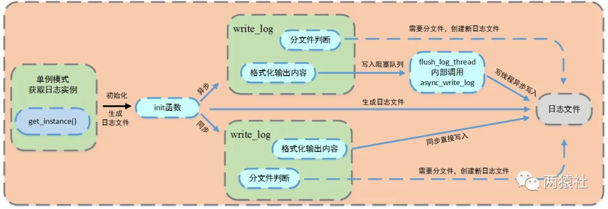
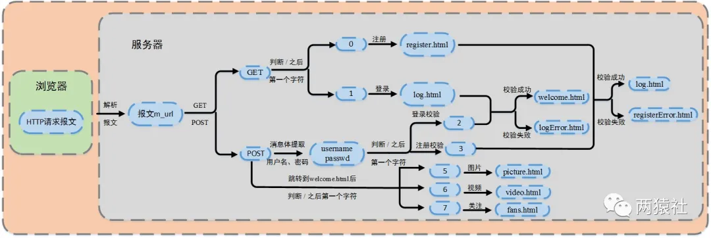

## 日志系统

### 基础知识

#### 日志

> **`日志`**，由服务器自动创建，并记录运行状态，错误信息，访问数据的文件。
>
> **`同步日志`**，日志写入函数与工作线程串行执行，由于涉及到I/O操作，当单条日志比较大的时候，同步模式会阻塞整个处理流程，服务器所能处理的并发能力将有所下降，尤其是在峰值的时候，写日志可能成为系统的瓶颈。
>
> **`异步日志`**，将所写的日志内容先存入阻塞队列，写线程从阻塞队列中取出内容，写入日志。

本项目中，使用单例模式创建日志系统，对服务器运行状态、错误信息和访问数据进行记录，该系统可以实现按天分类，超行分类功能，可以根据实际情况分别使用同步和异步写入两种方式。

其中异步写入方式，将生产者-消费者模型封装为阻塞队列，创建一个写线程，工作线程将要写的内容push进队列，写线程从队列中取出内容，写入日志文件。

日志系统大致可以分成两部分，其一是单例模式与阻塞队列的定义，其二是日志类的定义与使用。

#### 懒汉式单例模式

线程安全懒汉式单例模式

```c
class single{
private:
    //私有静态指针变量指向唯一实例
    static single *p;
    //静态锁，是由于静态函数只能访问静态成员
    static pthread_mutex_t lock;

    //私有化构造函数
    single(){pthread_mutex_init(&lock, NULL);}
    ~single(){}

public:
    static single* getinstance();
};

pthread_mutex_t single::lock;
single* single::p = NULL;

single* single::getinstance(){
    if (NULL == p){
        pthread_mutex_lock(&lock);
        if (NULL == p){
            p = new single;
        }
        pthread_mutex_unlock(&lock);
    }
    return p;
}
```

更优雅的写法：

- 函数中的静态变量

  当变量声明为static时，空间**将在程序的生命周期内分配**。即使多次调用该函数，静态变量的空间也**只分配一次**，前一次调用中的变量值通过下一次函数调用传递

- C++0X以后，要求编译器保证内部静态变量的线程安全性

```c++
class single{
private:
    single(){}
    ~single(){}

public:
    static single* getinstance();
};

single* single::getinstance(){
    static single obj;
    return &obj;
}
```

#### 饿汉式单例模式

饿汉模式在程序运行时就定义了对象，并对其初始化，因此线程安全。
之后，不管哪个线程调用成员函数getinstance()，都只不过是返回一个对象的指针而已。所以是线程安全的，不需要在获取实例的成员函数中加锁。

```cpp
class single{
private:
    static single* p;
    single(){}
    ~single(){}
public:
    static single* getinstance();
};

single* single::p = new single();
single* single::getinstance(){
    return p;
}

//测试方法
int main(){
    single *p1 = single::getinstance();
    single *p2 = single::getinstance();
    if (p1 == p2)
        cout << "same" << endl;
    system("pause");
    return 0;
}
```

饿汉模式问题：非静态对象（函数外的static对象）在不同编译单元中的初始化顺序是未定义的。如果在初始化完成之前调用 getInstance() 方法会返回一个未定义的实例。

### 基础API

#### fputs

```c
#include <stdio.h>
int fputs(const char *str, FILE *stream);
```

- str，一个数组，包含了要写入的以空字符终止的字符序列。
- stream，指向FILE对象的指针，该FILE对象标识了要被写入字符串的流。

#### **可变参数宏__VA_ARGS__**

__VA_ARGS__是一个可变参数的宏，定义时宏定义中参数列表的最后一个参数为省略号，在实际使用时会发现有时会加##，有时又不加。

```c
//最简单的定义
#define my_print1(...)  printf(__VA_ARGS__)

//搭配va_list的format使用
#define my_print2(format, ...) printf(format, __VA_ARGS__)  
#define my_print3(format, ...) printf(format, ##__VA_ARGS__)
```

__VA_ARGS__宏前面加上##的作用在于，当可变参数的个数为0时，这里printf参数列表中的的##会把前面多余的","去掉，否则会编译出错，建议使用后面这种，使得程序更加健壮。

#### fflush

```c
#include <stdio.h>
int fflush(FILE *stream);
```

fflush()会强迫将缓冲区内的数据写回参数stream 指定的文件中，如果参数stream 为NULL，fflush()会将所有打开的文件数据更新。

在使用多个输出函数连续进行多次输出到控制台时，有可能下一个数据再上一个数据还没输出完毕，还在输出缓冲区中时，下一个printf就把另一个数据加入输出缓冲区，结果冲掉了原来的数据，出现输出错误。

在prinf()后加上fflush(stdout); 强制马上输出到控制台，可以避免出现上述错误。

### 流程图与日志类定义

#### **流程图**

- 日志文件

- - 局部变量的懒汉模式获取实例
  - 生成日志文件，并判断同步和异步写入方式

- 同步

- - 判断是否分文件
  - 直接格式化输出内容，将信息写入日志文件

- 异步

- - 判断是否分文件
  - 格式化输出内容，将内容写入阻塞队列，创建一个写线程，从阻塞队列取出内容写入日志文件




#### **日志类定义**

通过局部变量的懒汉单例模式创建日志实例，对其进行初始化生成日志文件后，格式化输出内容，并根据不同的写入方式，完成对应逻辑，写入日志文件。

日志类包括但不限于如下方法，

- 公有的实例获取方法
- 初始化日志文件方法
- 异步日志写入方法，内部调用私有异步方法
- 内容格式化方法
- 刷新缓冲区
- …

```c++
class Log{}
```


日志类中的方法都不会被其他程序直接调用，末尾的四个可变参数宏提供了其他程序的调用方法。

前述方法对日志等级进行分类，包括DEBUG，INFO，WARN和ERROR四种级别的日志。

### 功能实现

init函数实现日志创建、写入方式的判断。

write_log函数完成写入日志文件中的具体内容，主要实现日志分级、分文件、格式化输出内容。

#### **生成日志文件 && 判断写入方式**

通过单例模式获取唯一的日志类，调用init方法，初始化生成日志文件，服务器启动按当前时刻创建日志，前缀为时间，后缀为自定义log文件名，并记录创建日志的时间day和行数count。

写入方式通过初始化时**是否设置队列大小**（表示在队列中可以放几条数据）来判断，若队列大小为0，则为同步，否则为异步。

```cpp
bool Log::init(const char *file_name, int log_buf_size, int split_lines, int max_queue_size){}
```

#### **日志分级与分文件**

日志分级的实现大同小异，一般的会提供五种级别，具体的，

- Debug，调试代码时的输出，在系统实际运行时，一般不使用。
- Warn，这种警告与调试时终端的warning类似，同样是调试代码时使用。
- Info，报告系统当前的状态，当前执行的流程或接收的信息等。
- Error和Fatal，输出系统的错误信息。

上述的使用方法仅仅是个人理解，在开发中具体如何选择等级因人而异。项目中给出了除Fatal外的四种分级，实际使用了Debug，Info和Error三种。

超行、按天分文件逻辑，具体的，

- 日志写入前会判断当前day是否为创建日志的时间，行数是否超过最大行限制

- - 若为创建日志时间，写入日志，否则按当前时间创建新log，更新创建时间和行数
  - 若行数超过最大行限制，在当前日志的末尾加count/max_lines为后缀创建新log

将系统信息格式化后输出，具体为：格式化时间 + 格式化内容

```cpp
void Log::write_log(int level, const char *format, ...)
```


## 数据库连接池

### 本文内容

本篇将介绍数据库连接池的定义，具体的涉及到单例模式创建、连接池代码实现、RAII机制释放数据库连接。

**单例模式创建**，结合代码描述连接池的单例实现。

**连接池代码实现**，结合代码对连接池的外部访问接口进行详解。

**RAII机制释放数据库连接**，描述连接释放的封装逻辑。

### 单例模式创建

使用局部静态变量懒汉模式创建连接池。

```cpp
class connection_pool{}
```

### 连接池代码实现

连接池的功能主要有：初始化，获取连接、释放连接，销毁连接池。

#### **初始化**

值得注意的是，销毁连接池没有直接被外部调用，而是通过RAII机制来完成自动释放；使用信号量实现多线程争夺连接的同步机制，这里将信号量初始化为数据库的连接总数。

```cpp
connection_pool::connection_pool(){}
connection_pool::~connection_pool(){}
void connection_pool::init(string url, string User, string PassWord, 
                           string DBName, int Port, unsigned int MaxConn){}
```

#### 获取、释放连接

当线程数量大于数据库连接数量时，使用信号量进行同步，每次取出连接，信号量原子减1，释放连接原子加1，若连接池内没有连接了，则阻塞等待。

另外，由于多线程操作连接池，会造成竞争，这里使用互斥锁完成同步，具体的同步机制均使用lock.h中封装好的类。

```cpp
//当有请求时，从数据库连接池中返回一个可用连接，更新使用和空闲连接数
MYSQL *connection_pool::GetConnection(){}
//释放当前使用的连接
bool connection_pool::ReleaseConnection(MYSQL *con){}
```

#### **销毁连接池**

通过迭代器遍历连接池链表，关闭对应数据库连接，清空链表并重置空闲连接和现有连接数量。

```cpp
void connection_pool::DestroyPool(){}
```

### RAII机制释放数据库连接

将数据库连接的获取与释放通过RAII机制封装，避免手动释放。

#### 定义

这里需要注意的是，在获取连接时，通过有参构造对传入的参数进行修改。其中数据库连接本身是指针类型，所以参数需要通过双指针才能对其进行修改。

```cpp
class connectionRAII{}
```

#### **实现**

不直接调用获取和释放连接的接口，将其封装起来，通过RAII机制进行获取和释放。

```cpp
connectionRAII::connectionRAII(MYSQL **SQL, connection_pool *connPool){}
```


## 注册登录

使用数据库连接池实现服务器访问数据库的功能，使用POST请求完成注册和登录的校验工作。

### 本文内容

本篇将介绍同步实现注册登录功能，具体的涉及到流程图，载入数据库表，提取用户名和密码，注册登录流程与页面跳转的的代码实现。

**流程图**，描述服务器从报文中提取出用户名密码，并完成注册和登录校验后，实现页面跳转的逻辑。

**载入数据库表**，结合代码将数据库中的数据载入到服务器中。

**提取用户名和密码**，结合代码对报文进行解析，提取用户名和密码。

**注册登录流程**，结合代码对描述服务器进行注册和登录校验的流程。

**页面跳转**，结合代码对页面跳转机制进行详解。




### 载入数据库表

将数据库中的用户名和密码载入到服务器的map中来，map中的key为用户名，value为密码。

```cpp
//用户名和密码
map<string, string> users;
void http_conn::initmysql_result(connection_pool *connPool){}
```

#### **提取用户名和密码**

服务器端解析浏览器的请求报文，当解析为POST请求时，cgi标志位设置为1，并将请求报文的消息体赋值给m_string，进而提取出用户名和密码。

```cpp
//判断http请求是否被完整读入
http_conn::HTTP_CODE http_conn::parse_content(char *text){}
http_conn::HTTP_CODE http_conn::do_request() {}
```

### 同步线程登录注册

通过m_url定位/所在位置，根据/后的第一个字符判断是登录还是注册校验。

- 2：登录校验
- 3：注册校验

根据校验结果，跳转对应页面。另外，对数据库进行操作时，需要通过锁来同步。

```cpp
http_conn::HTTP_CODE http_conn::do_request() {}
```

### 页面跳转

通过m_url定位/所在位置，根据/后的第一个字符，使用分支语句实现页面跳转。具体的，

- 0：跳转注册页面，GET
- 1：跳转登录页面，GET
- 5：显示图片页面，POST
- 6：显示视频页面，POST
- 7：显示关注页面，POST