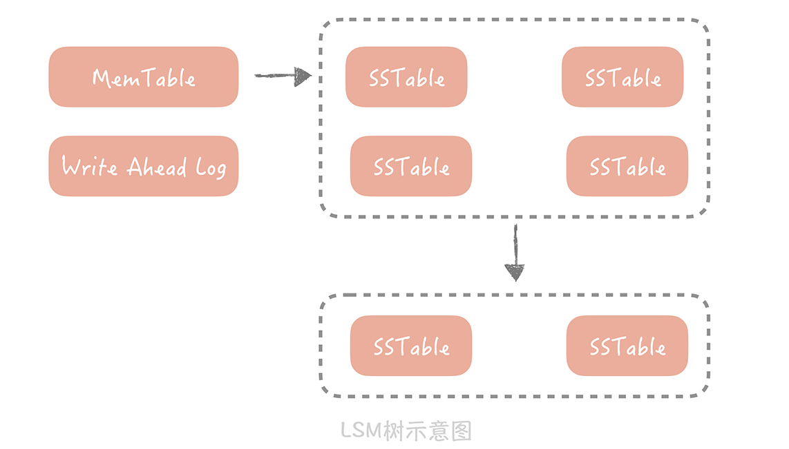

## 0 课程大纲

**基础篇**主要是一些基本的高并发架构设计理念，你可以把它看作整个课程的一个总纲，建立对高并发系统的初步认识。

**演进篇**是整个课程的核心，主要讲解系统支持高并发的方法。我会用一个虚拟的系统，带你分析当随着前端并发增加，这个系统的变化，以及你会遇到的一系列痛点问题。比如数据查询的性能瓶颈，缓存的高可用问题，然后从数据库、缓存、消息队列、分布式服务和维护这五个角度来展开，针对问题寻找解决方案，**让你置身其中，真真切切地走一遍系统演进的道路。**

**实战篇**将以两个实际案例，带你应用学到的知识应对高并发大流量的冲击。

一个案例是**如何设计承担每秒几十万次用户未读数请求的系统。**之所以选择它，是因为在大部分的系统中未读数都会是请求量最大、并发最高的服务，在微博时 QPS 会达到每秒 50 万次。同时，未读数系统的业务逻辑比较简单，在你了解设计方案的时候也不需要预先对业务逻辑有深入了解；**另一个例子是信息流系统的设计，**它是社区社交产品中的核心系统，业务逻辑复杂且请求量大，方案中几乎涉及高并发系统设计的全部内容。

## 1 高并发架构设计理念

### 通用设计方法

1. Scale-out（横向扩展）分而治之

Scale-up：通过购买性能更好的硬件来提升系统的并发处理能力；Scale-out：通过将多个低性能的机器组成一个分布式集群来共同抵御高并发流量的冲击

2. 缓存

使用缓存来提高系统的性能，就好比用“拓宽河道”的方式抵抗高并发大流量的冲击。

3. 异步：在某些场景下，未处理完成之前，我们可以让请求先返回，在数据准备好之后再通知请求方，这样可以在单位时间内处理更多的请求。

### 架构分层

MVC架构：Model（模型），View（视图）和 Controller（控制器）。将用户视图和业务处理隔离开，并且通过控制器连接起来。实现表现和逻辑的解耦，是一种标准的软件分层架构。

表现层、逻辑层和数据访问层：表现层展示数据结果和接受用户指令；逻辑层实现复杂业务；数据访问层处理和存储之间的交互。

**三层架构的细化**

- 终端显示层：各端模板渲染并执行显示的层。当前主要是 Velocity 渲染，JS 渲染， JSP 渲染，移动端展示等。
- 开放接口层：将 Service 层方法封装成开放接口，同时进行网关安全控制和流量控制等。
- Web 层：主要是对访问控制进行转发，各类基本参数校验，或者不复用的业务简单处理等。
- Service 层：业务逻辑层。
- Manager 层：通用业务处理层。这一层主要有两个作用，其一，你可以将原先 Service 层的一些通用能力下沉到这一层，比如与缓存和存储交互策略，中间件的接入；其二，你也可以在这一层封装对第三方接口的调用，比如调用支付服务，调用审核服务等。
- DAO 层：数据访问层，与底层 MySQL、Oracle、Hbase 等进行数据交互。
- 外部接口或第三方平台：包括其它部门 RPC 开放接口，基础平台，其它公司的 HTTP 接口。

### 高性能

假如说，你现在有一个系统，这个系统中处理核心只有一个，执行的任务的响应时间都在 10ms，它的吞吐量是在每秒 100 次。那么我们如何来优化性能从而提高系统的并发能力呢？主要有两种思路：一种是提高系统的处理核心数，另一种是减少单次任务的响应时间。

**1. 提高系统的处理核心数**

**2. 减少单次任务响应时间**

CPU 密集型系统中，需要处理大量的 CPU 运算，那么选用更高效的算法或者减少运算次数就是这类系统重要的优化手段。

IO 密集型系统指的是系统的大部分操作是在等待 IO 完成，这里 IO 指的是磁盘 IO 和网络 IO。我们熟知的系统大部分都属于 IO 密集型，比如数据库系统、缓存系统、Web 系统。这类系统的性能瓶颈可能出在系统内部，也可能是依赖的其他系统，而发现这类性能瓶颈的手段主要有两类。

第一类是采用工具，Linux 的工具集很丰富，完全可以满足你的优化需要，比如网络协议栈、网卡、磁盘、文件系统、内存，等等。这些工具的用法很多，你可以在排查问题的过程中逐渐积累。除此之外呢，一些开发语言还有针对语言特性的分析工具，比如说 Java 语言就有其专属的内存分析工具。

另一类手段是通过监控来发现性能问题。在监控中我们可以对任务的每一个步骤做分时的统计，从而找到任务的哪一步消耗了更多的时间。

而优化方案会随着问题的不同而不同。比方说，如果是数据库访问慢，那么就要看是不是有锁表的情况、是不是有全表扫描、索引加得是否合适、是否有 JOIN 操作、需不需要加缓存，等等；如果是网络的问题，就要看网络的参数是否有优化的空间，抓包来看是否有大量的超时重传，网卡是否有大量丢包等。

### 高可用

高可用性（High Availability，HA）：系统具备较高的无故障运行的能力

**设计思路**

1. 系统设计

design for failure，具体的优化方法，比如failover（故障转移）、超时控制以及降级和限流。

一般来说，发生 failover 的节点可能有两种情况：

- 是在完全对等的节点之间做 failover。

  所有节点都承担读写流量，并且节点中不保存状态，每个节点都可以作为另一个节点的镜像。在这种情况下，如果访问某一个节点失败，那么简单地随机访问另一个节点就好了。

  

  

- 是在不对等的节点之间，即系统中存在主节点也存在备节点。

  需要在代码中控制如何检测主备机器是否故障，以及如何做主备切换。

  可以在客户端上定期地向主节点发送心跳包，也可以从备份节点上定期发送心跳包。当一段时间内未收到心跳包，就可以认为主节点已经发生故障，可以触发选主的操作。

2. 系统运维

**灰度发布**

灰度发布指的是系统的变更不是一次性地推到线上的，而是按照一定比例逐步推进的。一般情况下，灰度发布是以机器维度进行的。比方说，我们先在 10% 的机器上进行变更，同时观察 Dashboard 上的系统性能指标以及错误日志。如果运行了一段时间之后系统指标比较平稳并且没有出现大量的错误日志，那么再推动全量变更。

**故障演练**

故障演练指的是对系统进行一些破坏性的手段，观察在出现局部故障时，整体的系统表现是怎样的，从而发现系统中存在的，潜在的可用性问题。

### 高拓展

无状态的服务和组件更易于扩展，而像 MySQL 这种存储服务是有状态的，就比较难以扩展。

**数据库、缓存、依赖的第三方、负载均衡、交换机带宽等等**都是系统扩展时需要考虑的因素。

**拆分**是提升系统扩展性最重要的一个思路，它会把庞杂的系统拆分成独立的，有单一职责的模块。

举一个简单的例子，假如你要设计一个社区，那么社区有 5 个模块。

- 用户：负责维护社区用户信息，注册，登陆等；
- 关系：用户之间关注、好友、拉黑等关系的维护；
- 内容：社区发的内容，就像朋友圈或者微博的内容；
- 评论、赞：用户可能会有的两种常规互动操作；
- 搜索：用户的搜索，内容的搜索。

而部署方式遵照最简单的三层部署架构，负载均衡负责请求的分发，应用服务器负责业务逻辑的处理，数据库负责数据的存储落地。这时，所有模块的业务代码都混合在一起了，数据也都存储在一个库里。

1. 存储层的拓展性

**存储拆分首先考虑的维度是业务维度。**

在按照存储拆分后，还可以按照数据特征做水平的拆分，比如说我们可以给用户库增加两个节点，然后按照某些算法将用户的数据拆分到这三个库里面，具体的算法在数据库分库分表部分。

当数据库按照业务和数据维度拆分之后，我们尽量不要使用事务。因为当一个事务中同时更新不同的数据库时，需要使用二阶段提交，来协调所有数据库要么全部更新成功，要么全部更新失败。这个协调的成本会随着资源的扩展不断升高，最终达到无法承受的程度。

2. 业务层的拓展

从三个维度考虑业务层的拆分方案，它们分别是：业务纬度，重要性纬度和请求来源纬度。

把相同业务的服务拆分成单独的业务池，每个业务依赖独自的数据库资源，不会依赖其它业务的数据库资源。

还可以根据业务接口的重要程度，把业务分为核心池和非核心池。当整体流量上升时优先扩容核心池，降级部分非核心池的接口，从而保证整体系统的稳定性。

## 2 数据库优化

布隆过滤器：为了解决存在大量缓存穿透的情况下，如何尽量提升缓存命中率的问题

### 数据库连接池

数据库连接池有两个最重要的配置：**最小连接数和最大连接数，**它们控制着从连接池中获取连接的流程：

- 如果当前连接数小于最小连接数，则创建新的连接处理数据库请求；
- 如果连接池中有空闲连接则复用空闲连接；
- 如果空闲池中没有连接并且当前连接数小于最大连接数，则创建新的连接处理请求；
- 如果当前连接数已经大于等于最大连接数，则按照配置中设定的时间（C3P0 的连接池配置是 checkoutTimeout）等待旧的连接可用；
- 如果等待超过了这个设定时间则向用户抛出错误。

**故障与修复**

1. 数据库的域名对应的 IP 发生了变更，池子的连接还是使用旧的 IP，当旧的 IP 下的数据库服务关闭后，再使用这个连接查询就会发生错误；
2. MySQL 有个参数是“wait_timeout”，控制着当数据库连接闲置多长时间后，数据库会主动的关闭这条连接。这个机制对于数据库使用方是无感知的，所以当我们使用这个被关闭的连接时就会发生错误。

**解决**

1. 启动一个线程来定期检测连接池中的连接是否可用，比如使用连接发送“select 1”的命令给数据库看是否会抛出异常，如果抛出异常则将这个连接从连接池中移除，并且尝试关闭。目前 C3P0 连接池可以采用这种方式来检测连接是否可用，**也是我比较推荐的方式。**

2. 在获取到连接之后，先校验连接是否可用，如果可用才会执行 SQL 语句。比如 DBCP 连接池的 testOnBorrow 配置项，就是控制是否开启这个验证。这种方式在获取连接时会引入多余的开销，**在线上系统中还是尽量不要开启，在测试服务上可以使用。**

 Tomcat 使用的线程池不是 JDK 原生的线程池，而是做了一些改造：当线程数超过 coreThreadCount 之后会优先创建线程，直到线程数到达 maxThreadCount，这样就比较适合于 Web 系统大量 IO 操作的场景了

重点

- 池子的最大值和最小值的设置很重要，初期可以依据经验来设置，后面还是需要根据实际运行情况做调整。
- 池子中的对象需要在使用之前预先初始化完成，这叫做池子的预热，比方说使用线程池时就需要预先初始化所有的核心线程。如果池子未经过预热可能会导致系统重启后产生比较多的慢请求。
- 池化技术核心是一种空间换时间优化方法的实践，所以要关注空间占用情况，避免出现空间过度使用出现内存泄露或者频繁垃圾回收等问题。

### 主从读写分离

#### 1.主从复制

数据的拷贝，我们称为主从复制

MySQL的主从复制是依赖于 binlog 的。

主从复制的过程：首先从库在连接到主节点时会创建一个 IO 线程，用以请求主库更新的 binlog，并且把接收到的 binlog 信息写入一个叫做 relay log 的日志文件中，而主库也会创建一个 log dump 线程来发送 binlog 给从库；同时，从库还会创建一个 SQL 线程读取 relay log 中的内容，并且在从库中做回放，最终实现主从的一致性。这是一种比较常见的主从复制方式。

主从复制的缺陷：延迟对业务造成影响

解决方案：

- **第一种方案是数据的冗余。**你可以在发送消息队列时不仅仅发送微博 ID，而是发送队列处理机需要的所有微博信息，借此避免从数据库中重新查询数据。

- **第二种方案是使用缓存。**我可以在同步写数据库的同时，也把微博的数据写入到 Memcached 缓存里面，这样队列处理机在获取微博信息的时候会优先查询缓存，这样也可以保证数据的一致性。

  缓存的方案比较适合新增数据的场景，在更新数据的场景下，先更新缓存可能会造成数据的不一致

- **最后一种方案是查询主库。**我可以在队列处理机中不查询从库而改为查询主库。不过，这种方式使用起来要慎重，要明确查询的量级不会很大，是在主库的可承受范围之内，否则会对主库造成比较大的压力。

#### 2. 如何访问数据库

目的：屏蔽主从分离带来的访问数据库方式的变化，让开发同学像是在使用单一数据库一样。

**为了降低实现的复杂度，业界涌现了很多数据库中间件来解决数据库的访问问题**

- 第一类以淘宝的 TDDL（ Taobao Distributed Data Layer）为代表，以代码形式内嵌运行在应用程序内部。
- 另一类是单独部署的代理层方案，这一类方案代表比较多，如早期阿里巴巴开源的 Cobar，基于 Cobar 开发出来的 Mycat，360 开源的 Atlas，美团开源的基于 Atlas 开发的 DBProxy 等等。

### 分库分表

分库分表是一种常见的将数据分片的方式，它的基本思想是依照某一种策略将数据尽量平均的分配到多个数据库节点或者多个表中。

#### 垂直拆分

垂直拆分，顾名思义就是对数据库竖着拆分，也就是将数据库的表拆分到多个不同的数据库中。

垂直拆分的原则一般是按照业务类型来拆分，核心思想是专库专用，将业务耦合度比较高的表拆分到单独的库中。

可以暂时缓解存储容量的瓶颈，依然不能解决某一个业务模块的数据大量膨胀的问题

#### 水平拆分

水平拆分指的是将单一数据表按照某一种规则拆分到多个数据库和多个数据表中，关注点在数据的特点。

**拆分的规则有下面这两种：**

1. 按照某一个字段的哈希值做拆分，这种拆分规则比较适用于实体表，比如说用户表，内容表，我们一般按照这些实体表的 ID 字段来拆分。

   

2. 另一种比较常用的是按照某一个字段的区间来拆分，比较常用的是时间字段。

#### 解决分库分表引入的问题

引入了分库分表键，也叫做分区键

查询性能变差：**所以最合适的思路是**你要建立一个昵称和 ID 的映射表，在查询的时候要先通过昵称查询到 ID，再通过 ID 查询完整的数据，这个表也可以是分库分表的，也需要占用一定的存储空间，但是因为表中只有两个字段，所以相比重新做一次拆分还是会节省不少的空间的。

数据库的特性实现困难：无法跨库执行 SQL ，则减少join的使用。将计数的数据单独存储在一张表中或者记录在 Redis 里面

### 分库分表后ID的全局唯一性

### 数据库和NoSQL互补

NoSQL总结

1. 在性能方面，NoSQL 数据库使用一些算法将对磁盘的随机写转换成顺序写，提升了写的性能；

2. 在某些场景下，比如全文搜索功能，关系型数据库并不能高效地支持，需要 NoSQL 数据库的支持；

3. 在扩展性方面，NoSQL 数据库天生支持分布式，支持数据冗余和数据分片的特性。

不同的NoSQL数据库

- Redis、LevelDB 这样的 KV 存储。这类存储相比于传统的数据库的优势是极高的读写性能，一般对性能有比较高的要求的场景会使用。
- Hbase、Cassandra 这样的列式存储数据库。这种数据库的特点是数据不像传统数据库以行为单位来存储，而是以列来存储，适用于一些离线数据统计的场景。
- 像 MongoDB、CouchDB 这样的文档型数据库。这种数据库的特点是 Schema Free（模式自由），数据表中的字段可以任意扩展，比如说电商系统中的商品有非常多的字段，并且不同品类的商品的字段也都不尽相同，使用关系型数据库就需要不断增加字段支持，而用文档型数据库就简单很多了。

索引在 InnoDB 引擎中是以 B+ 树方式来组织的，而 MySQL 主键是聚簇索引，既然数据和索引数据放在一起，那么在数据插入或者更新的时候，我们需要找到要插入的位置，再把数据写到特定的位置上，这就产生了随机的 IO。而且一旦发生了页分裂，就不可避免会做数据的移动，也会极大地损耗写入性能。

很多 NoSQL 数据库都在使用的**基于 LSM 树的存储引擎**

LSM 树（Log-Structured Merge Tree）牺牲了一定的读性能来换取写入数据的高性能，Hbase、Cassandra、LevelDB 都是用这种算法作为存储的引擎。

因为存储的数据都是有序的，所以查找的效率是很高的，只是因为数据被拆分成多个 SSTable，所以读取的效率会低于 B+ 树索引。

## 3 缓存

### 缓存分类

静态缓存：每篇文章在录入的时候渲染成静态页面，放置在所有的前端 Nginx 或者 Squid 等 Web 服务器上，这样用户在访问的时候会优先访问 Web 服务器上的静态页面

分布式缓存：Memcached、Redis。通过一些分布式的方案组成集群可以突破单机的限制，处理动态的请求。

热点本地缓存：遇到极端的热点数据查询时，如 HashMap，Guava Cache 或者是 Ehcache。

### 缓存的读写策略

缓存并发更新导致问题

#### Cache Aside 策略

（也叫旁路缓存策略）：在更新数据时删除缓存中的数据；读取数据时，从数据库中读取数据，更新到缓存中。

**读策略的步骤是：**

- 从缓存中读取数据；
- 如果缓存命中，则直接返回数据；
- 如果缓存不命中，则从数据库中查询数据；
- 查询到数据后，将数据写入到缓存中，并且返回给用户。

**写策略的步骤是：**

- 更新数据库中的记录；
- 删除缓存记录。

Cache Aside 存在的最大的问题是当写入比较频繁时，缓存中的数据会被频繁地清理，这样会对缓存的命中率有一些影响。**如果你的业务对缓存命中率有严格的要求，那么可以考虑两种解决方案：**

1. 一种做法是在更新数据时也更新缓存，只是在更新缓存前先加一个分布式锁，因为这样在同一时间只允许一个线程更新缓存，就不会产生并发问题了。当然这么做对于写入的性能会有一些影响；

2. 另一种做法同样也是在更新数据时更新缓存，只是给缓存加一个较短的过期时间，这样即使出现缓存不一致的情况，缓存的数据也会很快地过期，对业务的影响也是可以接受。

