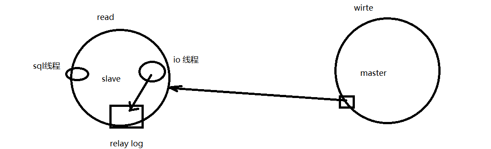

## Redis

### 数据类型

| 数据类型 |      可以存储的值      |                             操作                             |
| :------: | :--------------------: | :----------------------------------------------------------: |
|  STRING  | 字符串、整数或者浮点数 | 对整个字符串或者字符串的其中一部分执行操作</br> 对整数和浮点数执行自增或者自减操作 |
|   LIST   |          列表          | 从两端压入或者弹出元素 </br> 对单个或者多个元素进行修剪，</br> 只保留一个范围内的元素 |
|   SET    |        无序集合        | 添加、获取、移除单个元素</br> 检查一个元素是否存在于集合中</br> 计算交集、并集、差集</br> 从集合里面随机获取元素 |
|   HASH   | 包含键值对的无序散列表 | 添加、获取、移除单个键值对</br> 获取所有键值对</br> 检查某个键是否存在 |
|   ZSET   |        有序集合        | 添加、获取、删除元素</br> 根据分值范围或者成员来获取元素</br> 计算一个键的排名 |

## 基础知识

### 基础架构


### 关系型和非关系型

#### 关系型

- 使用表结构，支持SQL和复杂查询
- 读写性能差，硬盘IO是瓶颈

#### 非关系型

- 非关系型基于键值对，不需要经过SQL层的解析，性能高
- 无事务的处理

### 数据库连接池的作用

- 资源复用：避免创建、释放连接引起的性能开销
- 加快响应速度
- 统一连接管理，避免资源泄露

### MVCC

> https://www.cnblogs.com/delav/p/9683908.html

MVCC（Multi-Version Concurrent Control），即多版本并发控制，通过保存数据在某个时间点的快照来实现，因此每个读操作都会看到一个一致性的视图，并且可以实现非阻塞的读。MVCC允许数据具有多个版本，这个版本可以是时间戳或者是全局递增的事务ID，在同一个时间点，不同的事务看到的数据是不同的。

## 存储引擎

### 引擎介绍

> https://blog.csdn.net/qq_35642036/article/details/82820178

目前MySQL默认的存储引擎是InnoDB。

是否要支持事务，如果要请选择innodb，如果不需要可以考虑MyISAM；

1. MyISAM更适合读密集的表，而InnoDB更适合写密集的表。
   在数据库做主从分离的情况下，经常选择MyISAM作为主库的存储引擎。
2. 系统奔溃后，MyISAM恢复起来更困难，能否接受；

**InnoDB为什么推荐使用自增ID作为主键？**

  答：自增ID可以保证每次插入时B+索引是从右边扩展的，可以避免B+树和频繁合并和分裂（对比使用UUID）。如果使用字符串主键和随机主键，会使得数据随机插入，效率比较差。

### InnoDB和MyISAM二者区别

#### 事务

InnoDB支持事务，MyISAM不支持。

对于InnoDB每一条SQL语言都默认封装成事务，自动提交，这样会影响速度。

为什么InnoDB支持事务，MyISAM不支持事务？

原因：

- MyISAM使用表级锁，InnoDB是行级锁。在表级锁情况下，事务对多行进行操作，无法实现。
- 事务进行中，有undolog临时表，对一行进行多次操作，也是在多次操作结束后写入表中

#### 外键

InnoDB支持外键，而MyISAM不支持。

对一个包含外键的InnoDB表转为MYISAM会失败

#### 聚集索引

InnoDB是聚集索引，数据和主键绑定；MyISAM是非聚集索引，索引保存数据文件的指针。

InnoDB是聚集索引，使用B+Tree作为索引结构，数据文件是和（主键）索引绑在一起的（表数据文件本身就是按B+Tree组织的一个索引结构），必须要有主键，通过主键索引效率很高。但是辅助索引需要两次查询，先查询到主键，然后再通过主键查询到数据。因此，主键不应该过大，因为主键太大，其他索引也都会很大。


MyISAM是非聚集索引，也是使用B+Tree作为索引结构，索引和数据文件是分离的，索引保存的是数据文件的指针。主键索引和辅助索引是独立的。


也就是说：InnoDB的B+树主键索引的叶子节点就是数据文件，辅助索引的叶子节点是主键的值；而MyISAM的B+树主键索引和辅助索引的叶子节点都是数据文件的地址指针。

#### 锁

InnoDB支持表、行(默认)级锁，而MyISAM支持表级锁

InnoDB的行锁是实现在索引上的，而不是锁在物理行记录上。潜台词是，如果访问没有命中索引，也无法使用行锁，将要退化为表锁。

```sql
例如：
    t_user(uid, uname, age, sex) innodb;
    uid PK
    无其他索引
   	/* 命中索引，行锁。*/
    update t_user set age=10 where uid=1;  
    /* 未命中索引，表锁。*/
    update t_user set age=10 where uid != 1;           
 		/*无索引，表锁。*/
    update t_user set age=10 where name='chackca';    
```

### InnoDB MVCC实现原理

借助Undo Log

每一行记录都有两个隐藏列： DATA_TRX_ID 、 DATA_ROLL_PTR （如果没有主键，则还会多一个隐藏的主键列）。


DATA_TRX_ID：记录最近**更新这条行记录的 事务 ID** ，大小为 6 个字节

DATA_ROLL_PTR：表示**指向该行回滚段 （rollback segment） 的指针**

DB_ROW_ID：行标识（隐藏单调自增 ID ），大小为 6 字节，如果表没有主键， InnoDB 会自动生成一个隐藏主键， 因此会出现这个列。

## 日志系统

### binlog（归档日志）

执行记录：binlog

select 语句在binlog中没有，insert、update、delete都有

对事务的回滚：undolog

binlog回滚：拿到前一天24：00的数据，然后执行之后的binlog数据

### redo log（重做日志）

有了 redo log，InnoDB 就可以保证即使数据库发生异常重启，之前提交的记录都不会丢失，这个能力称为**crash-safe**。

### 区别

1. redo log 是 InnoDB 引擎特有的；binlog 是 MySQL 的 Server 层实现的，所有引擎都可以使用。
2. redo log 是物理日志，记录的是“在某个数据页上做了什么修改”；binlog 是逻辑日志，记录的是这个语句的原始逻辑，比如“给 ID=2 这一行的 c 字段加 1 ”。
3. redo log 是循环写的，空间固定会用完；binlog 是可以追加写入的。“追加写”是指 binlog 文件写到一定大小后会切换到下一个，并不会覆盖以前的日志。
4. binlog可以作为恢复数据使用，主从复制搭建，redo log作为异常宕机或者介质故障后的数据恢复使用。

### update 语句执行流程

1. 执行器先找引擎取 ID=2 这一行。ID 是主键，引擎直接用树搜索找到这一行。如果 ID=2 这一行所在的数据页本来就在内存中，就直接返回给执行器；否则，需要先从磁盘读入内存，然后再返回。
2. 执行器拿到引擎给的行数据，把这个值加上 1，比如原来是 N，现在就是 N+1，得到新的一行数据，再调用引擎接口写入这行新数据。
3. 引擎将这行新数据更新到内存中，同时将这个更新操作记录到 redo log 里面，此时 redo log 处于 prepare 状态。然后告知执行器执行完成了，随时可以提交事务。
4. 执行器生成这个操作的 binlog，并把 binlog 写入磁盘。
5. 执行器调用引擎的提交事务接口，引擎把刚刚写入的 redo log 改成提交（commit）状态，更新完成。


### 两阶段提交

如果不使用“两阶段提交”，那么数据库的状态就有可能和用它的日志恢复出来的库的状态不一致。

### 数据库主从模式



master主动通知slave有数据更新，slave接收到数据后，写到relay log中

relay log：binlog的增量？


## 事务隔离

### 事务的ACID

（四大特性都要能够举例说明，理解透彻，比如原子性和一致性的关联，隔离性不好会出现的问题）

> https://blog.csdn.net/zh521zh/article/details/69400053

原子性（Atomicity）：事务包含的所有操作要么全部成功，要么全部失败回滚

- 事务的执行，如何保证原子性？先把操作写到undo log临时表中，然后一起写入到表中

一致性（Consistency）：事务必须使数据库从一个一致性状态转变为另一个一致性状态，即执行前后都是满足一致性。如转账操作。

隔离性（Isolation）：并发的事务之间要相互隔离，不能相互干扰。 

持久性（Durability）：事务被提交后，数据库中数据的修改是永久的，即使故障也不会丢失对事务的操作。

### 隔离级别的理解


- 读未提交是指，一个事务还没提交时，它做的变更就能被别的事务看到。V1、V2、V3 都是 2。无视图概念
- 读提交是指，一个事务提交之后，它做的变更才会被其他事务看到。 V1 是 1，V2、V3 都是 2。视图创建于每个SQL语句开始执行时。
- 可重复读是指，一个事务执行过程中看到的数据，总是跟这个事务在启动时看到的数据是一致的。当然在可重复读隔离级别下，未提交变更对其他事务也是不可见的。 V1、V2 是 1，V3 是 2。视图在事务启动时创建的。
- 串行化，顾名思义是对于同一行记录，“写”会加“写锁”，“读”会加“读锁”。当出现读写锁冲突的时候，后访问的事务必须等前一个事务执行完成，才能继续执行。 V1、V2 值是 1，V3 是2。

### 四种隔离级别

| 事务隔离级别                 | 脏读 | 不可重复读 | 幻读 |
| ---------------------------- | ---- | ---------- | ---- |
| 读未提交（read-uncommitted） | 是   | 是         | 是   |
| 不可重复读（read-committed） | 否   | 是         | 是   |
| 可重复读（repeatable-read）  | 否   | 否         | 是   |
| 串行化（serializable）       | 否   | 否         | 否   |

> https://www.cnblogs.com/jian-gao/p/10795407.html

4种隔离级别限定事务内外的哪些改变是可见的，哪些是不可见的。低级别的隔离级一般支持更高的并发处理，并拥有更低的系统开销。

**Read Uncommitted（读未提交）**

在该隔离级别，所有事务都可以看到其他未提交事务的执行结果。本隔离级别很少用于实际应用，因为它的性能也不比其他级别好多少。读取未提交的数据，也被称之为脏读（Dirty Read）。

**Read Committed（读提交）**

这是大多数数据库系统的默认隔离级别（但不是MySQL默认的）。它满足了隔离的简单定义：一个事务只能看见已经提交事务所做的改变。

这种隔离级别 也支持所谓的不可重复读（Nonrepeatable Read），因为同一事务的其他实例在该实例处理其间可能会有新的commit，所以同一select可能返回不同结果。

**Repeatable Read（可重复读）**

这是MySQL的默认事务隔离级别，它确保同一事务的多个实例在并发读取数据时，会看到同样的数据行。

不过理论上，这会导致另一个棘手的问题：幻读 （Phantom Read）。简单的说，幻读指当用户读取某一范围的数据行时，另一个事务又在该范围内**插入了新行**，当用户再读取该范围的数据行时，会发现有新的“幻影” 行。InnoDB和Falcon存储引擎通过多版本并发控制（MVCC，Multiversion Concurrency Control）机制解决了该问题。 

解决幻读：将两行记录间的空隙加上锁，阻止新记录的插入；这个锁称为间隙锁。

**Serializable（串行化）**

这是最高的隔离级别，它通过强制事务排序，使之不可能相互冲突，从而解决幻读问题。简言之，它是在每个读的数据行上加上共享锁。在这个级别，可能导致大量的超时现象和锁竞争。

### 三种异常

- 脏读：当前事务(A)中可以读到其他事务(B)未提交的数据（脏数据），这种现象是脏读。
- 不可重复读：在事务A中先后两次读取同一个数据，两次读取的结果不一样，这种现象称为不可重复读。
- 幻读：在事务A中按照某个条件先后两次查询数据库，两次查询结果的条数不同，这种现象称为幻读。

脏读与不可重复读的**区别**：前者读到的是其他事务**未提交的数据**，后者读到的是其他事务**已提交的数据**。

不可重复读和幻读的**区别**：

（1）不可重复读是读取了其他事务更改的数据，针对 **update** 操作 解决：使用行级锁，锁定该行，事务 A 多次读取操作完成后才释放该锁，这个时候才允许其他事务更改刚才的数据。 

（2）幻读是读取了其他事务新增的数据，针对 **insert 与 delete** 操作 解决：使用表级锁，锁定整张表，事务 A 多次读取数据总量之后才释放该锁，这个时候才允许其他事务新增数据。

幻读和不可重复读都是指的一个事务范围内的操作受到其他事务的影响了。只不过幻读是重点在插入和删除，不可重复读重点在修改

### 幻读

> https://segmentfault.com/a/1190000016566788?utm_source=tag-newest

可以在 `RR` 下根据业务需求决定是否加锁，存在幻读风险我们加锁，不存在就不加锁

定义：幻读，并不是说两次读取获取的结果集不同，幻读侧重的方面是某一次的 select 操作得到的结果所表征的数据状态无法支撑后续的业务操作。更为具体一些：select 某记录是否存在，不存在，准备插入此记录，但执行 insert 时发现此记录已存在，无法插入，此时就发生了幻读。

### 并发事务问题

1. 可以**交给应用**解决更新丢失(Lost Update)

2. 需要**数据库提供事务间的隔离机制**来解决 脏读(Dirty Reads) 不可重复读(Non-Repeatable Reads) 幻读(Phantom Reads)

3. 实现隔离机制的方法主要有两种

   1) 加读写锁

   2) 一致性快照读，即 MVCC, MVCC只在repeatable read和read committed两个隔离级别下工作。

## 数据库锁

乐观锁和悲观锁？

### 行级锁,表级锁,页级锁

按照锁的粒度从细到粗，把数据库锁分为行级锁(InnoDB引擎)、表级锁(MyISAM引擎)和页级锁(BDB引擎)。

#### 行级锁

适用于更改一条数据的多个属性

行级锁是MySQL中锁定粒度最细的一种锁

特点：开销大，加锁慢；会出现死锁；锁定粒度最小，发生锁冲突的概率最低，并发度也最高。

#### 表级锁

插入一条数据

MyISAM的基础单位

特点：开销小，加锁快；不会出现死锁；锁定粒度大，发出锁冲突的概率最高，并发度最低。

#### 页级锁

特点：开销和加锁时间界于表锁和行锁之间；会出现死锁；锁定粒度界于表锁和行锁之间，并发度一般


### 锁的类型

ＭySQL的表锁有两种模式：

- 表共享读锁（Table Read Lock）

- 表独占写锁（Table Write Lock）

InnoDB两种类型的**行锁**：

- 共享锁（S）：允许一个事务去读一行，**阻止其他事务**获得相同数据集的**排他锁**。

- 排他锁（Ｘ）：允许获取排他锁的事务更新数据，**阻止其他事务**取得相同的数据集**共享读锁和排他写锁**。

InnoDB两种内部使用的意向锁（Intention Locks），这两种意向锁都是表锁。


## 索引

### 索引的实现原理

MyISAM 的 B+Tree 叶节点的 data 域存放的是**数据记录的地址**，数据存储在其他位置。支持全文索引

InnoDB 的 B+Tree 叶节点 data 存放**数据文件本身**，同时也是索引文件。不支持全文索引

原因：MyISAM可以把整个树一次性加载到内存中，InnoDB只能加载一部分树。

### 数据库的索引类型

> https://www.cnblogs.com/study-everyday/p/7391477.html

索引是对数据库表中一个或多个列（例如，employee 表的姓氏 (lname) 列）的值进行排序的结构。

缺点：占用空间；更新表时需要重建索引，导致降低速度。

#### 唯一索引： UNIQUE

例如：create unique index stusno on student（sno）；

表明此索引的每一个索引值只对应唯一的数据记录

#### 主键索引： primary key

通过其值唯一标识表中的每一行

#### 聚集索引（也叫聚簇索引）：cluster

在聚集索引中，表中行的物理顺序与列值（一般是主键的一列）的逻辑顺序相同。一个表只能包含一个聚集索引。 与非聚集索引相比，聚集索引通常提供更快的数据访问速度。

非聚集索引表中行的物理顺序与键值的逻辑顺序不匹配。

### 聚集索引和非聚集索引的区别

> https://www.cnblogs.com/s-b-b/p/8334593.html

聚集索引的叶子节点就是对应的数据节点

非聚集索引叶节点仍然是索引节点，只是有一个指针指向对应的数据块，此如果使用非聚集索引查询，而查询列中包含了其他该索引没有覆盖的列，那么他还要进行第二次的查询，查询节点上对应的数据行的数据。

1. 使用聚集索引的查询效率要比非聚集索引的效率要高，但是如果需要频繁去改变聚集索引的值，写入性能并不高，因为需要移动对应数据的物理位置。
2. 非聚集索引尽量避免二次查询，可以大幅提升性能。
3. 不是所有的表都适合建立索引，只有数据量大表才适合建立索引，且建立在选择性高的列上面性能会更好。

### 唯一性索引和主键约束的区别

> [csdnblog](https://blog.csdn.net/wushuang5566110/article/details/8069997?utm_medium=distribute.pc_relevant_t0.none-task-blog-2%7Edefault%7EBlogCommendFromMachineLearnPai2%7Edefault-1.control&depth_1-utm_source=distribute.pc_relevant_t0.none-task-blog-2%7Edefault%7EBlogCommendFromMachineLearnPai2%7Edefault-1.control)

主键是一种约束，唯一索引是一种索引，两者在本质上是不同的。

主键创建后一定包含一个唯一性索引，唯一性索引并不一定就是主键。

主键约束（PRIMARY KEY）

1) 主键用于唯一地标识表中的每一条记录，可以定义一列或多列为主键。 
2) 是不可能（或很难）更新． 
3) 主键列上没有任何两行具有相同值（即重复值），不允许空（NULL）．
4) 主健可作外健，唯一索引不可；

### 索引的优缺点

什么时候使用索引，什么时候不能使用索引（重点）

> https://blog.csdn.net/weixin_44535476/article/details/89256755

优点：检索速度；唯一性、表与表之间的连接性等。

缺点：时间、空间。

使用索引：查询操作多的时候。

不使用索引：规模小的表、很少使用的列、数据值少的列

修改性能远和检索性能是冲突的，经常会被批量更新的表可以具有索引，但批量操作的性能会由于索引而降低。

### 索引的底层实现

（B+树，为何不采用红黑树，B树）

B+树和B树相比红黑树更矮，查询遍历的节点更少

B+树相对B树，将数据全部存在在叶子节点，非叶节点（索引部分）更加灵活

### 索引最左前缀问题？


## 还没看

### Mysql的表空间方式，各自特点


### 分布式事务

### 数据库的范式

### 数据的锁的种类，加锁的方式

### 视图的作用与使用方法（如何删除等）

### 分库分表，主从复制，读写分离。（我不会，也没碰到过）

### 项目中哪里用到了数据库，怎么用的

### Memcache和Redis了解

### 数据库索引的作用

### 数据库熟悉吗？（不熟悉啊，没关系，我问几个问题）知道索引吗？在什么场景下用索引，索引有什么好处，有什么缺点？

### 索引使用什么数据结构实现的

### 数据库事务介绍一下

### 数据库引擎了解吗

### 各种索引的理解（头条，小米，腾讯）

### 各种日志的理解（头条，小米）

### 怎么看哪一个查询是慢查询（头条）

### Redis的跳表（头条）

### Redis的持久化（小米，头条）

### Redis和Mem..的区别（小米，腾讯）

### 数据库三个重要范式

### mysql索引为什么用B+树

### mysql 事务

### 引擎

### mysql具体语句（跪了）

### 空间数据库和普通的关系型数据库查询sql有什么区别

### 如果在三维空间里面有一条直线，要你在数据库中查找哪些点落在这条线上，假设每行数据都是一个点，你会怎么做

### 关系型数据库中要快速查找某一个年龄的数量，假设有1亿条数据，你会怎么设计表，怎么设计索引

### 第三范式了解吗 

### redis可以用来做什么，掉电数据如何恢复

### 数据库死锁的场景，怎么解决，操作系统的死锁，怎么解决

### 如何实现一个CDN系统

### 数据库的ACID四种属性的底层实现原理

### 如何实现一个缓存系统

### 海量词汇统计出现频率

### 项目性能瓶颈在哪，数据库表怎么设计

### 假设项目的性能瓶颈出现在写数据库上，应该怎么解决峰值时写速度慢的问题

### 假设数据库需要保存一年的数据，每天一百万条数据，一张表最多存一千万条数据，应该怎么设计表

### 一亿条电话号码删除重复的部分，时间、空间复杂度尽可能低

### MongoDB如何实现事务，事务的隔离级别

### MongoDB副本集实现高可用的原理，raft过程，投票规则，日志复制的过程，rocksdb引擎的优点，LSM树讲解

### MongoDB高可用架构的原理


## ref

- MySQL 的学习资源史上最全：https://learnku.com/articles/40174
- 《MySQL是怎样运行的》 [链接](https://shidongxu0312.github.io/2019/11/13/MySQL-%E6%98%AF%E6%80%8E%E6%A0%B7%E8%BF%90%E8%A1%8C%E7%9A%84-%E4%BB%8E%E6%A0%B9%E5%84%BF%E4%B8%8A%E7%90%86%E8%A7%A3-MySQL/)

## 
