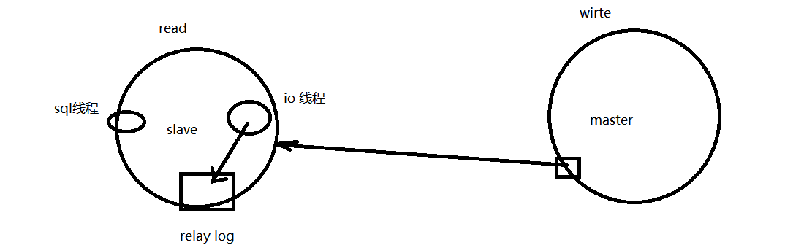

MySQL 的学习资源史上最全：https://learnku.com/articles/40174

《MySQL是怎样运行的》 [链接](https://shidongxu0312.github.io/2019/11/13/MySQL-%E6%98%AF%E6%80%8E%E6%A0%B7%E8%BF%90%E8%A1%8C%E7%9A%84-%E4%BB%8E%E6%A0%B9%E5%84%BF%E4%B8%8A%E7%90%86%E8%A7%A3-MySQL/)

## MySQL事务

### MySQL事务概念

- 在 MySQL 中只有使用了 Innodb 数据库引擎的数据库或表才支持事务。
- 事务处理可以用来维护数据库的完整性，保证成批的 SQL 语句要么全部执行，要么全部不执行。
- 事务用来管理 insert,update,delete 语句。

事务四大特征：

- 原子性（Atomicity，或称不可分割性）：一次操作多条数据，要么全部成功，要么全部不成功
  - 事务的执行，如何保证原子性？先把操作写到undo log临时表中，然后一起写入到表中
- 一致性（Consistency）
- 隔离性（Isolation，又称独立性）：多个事务同时执行，防止多个事务并发执行引起的交叉数据不一致问题
- 持久性（Durability）：事务处理后对数据的修改是永久的

### MySQL事务隔离级别

| 事务隔离级别                 | 脏读 | 不可重复读 | 幻读 |
| ---------------------------- | ---- | ---------- | ---- |
| 读未提交（read-uncommitted） | 是   | 是         | 是   |
| 不可重复读（read-committed） | 否   | 是         | 是   |
| 可重复读（repeatable-read）  | 否   | 否         | 是   |
| 串行化（serializable）       | 否   | 否         | 否   |

- 脏读：当前事务(A)中可以读到其他事务(B)未提交的数据（脏数据），这种现象是脏读。
- 不可重复读：在事务A中先后两次读取同一个数据，两次读取的结果不一样，这种现象称为不可重复读。
- 幻读：在事务A中按照某个条件先后两次查询数据库，两次查询结果的条数不同，这种现象称为幻读。

脏读与不可重复读的**区别**：前者读到的是其他事务**未提交的数据**，后者读到的是其他事务**已提交的数据**。

不可重复读和幻读的**区别**：

（1）不可重复读是读取了其他事务更改的数据，针对 **update** 操作 解决：使用行级锁，锁定该行，事务 A 多次读取操作完成后才释放该锁，这个时候才允许其他事务更改刚才的数据。 

（2）幻读是读取了其他事务新增的数据，针对 **insert 与 delete** 操作 解决：使用表级锁，锁定整张表，事务 A 多次读取数据总量之后才释放该锁，这个时候才允许其他事务新增数据。

幻读和不可重复读都是指的一个事务范围内的操作受到其他事务的影响了。只不过幻读是重点在插入和删除，不可重复读重点在修改

### 并发事务问题

1. 可以**交给应用**解决更新丢失(Lost Update)

2. 需要**数据库提供事务间的隔离机制**来解决 脏读(Dirty Reads) 不可重复读(Non-Repeatable Reads) 幻读(Phantom Reads)

3. 实现隔离机制的方法主要有两种

   1) 加读写锁

   2) 一致性快照读，即 MVCC, MVCC只在repeatable read和read committed两个隔离级别下工作。

### 行级锁,表级锁,页级锁

按照锁的粒度从细到粗，把数据库锁分为行级锁(InnoDB引擎)、表级锁(MyISAM引擎)和页级锁(BDB引擎)。

#### 行级锁

适用于更改一条数据的多个属性

行级锁是MySQL中锁定粒度最细的一种锁

特点：开销大，加锁慢；会出现死锁；锁定粒度最小，发生锁冲突的概率最低，并发度也最高。

#### 表级锁

插入一条数据

MyISAM的基础单位

特点：开销小，加锁快；不会出现死锁；锁定粒度大，发出锁冲突的概率最高，并发度最低。

#### 页级锁

特点：开销和加锁时间界于表锁和行锁之间；会出现死锁；锁定粒度界于表锁和行锁之间，并发度一般

#### 为什么InnoDB支持事务，MyISAM不支持事务

原因：MyISAM使用表级锁，InnoDB是行级锁

在表级锁情况下，事务对多行进行操作，无法实现

事务进行中，有undolog临时表，对一行进行多次操作，也是在多次操作结束后写入表中

### 锁的类型

ＭySQL的表锁有两种模式：

- 表共享读锁（Table Read Lock）

- 表独占写锁（Table Write Lock）

InnoDB两种类型的**行锁**：

- 共享锁（S）：允许一个事务去读一行，**阻止其他事务**获得相同数据集的**排他锁**。

- 排他锁（Ｘ）：允许获取排他锁的事务更新数据，**阻止其他事务**取得相同的数据集**共享读锁和排他写锁**。

InnoDB两种内部使用的意向锁（Intention Locks），这两种意向锁都是表锁。

### InnoDB MVCC实现原理

借助Undo Log

每一行记录都有两个隐藏列： DATA_TRX_ID 、 DATA_ROLL_PTR （如果没有主键，则还会多一个隐藏的主键列）。

DATA_TRX_ID：记录最近**更新这条行记录的 事务 ID** ，大小为 6 个字节

DATA_ROLL_PTR：表示**指向该行回滚段 （rollback segment） 的指针**

DB_ROW_ID：行标识（隐藏单调自增 ID ），大小为 6 字节，如果表没有主键， InnoDB 会自动生成一个隐藏主键， 因此会出现这个列。

## MySQL索引

table里有10000条数据，在MySQL如何存储？

B+树：所有的数据都存储在叶子节点

### 索引分类

#### 根据存储分类

- B-树索引

- 哈希索引

根据用途分类：普通索引,唯一性索引,主键索引,空间索引,全文索引

#### 索引的实现原理

MyISAM 引擎使用 B+Tree 作为索引结构，**叶节点的 data 域**存放的是数据记录的**地址**，数据存储在其他位置。支持全文索引

InnoDB 也使用 B+Tree 作为索引结构，InnoDB 的**数据文件本身就是索引文件**。不支持全文索引（原因？）

MyISAM可以把整个树一次性加载到内存中，InnoDB只能加载一部分树。

## MySQL binlog

执行记录：binlog

`select * from teacher;` 在binlog中没有，insert、update、delete都有

对事务的回滚：undolog

binlog回滚：拿到前一天24：00的数据，然后执行之后的binlog数据

数据库主从模式：

master主动通知slave有数据更新，slave接收到数据后，写到relay log中

relay log：binlog的增量？

