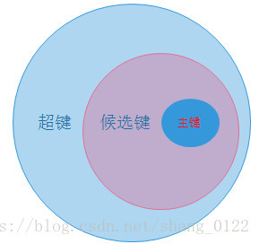
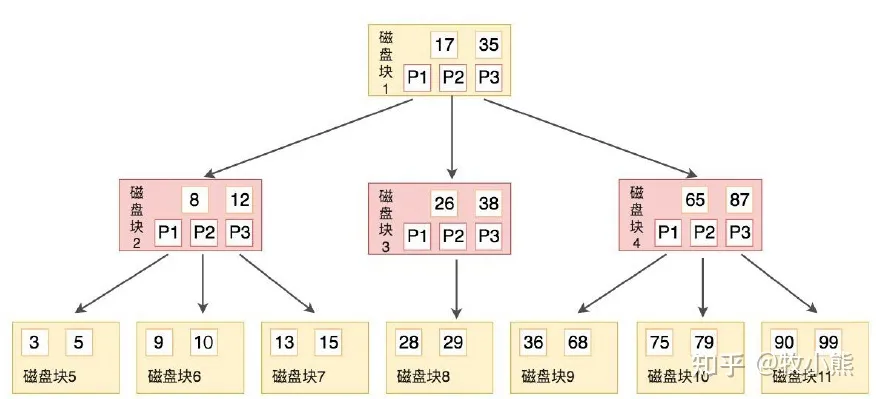
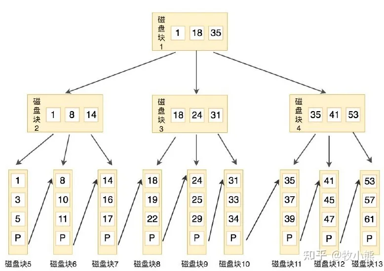

> https://mp.weixin.qq.com/s/P63Ct4qYGLC4tWP92fW33g

## MySQL数据库-基础知识

### 1.说说主键、外键、超键、候选键的差别并举例

- 超键(super key): 在关系中能唯一标识元组的属性集称为关系模式的超键。
- 候选键(candidate key): 不含有多余属性的超键称为候选键。也就是在候选键中，若再删除属性，就不是键了！
- 主键(primary key): 用户选作元组标识的一个候选键程序主键。
- 外键(foreign key)：如果关系模式R中属性K是其它模式的主键，那么k在模式R中称为外键。

举个例子，对于 学生信息（学号 身份证号 性别 年龄 身高 体重 宿舍号）和 宿舍信息（宿舍号 楼号）：

- 超键：只要含有“学号”或者“身份证号”两个属性的集合就叫超键，例如R1（学号 性别）、R2（身份证号 身高）、R3（学号 身份证号）等等都可以称为超键！
- 候选键：不含有多余的属性的超键，比如（学号）、（身份证号）都是候选键，又比如R1中学号这一个属性就可以唯一标识元组了，而有没有性别这一属性对是否唯一标识元组没有任何的影响！
- 主键：就是用户从很多候选键选出来的一个键就是主键，比如你要求学号是主键，那么身份证号就不可以是主键了！
- 外键：宿舍号就是学生信息表的外键。



### 2.为什么一般用自增列作为主键？

- 如果表使用自增主键，那么每次插入新的记录，记录就会顺序添加到当前索引节点的后续位置，当一页写满，就会自动开辟一个新的页。
- 如果使用非自增主键（如果身份证号或学号等），由于每次插入主键的值近似于随机，因此每次新记录都要被插到现有索引页的中间某个位置，此时MySQL不得不为了将新记录插到合适位置而移动数据，这增加了很多开销，同时会增加大量的碎片。

### 3.触发器的作用？

- 安全性，可以基于数据库的值使用户具有操作数据库的某种权利。
- 审计，可以跟踪用户对数据库的操作。
- 实现复杂的非标准的数据库相关完整性规则，触发器可以对数据库中相关的表进行连环更新。
- 触发器能够拒绝或回退那些破坏相关完整性的变化，取消试图进行数据更新的事务。当插入一个与其主键不匹配的外部键时，这种触发器会起作用。

### 4.什么是存储过程？优缺点是什么？与函数的区别是什么？

存储过程是一个预编译的SQL语句，优点是允许模块化的设计，就是说只需创建一次，以后在该程序中就可以调用多次。

优点：

- 存储过程是预编译过的，执行效率高。
- 存储过程的代码直接存放于数据库中，通过存储过程名直接调用，减少网络通讯。
- 安全性高，执行存储过程需要有一定权限的用户。
- 存储过程可以重复使用，可减少工作量冗余。

缺点：移植性差

与函数的区别:

- 存储过程用户在数据库中完成特定操作或者任务（如插入，删除等），函数用于返回特定的数据。
- 存储过程声明用procedure，函数用function。
- 存储过程不需要返回类型，函数必须要返回类型。
- 存储过程可作为独立的pl-sql执行，函数不能作为独立的plsql执行，必须作为表达式的一部分。
- 存储过程只能通过out和in/out来返回值，函数除了可以使用out，in/out以外，还可以使用return返回值。
- sql语句（DML或SELECT)中不可用调用存储过程，而函数可以。

### 5.什么是视图，优缺点是什么？

视图：是一种虚拟的表，具有和物理表相同的功能。可以对视图进行增，改，查，操作，试图通常是有一个表或者多个表的行或列的子集。对视图的修改会影响基本表。

优点：

- 对数据库的访问，因为视图可以有选择性的选取数据库里的一部分。
- 用户通过简单的查询可以从复杂查询中得到结果。
- 维护数据的独立性，试图可从多个表检索数据。
- 对于相同的数据可产生不同的视图。

缺点：

查询视图时，必须把视图的查询转化成对基本表的查询，如果这个视图是由一个复杂的多表查询所定义，那么，那么就无法更改数据。

### 6.说说drop、truncate、 delete区别

- drop直接删掉表。
- truncate删除表中数据，再插入时自增长id又从1开始。
- delete删除表中数据，可以加where字句。

### 7.什么是临时表，临时表什么时候删除？

临时表可以手动删除：

```
DROP TEMPORARY TABLE IF TEXITS temp_tb
```

临时表只在当前连接可见，当关闭连接时，MySQL会自动删除表并释放所有空间。因此在不同的连接中可以创建同名的临时表，并且操作属于本连接的临时表。创建临时表的语法与创建表语法类似，不同之处是增加关键字TEMPORARY：

```
CREATE TEMPORARY TABLE tmp_table (
NAME VARCHAR (10) NOT NULL,
time date NOT NULL
);
select * from tmp_table;
```

### 8.关系型数据库和非关系型数据库的优劣？

非关系型数据库以redis为例，NOSQL是基于键值对的，而且不需要经过SQL层的解析，所以性能高，查询速度快。同时由于是键值对，数据之间没有耦合，容易水平扩展。

关系数据库：使用SQL语句方便在多个表之间做复杂查询，同时有较好的事务支持，支持对安全性有一定要求的数据访问。

### 9.什么是数据库范式？

- 第一范式:(确保每列保持原子性)所有字段值都是不可分解的原子值。
- 第二范式:(确保表中的每列都和主键相关)在一个数据库表中，一个表中只能保存一种数据，不可以把多种数据保存在同一张数据库表中，数据表里的非主属性都要和这个数据表的候选键有完全依赖关系。
- 第三范式:(确保每列都和主键列直接相关,而不是间接相关) 数据表中的每一列数据都和主键直接相关，而不能间接相关。
- 第四范式:要求把同一表内的多对多关系删除。
- 第五范式:从最终结构重新建立原始结构。

需要注意的是，遵循数据库范式会一定程度影响数据库的查询效率，因此会存在反范式的优化。

### 10.什么是 内连接、外连接、交叉连接、笛卡尔积等?

- 内连接: 只连接匹配的行。
- 左外连接: 包含左边表的全部行（不管右边的表中是否存在与它们匹配的行），以及右边表中全部匹配的行。
- 右外连接: 包含右边表的全部行（不管左边的表中是否存在与它们匹配的行），以及左边表中全部匹配的行。
- 全外连接: 包含左、右两个表的全部行，不管另外一边的表中是否存在与它们匹配的行。
- 交叉连接: 生成笛卡尔积－它不使用任何匹配或者选取条件，而是直接将一个数据源中的每个行与另一个数据源的每个行都一一匹配。

### 11.varchar和char的区别？

- char的长度是不可变的，而varchar的长度是可变的。
- char的存取速度还是要比varchar要快得多，因为其长度固定，方便程序的存储与查找。
- char的存储方式是：对英文字符（ASCII）占用1个字节，对一个汉字占用两个字节。varchar的存储方式是：对每个英文字符占用2个字节，汉字也占用2个字节。

### 12.说说like % - 的区别

- %百分号通配符:表示任何字符出现任意次数(可以是0次)。
- 下划线通配符:表示只能匹配单个字符,不能多也不能少,就是一个字符。
- like操作符: LIKE作用是指示mysql后面的搜索模式是利用通配符而不是直接相等匹配进行比较。

### 13.索引、索引的作用和索引的优缺点是什么，什么样的字段适合建索引？

数据库索引，是数据库管理系统中一个排序的数据结构，索引的实现通常使用B树及其变种B+树。在数据之外，数据库系统还维护着满足特定查找算法的数据结构，这些数据结构以某种方式引用（指向）数据，这样就可以在这些数据结构上实现高级查找算法。这种数据结构，就是索引。

索引的作用：协助快速查询、更新数据库表中数据。

索引的优点：

- 索引可以保证数据每一行的唯一性
- 加快数据的检索速度

缺点：

- 创建和维护索引需要时间
- 索引需要占用物理空间，增加空间成本
- 对数据进行增、删、改的时候需要动态维护

唯一的，不为空的，经常被查询的字段适合建立索引

### 14.B+树的索引和Hash索引的区别？

hash索引是键值对的索引，检索效率非常高；B+树索引需要从根节点到枝节点索引，最后才能访问到数据。

为什么不都用Hash索引而使用B+树索引？

Hash索引仅仅能满足"=","IN"和""查询，不能使用范围查询，hash是索引也不能用来做排序操作，hash的索引不能利用部分索引键查询。

### 15.B树和B+树的区别，为什么MySQL会用B+树?

B树

B+树

B树，每个节点都存储key和data，所有节点组成这棵树，并且叶子节点指针为nul，叶子结点不包含任何关键字信息。

B+树，所有的叶子结点中包含了全部关键字的信息，及指向含有这些关键字记录的指针，且叶子结点本身依关键字的大小自小而大的顺序链接，所有的非终端结点可以看成是索引部分，结点中仅含有其子树根结点中最大（或最小）关键字。

为什么MySQL用B+树呢？

- B+ 树查询效率更稳定（因为因为B+ 树每次只有访问到叶子节点才能找到对应的数据 而在 B 树中 非叶子节点也会存储数据）
- B+ 树的查询效率更高 （因为通常B+ 树比 B 树更矮胖 阶数更大 深度更低 查询所需要的磁盘 I/O 也会更少 。同样的磁盘页大小 B+ 树可以存储更多的节点关键字）
- 对索引进行范围查询时 B+ 树效率也更高（因为所有关键字都出现在B+ 树的叶子节点中 并通过有序链表进行了链接 。而在 B 树中则需要通过中序遍历才能完成范围查找 效率要低很多）

关于B+树的索引可以参考五分钟学算法的讲解：【面试现场】为什么MySQL数据库要用B+树存储索引？

## MySQL数据库-专业知识

### 16.Mysql中有哪几种锁？

- 行级锁：锁定力度小，发生锁冲突概率低，实现并发度高，开销大，加锁慢，并发度高。
- 页级锁：加锁时间比行锁长，页级锁开销介于表锁和行锁之间，会出现死锁，并发度一般。
- 表级锁：开销小，加锁快。

### 17.Mysql中默认事务隔离级别是？

- 读未提交(RU): 一个事务还没提交时, 它做的变更就能被别的事务看到。
- 读提交(RC): 一个事务提交之后, 它做的变更才会被其他事务看到。
- 可重复读(RR): 一个事务执行过程中看到的数据, 总是跟这个事务在启动时看到的数据是一致的。当然在可重复读隔离级别下, 未提交变更对其他事务也是不可见的。
- 串行化(S): 对于同一行记录, 读写都会加锁. 当出现读写锁冲突的时候, 后访问的事务必须等前一个事务执行完成才能继续执行。

### 18.Mysql数据库表类型有哪些？

MyISAM、InnoDB、HEAP、BOB,ARCHIVE,CSV等。

MyISAM：成熟、稳定、易于管理，快速读取。一些功能不支持（事务等），表级锁。

InnoDB：支持事务、外键等特性、数据行锁定。空间占用大，不支持全文索引等。

### 19.简述mysql的MVCC机制

MVCC是一种多版本并发控制机制，是MySQL的InnoDB存储引擎实现隔离级别的一种具体方式，用于实现提交读和可重复读这两种隔离级别。

MVCC实现原理。通过保存数据在某个时间点的快照来实现该机制，其在每行记录后面保存两个隐藏的列，分别保存这个行的创建版本号和删除版本号，然后Innodb的MVCC使用到的快照存储在Undo日志中，该日志通过回滚指针把一个数据行所有快照连接起来。

### 20.简述MySQL 两种常见存储引擎：MyISAM与InnoDB

目前MySQL默认的存储引擎是InnoDB。

现在大多数时候我们使用的都是InnoDB，但是在某些情况下使用MyISAM更好，比如：MyISAM更适合读密集的表，而InnoDB更适合写密集的的表。在数据库做主从分离的情况下，经常选择MyISAM作为主库的存储引擎。

**二者的常见对比**

- count运算上的区别：因为MyISAM缓存有表meta-data（行数等），因此在做COUNT(*)时对于一个结构很好的查询是不需要消耗多少资源的。而对于InnoDB来说，则没有这种缓存。
- 是否支持事务和崩溃后的安全恢复：MyISAM 强调的是性能，每次查询具有原子性,其执行数度比InnoDB类型更快，但是不提供事务支持。但是InnoDB 提供事务支持事务，外部键等高级数据库功能。具有事务(commit)、回滚(rollback)和崩溃修复能力(crash recovery capabilities)的事务安全(transaction-safe (ACID compliant))型表。
- 是否支持外键：MyISAM不支持，而InnoDB支持。

