https://zhuanlan.zhihu.com/p/152233908

## 1 查找重复元素

### 重复学生名

#### 【本题考点】

1）考察思路，有两种解题方法，但是使用**having**语句的方法更高效。

2）考察对having语句的掌握，很多人会把聚合函数写到where子句中。

3）熟记SQL子句的书写顺序和运行顺序。

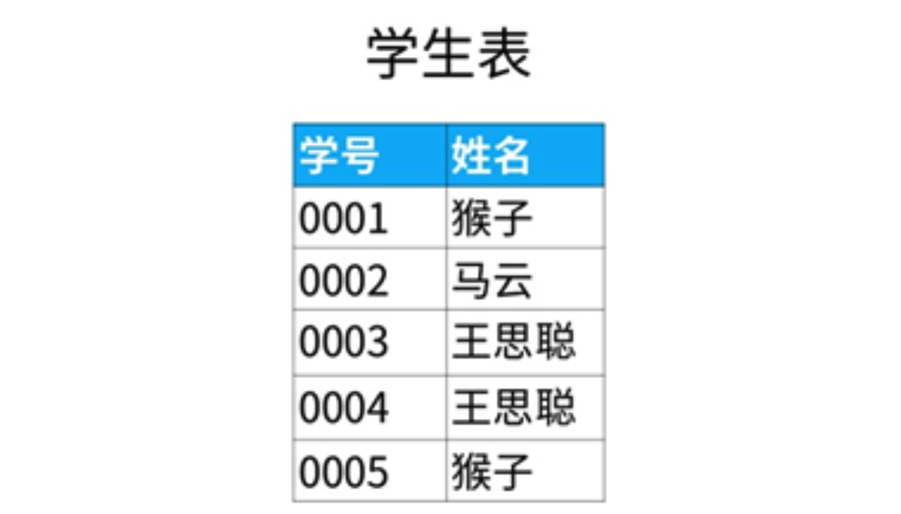

```mysql
select 姓名
from 学生表
group by 姓名
having count(姓名)>1
```

生成的表：


## 2 复杂查询

考察知识点：

- 分组汇总
- 子查询
- 标量子查询
- 关联子查询

### 查找第N高的数据

#### 【题目】

现在有“课程表”，记录了学生选修课程的名称以及成绩。

现在需要找出语文课中成绩第二高的学生成绩。

如果不存在第二高成绩的学生，那么查询应返回 null。

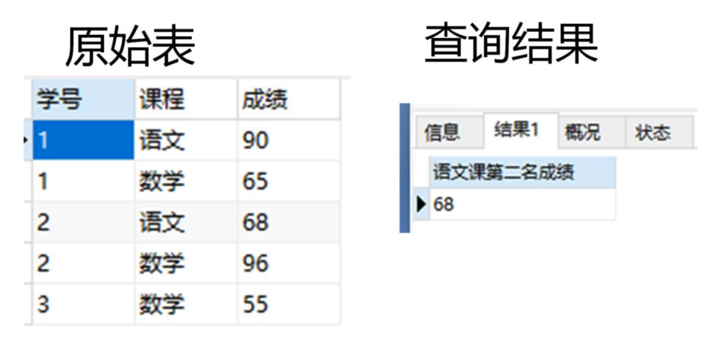

#### 解法1

找出成绩最高的，然后找出小于它的

```mysql
select max(distinct 成绩) 
from 成绩表
where 课程='语文' and
      成绩 < (select max(distinct 成绩) 
              from 成绩表 
              where 课程='语文');
```

#### 解法2

`limit n`子句表示查询结果返回前n条数据    

`offset n`表示跳过x条语句

`limit y offset x`分句表示查询结果跳过 x 条数据，读取前 y 条数据

使用limit和offset，降序排列再返回第二条记录可以得到第二大的值。

```mysql
select distinct 成绩  
from 成绩表
where 课程='语文'
order by 课程,成绩 desc
limit 1,1;
```

如果有空值，需要考虑

```mysql
select ifnull(第2步的sql,null) as '语文课第二名成绩';
```

## 3 多表查询：联结

**考察知识点**

> 什么是交叉联结？
> 什么是交叉联结？
> 什么是左联结？
> 什么是右联结？
> 什么是全联结？


### 查询所有学生的信息

**【题目】** 

现在有两个表，“学生表”记录了学生的基本信息，有“学号”、“姓名”。

“成绩”表记录了学生选修的课程，以及对应课程的成绩。

这两个表通过“学号”进行关联。

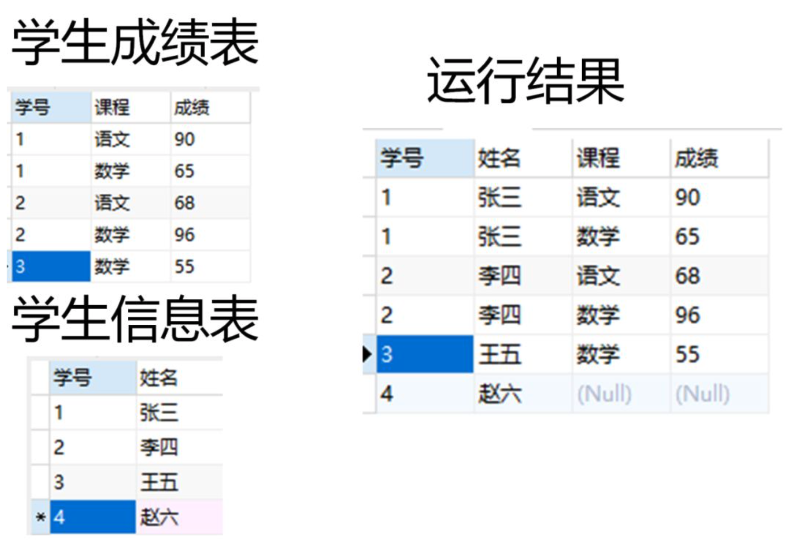

```mysql
select a.学号,a.姓名,b.课程,b.成绩
from 学生 as a
left join 成绩 as b
on a.学号=b.学号;
```

### 查询不在表里的数据

**【题目】**

下面是学生的名单，表名为“学生表”；近视学生的名单，表名为“近视学生表”。

请问不是近视眼的学生都有谁？

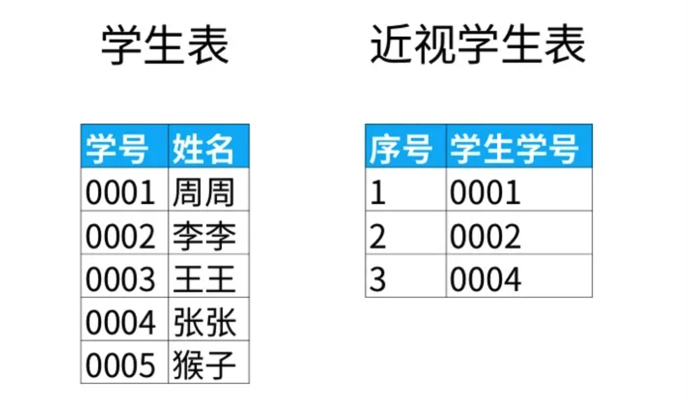

```mysql
select a.姓名 as 不近视的学生名单
from 学生表 as a
left join 近视学生表 as b
on a.学号=b.学号
where b.学号 is null;
```

### 多久没涨工资

#### 【题目】

“雇员表“中记录了员工的信息，“薪水表“中记录了对应员工发放的薪水。两表通过“雇员编号”关联。

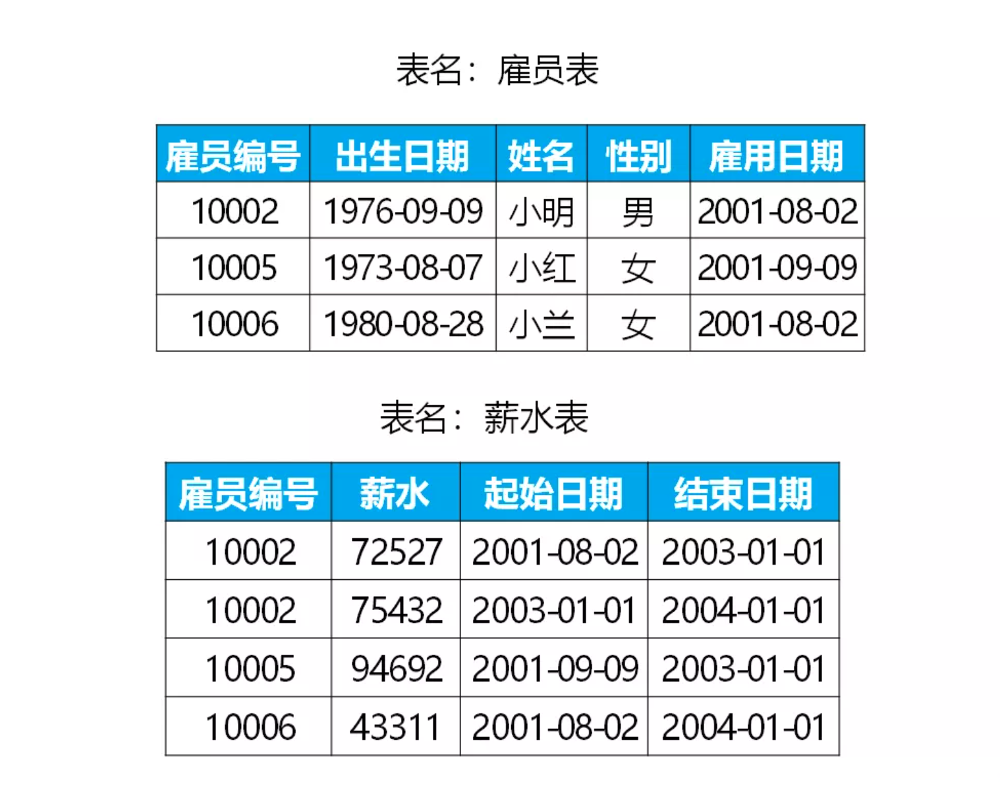

#### 【解题步骤】

**1. 当前薪水**

```mysql
select 雇员编号,薪水 as 当前薪水
from 薪水表
where 结束日期 = '2004-01-01';
```

**2. 入职薪水**

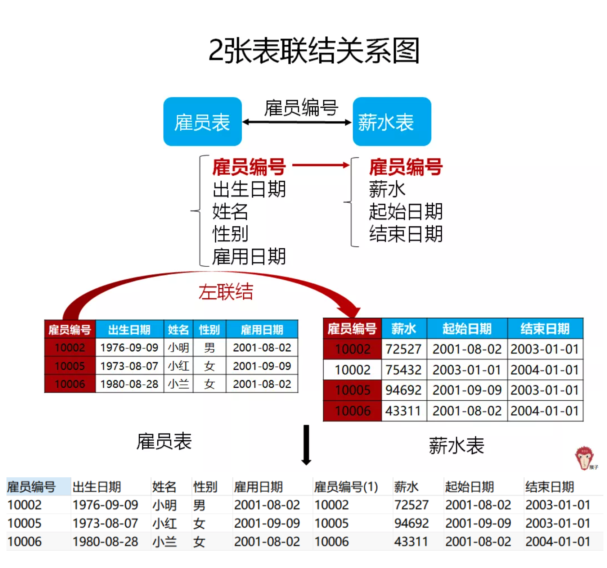

```mysql
select a.雇员编号,薪水 as 入职薪水
from 雇员表 as a 
left join 薪水表 as b
on a.雇员编号 = b.雇员编号
where a.雇用日期 = b.起始日期;
```

排除已离职

```sql
select a.雇员编号,薪水 as 入职薪水
from 雇员表 as a 
left join 薪水表 as b
on a.雇员编号 = b.雇员编号
where a.雇用日期 = b.起始日期 
	and a.雇员编号 in 
    (select 雇员编号
    from 薪水表
    where 结束日期 = '2004-01-01');
```

**3.薪水涨幅**

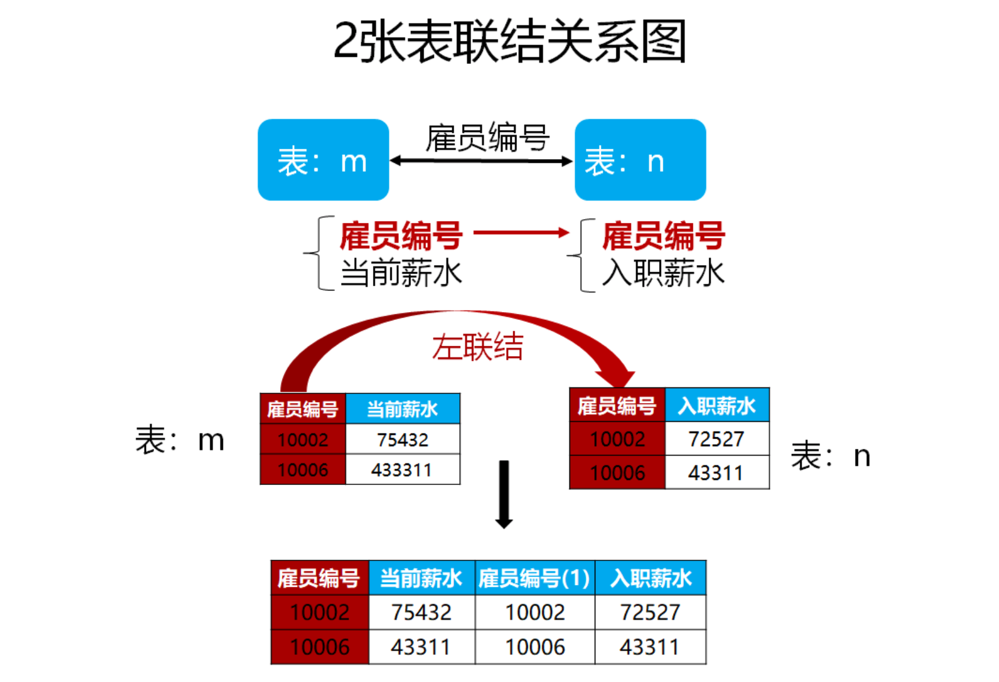

```sql
select m.雇员编号,当前薪水-入职薪水 as 薪水涨幅
from m
left join n
on m.雇员编号 = n.雇员编号;
```

**4.按薪水涨幅进行升序**

使用order by子句对查询结果排序。把表m和表n的sql代码代入，得到：

```sql
select m.雇员编号,当前薪水-入职薪水 as 薪水涨幅
from (select 雇员编号,薪水 as 当前薪水
			from 薪水表
			where 结束日期 = '2004-01-01') as m
left join (select a.雇员编号,薪水 as 入职薪水
            from 雇员表 as a 
            left join 薪水表 as b
            on a.雇员编号 = b.雇员编号
            where a.雇用日期 = b.起始日期 and a.雇员编号 in 
                (select 雇员编号
                from 薪水表
                where 结束日期 = '2004-01-01')) as n
on m.雇员编号 = n.雇员编号;
order by 薪水涨幅;
```

### 比较日期数据

#### **【题目】**

下面是某公司每天的营业额，表名为“日销”。“日期”这一列的数据类型是日期类型（date）。

请找出所有比前一天（昨天）营业额更高的数据。

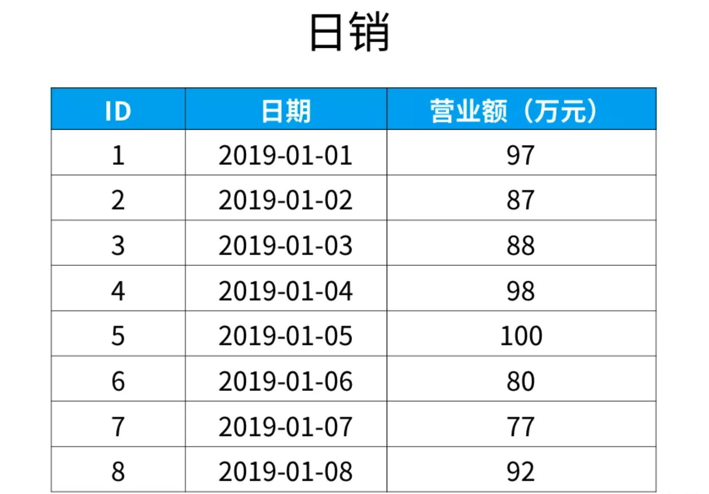

结果

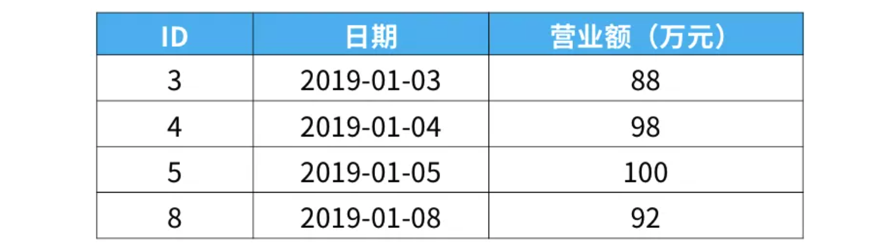

#### **【解题思路】**

1. 交叉联结 cross join

使用交叉联结会使两个表中的数据两两组合

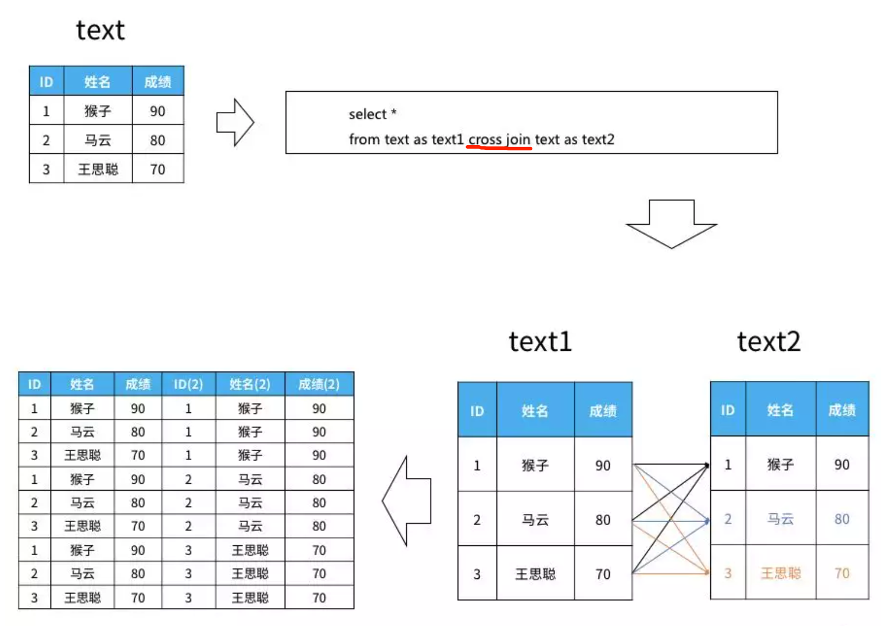

2. 如何找到前一天

`datediff(日期1, 日期2)` ：得到的结果是日期1-日期2 的天数。

`timestampdiff(时间类型, 日期1, 日期2)`：日期2 - 日期1 的时间差

在“时间类型”的参数位置，通过添加“day”, “hour”, “second”等关键词，来规定计算天数差、小时数差、还是分钟数差。

#### **【解题步骤】**

1. 找出日期差一天

```sql
select * from 日销 as a 
cross join 日销 as b
on datediff(a.日期, b.日期)=1;
```

2. 找出a中销售额大于b中销售额的数据

```sql
select * from 日销 as a 
cross join 日销 as b
on datediff(a.日期, b.日期)=1
where a.销售额 > b.销售额
```

3. 删除多余数据

```sql
select a.ID, a.日期, a.销售额（万元）from 日销 as a 
cross join 日销 as b 
on datediff(a.日期, b.日期) = 1
where a.销售额 > b.销售额;
```

## 4 多表查询：case

### 交换数据

#### **【题目】**

 ‘学生表’ 存放座位号和学生的信息。其中，座位号是连续递增的。总的座位数是偶数。

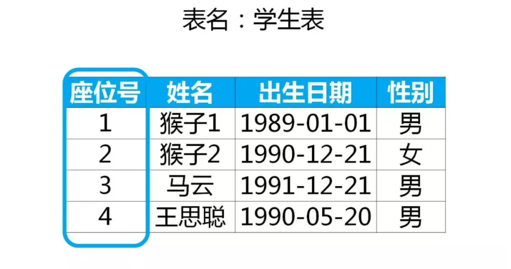

现在，改变相邻两个学生的座位，输出结果

#### **【解题思路】**

**第一步：理清换座位的逻辑**

查询目的是改变相邻学生的座位号。为了理清逻辑，在原表中插入一列叫做‘奇偶数’，对应表示“座位号”的值是“奇数”还是“偶数”。

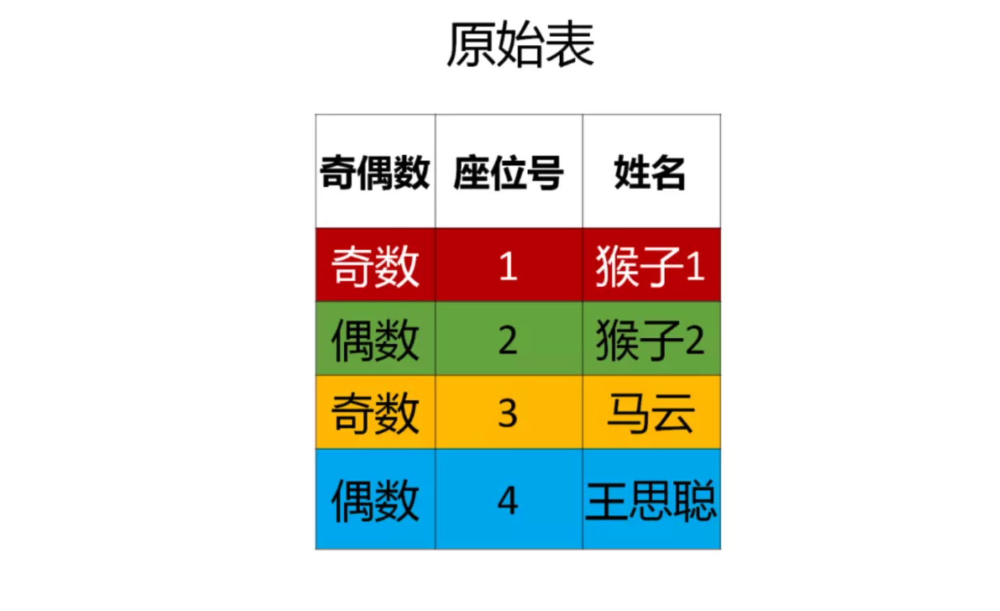

1）如果原来座位号是**奇数**的学生，换座位后，这名学生的座位号变为“座位号+1”。

2）如果原来座位号是**偶数**的学生，换座位后，这名学生的座位号变为“座位号-1”。

**第二步：判断奇偶数**

```sql
case
      when mod(座位号, 2) != 0  then  '奇数'
      when mod(座位号, 2)  = 0  then  '偶数'
end
```

把前面的逻辑写到sql里就是：

1）如果原来座位号是**奇数**的学生，换座位后，这名学生的座位号变为“座位号+1”**。**

2）如果原来座位号是**偶数**的学生，换座位后，这名学生的座位号变为“座位号-1”**。**

```sql
case
       when mod(座位号, 2) != 0  then 座位号 + 1
       when mod(座位号, 2)  = 0  then 座位号 - 1
end  as  '交换后座位号'
```

加入select字句，就是最好的结果：

```sql
select
      (case
             when mod(座位号, 2) != 0  then 座位号 + 1
             when mod(座位号, 2)  = 0  then 座位号 - 1
      end)  as  '交换后座位号',
      姓名
from 学生表;
```

#### 举一反三

最后一个座位号，等于表里有多少行，可以用count(*) 计算出来

```sql
select (
case
  when mode(id,2) != 0 and counts != id then id + 1
  when mode(id,2) != 0 and counts  = id then id
	else id - 1
end)
as id2, student from seat,
(select count(*) as counts from seat);
```

### 找出最小的N个数