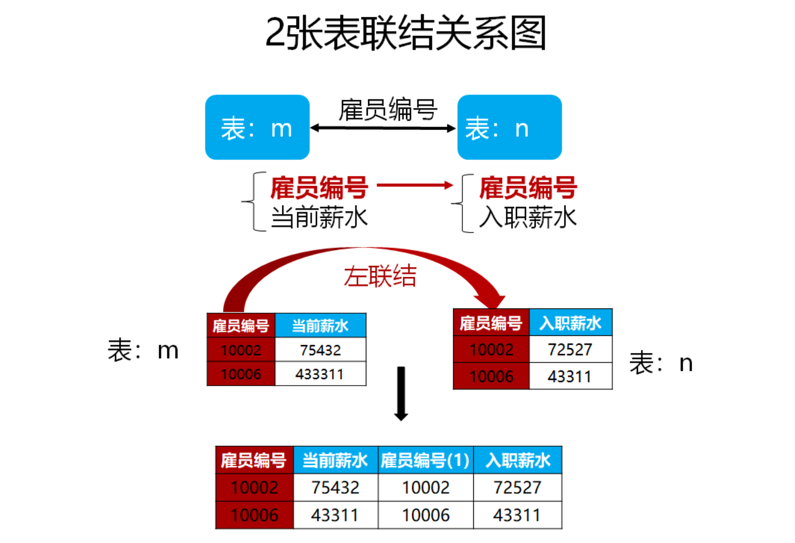
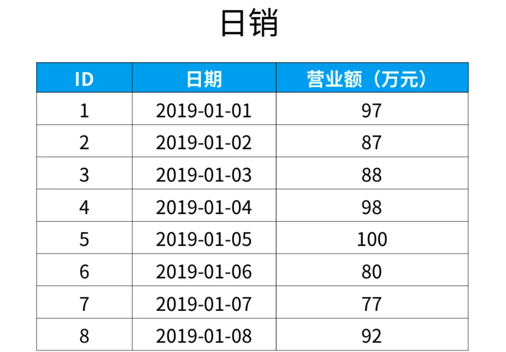

https://zhuanlan.zhihu.com/p/152233908

## 1 查找重复元素

### 查找所有重复的学生名

**【本题考点】**

1）考察思路，有两种解题方法，但是使用having语句的方法更高效。

2）考察对having语句的掌握，很多人会把聚合函数写到where子句中。

3）熟记SQL子句的书写顺序和运行顺序。


```mysql
select 姓名
from 学生表
group by 姓名
having count(姓名)>1
```

生成的表：


## 2 复杂查询

考察知识点：

> 分组汇总
> 子查询
> 标量子查询
> 关联子查询

### 查找第N高的数据

**【题目】**

现在有“课程表”，记录了学生选修课程的名称以及成绩。

现在需要找出语文课中成绩第二高的学生成绩。

如果不存在第二高成绩的学生，那么查询应返回 null。


**解法1**

找出成绩最高的，然后找出小于它的

```mysql
select max(distinct 成绩) 
from 成绩表
where 课程='语文' and
      成绩 < (select max(distinct 成绩) 
              from 成绩表 
              where 课程='语文');
```

**解法2**

limit n子句表示查询结果返回前n条数据    

offset n表示跳过x条语句

limit y offset x 分句表示查询结果跳过 x 条数据，读取前 y 条数据

使用limit和offset，降序排列再返回第二条记录可以得到第二大的值。

```mysql
select distinct 成绩  
from 成绩表
where 课程='语文'
order by 课程,成绩 desc
limit 1,1;
```

如果有空值，需要考虑

```mysql
select ifnull(第2步的sql,null) as '语文课第二名成绩';
```

## 3 多表查询

考察知识点：

> 什么是交叉联结？
> 什么是交叉联结？
> 什么是左联结？
> 什么是右联结？
> 什么是全联结？


### 查询所有学生的信息

**【题目】** 

现在有两个表，“学生表”记录了学生的基本信息，有“学号”、“姓名”。

“成绩”表记录了学生选修的课程，以及对应课程的成绩。

这两个表通过“学号”进行关联。


```mysql
select a.学号,a.姓名,b.课程,b.成绩
from 学生 as a
left join 成绩 as b
on a.学号=b.学号;
```

### 查询不在表里的数据

**【题目】**

下面是学生的名单，表名为“学生表”；

近视学生的名单，表名为“近视学生表”。请问不是近视眼的学生都有谁？

（“学生表”表中的学号与“近视学生”表中的学生学号一一对应）


```mysql
select a.姓名 as 不近视的学生名单
from 学生表 as a
left join 近视学生表 as b
on a.学号=b.学号
where b.学号 is null;
```

### 多久没涨工资

**【题目】**

“雇员表“中记录了员工的信息，“薪水表“中记录了对应员工发放的薪水。两表通过“雇员编号”关联。


**【解题步骤】**

**1. 当前薪水**

```mysql
select 雇员编号,薪水 as 当前薪水
from 薪水表
where 结束日期 = '2004-01-01';
```

**2. 入职薪水**


```mysql
select a.雇员编号,薪水 as 入职薪水
from 雇员表 as a 
left join 薪水表 as b
on a.雇员编号 = b.雇员编号
where a.雇用日期 = b.起始日期;
```

排除已离职

```sql
select a.雇员编号,薪水 as 入职薪水
from 雇员表 as a 
left join 薪水表 as b
on a.雇员编号 = b.雇员编号
where a.雇用日期 = b.起始日期 
	and a.雇员编号 in 
    (select 雇员编号
    from 薪水表
    where 结束日期 = '2004-01-01');
```

**3.薪水涨幅**



```sql
select m.雇员编号,当前薪水-入职薪水 as 薪水涨幅
from m
left join n
on m.雇员编号 = n.雇员编号;
```

**4.按薪水涨幅进行升序**

使用order by子句对查询结果排序。把表m和表n的sql代码代入，得到：

```sql
select m.雇员编号,当前薪水-入职薪水 as 薪水涨幅
from (select 雇员编号,薪水 as 当前薪水
			from 薪水表
			where 结束日期 = '2004-01-01') as m
left join (select a.雇员编号,薪水 as 入职薪水
            from 雇员表 as a 
            left join 薪水表 as b
            on a.雇员编号 = b.雇员编号
            where a.雇用日期 = b.起始日期 and a.雇员编号 in 
                (select 雇员编号
                from 薪水表
                where 结束日期 = '2004-01-01')) as n
on m.雇员编号 = n.雇员编号;
order by 薪水涨幅;
```

### 比较日期数据

https://mp.weixin.qq.com/s?__biz=MzAxMTMwNTMxMQ==&mid=2649247727&idx=1&sn=414455c2f0303a55a31e0c189f1e2c12&chksm=835fc7dfb4284ec94c7eed912cc3eb10c9b64814ceea562d4951bfb0c50c685da258a349abd0&scene=21#wechat_redirect

**【题目】**

下面是某公司每天的营业额，表名为“日销”。“日期”这一列的数据类型是日期类型（date）。

请找出所有比前一天（昨天）营业额更高的数据。




**【解题思路】**

1.交叉联结


