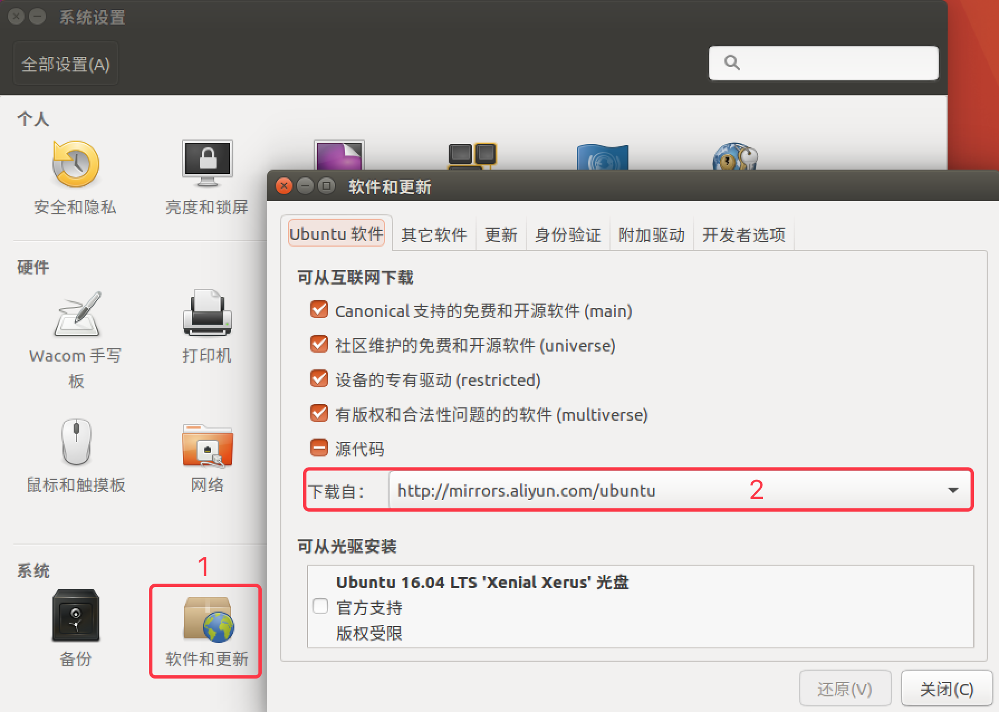

## 任务管理

​        (1) CTRL+Z挂起进程并放入后台

　　(2) jobs 显示当前暂停的进程

　　(3) bg %N 使第N个任务在后台运行(%前有空格)

　　(4) fg %N 使第N个任务在前台运行
　　默认bg,fg不带%N时表示对最后一个进程操作!

## jupyter lab 在后台启动时怎么关闭

```sh
ps aux | grep jupyter
#找到jupyter lab的进程号

kill -9 jupyter lab进程号
```


## 文件系统

- /dev：存放设备文件，常用的是 挂载光驱`mount /dev/cdrom/mnt`
- /home、/root：用户文件
- /usr：应用程序存放目录
  - /usr/bin：存放应用程序
  - /usr/lib：存放函数库文件
- /opt：额外安装的软件
- /var：存放系统执行过程中变化的文件
  - /var/log：存放日志
  - /var/spool/mail：邮件存放的目录
- /etc：系统配置文件


## 基本使用

[命令大全](https://www.runoob.com/linux/linux-command-manual.html)

| 序号 | 命令                   | 对应英文             | 作用                   |
| :--- | :--------------------- | :------------------- | :--------------------- |
| 01   | ls                     | list                 | 查看当前文件夹下的内容 |
| 02   | cd [目录名]            | change directory     | 切换文件夹             |
| 03   | mkdir [目录名]         | make directory       | 创建目录               |
| 04   | rm [文件名]            | remove               | 删除指定的文件名       |
|      | rm -rf 文件夹          |                      |                        |
|      |                        |                      |                        |
|      | pwd                    | print wrok directory | 查看当前所在文件夹     |
|      | which                  |                      | 查找操作所在目录       |
|      |                        |                      |                        |
|      | cp [源文件] [目标文件] | copy                 | 复制                   |
|      | mv [源文件] [目标文件] | move                 | 移动                   |
|      | cmp                    |                      | 比较                   |
|      | cat                    |                      | 打印到屏幕             |
|      | scp                    | secure copy          | 远程拷贝文件           |
|      |                        |                      |                        |

```bash
# 把本地当前目录下的 01.py 文件 复制到 远程 家目录下的 Desktop/01.py
# 注意：`:` 后面的路径如果不是绝对路径，则以用户的家目录作为参照路径
scp -P port 01.py user@remote:Desktop/01.py

# 把远程 家目录下的 Desktop/01.py 文件 复制到 本地当前目录下的 01.py
scp -P port user@remote:Desktop/01.py 01.py

# 加上 -r 选项可以传送文件夹
# 把当前目录下的 demo 文件夹 复制到 远程 家目录下的 Desktop
scp -r demo user@remote:Desktop

# 把远程 家目录下的 Desktop 复制到 当前目录下的 demo 文件夹
scp -r user@remote:Desktop demo
```

## 读log

https://www.cnblogs.com/shigfdengys/p/11164615.html

log所在位置：/var/log

| 命令                      | 含义                          |      |
| ------------------------- | ----------------------------- | ---- |
| tail -n 100 catalina.out  | 查询尾部最后100行，并不断刷新 |      |
| tail -n +100 catalina.out | 查询100行之后的所有           |      |
|                           |                               |      |
| cat filename              | 一次显示整个文件              |      |
| cat > filename            | 从键盘创建一个文件            |      |
| tac                       | 反向显示                      |      |


## 远程管理

[腾讯云教程](https://cloud.tencent.com/developer/article/1527703)


```bash
ssh -o StrictHostKeyChecking=no ubuntu@119.45.59.115
curl ifconfig.me
curl cip.cc
```

183.193.51.166

端口号

- **IP 地址**：通过 **IP 地址** 找到网络上的 **计算机**
- **端口号**：通过 **端口号** 可以找到 **计算机上运行的应用程序**
  - **SSH 服务器** 的默认端口号是 `22`，可以省略
- 常见服务端口号列表：

| 序号 | 服务       | 端口号 |
| :--- | :--------- | :----- |
| 01   | SSH 服务器 | 22     |
| 02   | Web 服务器 | 80     |
| 03   | HTTPS      | 443    |
| 04   | FTP 服务器 | 21     |


```bash
# 把本地当前目录下的 01.py 文件 复制到 远程 家目录下的 Desktop/01.py
# 注意：`:` 后面的路径如果不是绝对路径，则以用户的家目录作为参照路径
scp -P port 01.py user@remote:Desktop/01.py

# 把远程 家目录下的 Desktop/01.py 文件 复制到 本地当前目录下的 01.py
scp -P port user@remote:Desktop/01.py 01.py

# 加上 -r 选项可以传送文件夹
# 把当前目录下的 demo 文件夹 复制到 远程 家目录下的 Desktop
scp -r demo user@remote:Desktop

# 把远程 家目录下的 Desktop 复制到 当前目录下的 demo 文件夹
scp -r user@remote:Desktop demo
```


## 用户权限

sudo passwd root


## 进程信息

- 所谓 **进程**，通俗地说就是 **当前正在执行的一个程序**

| 序号 | 命令               | 作用                                  |
| :--- | :----------------- | :------------------------------------ |
| 01   | ps aux             | `process status` 查看进程的详细状况   |
| 02   | top                | 动态显示运行中的进程并且排序          |
| 03   | kill [-9] 进程代号 | 终止指定代号的进程，`-9` 表示强行终止 |


## 查找文件

- `find` 命令功能非常强大，通常用来在 **特定的目录下** **搜索** 符合条件的文件

| 命令                     | 作用                                            |
| :----------------------- | :---------------------------------------------- |
| find [路径] -name "*.py" | 查找指定路径下扩展名是 `.py` 的文件，包括子目录 |

- 如果省略路径，表示在当前文件夹下查找
- 之前学习的通配符，在使用 `find` 命令时同时可用
- 有关 `find` 的高级使用，在就业班会讲


## 打包 ／ 解包

```bash
# 打包文件
tar -cvf 打包文件.tar 被打包的文件／路径...

# 解包文件
tar -xvf 打包文件.tar
```

- `tar` 选项说明

| 选项 | 含义                                                         |
| :--- | :----------------------------------------------------------- |
| c    | 生成档案文件，创建打包文件                                   |
| x    | 解开档案文件                                                 |
| v    | 列出归档解档的详细过程，显示进度                             |
| f    | 指定档案文件名称，f 后面一定是 .tar 文件，所以必须放选项最后 |

> 注意：`f` 选项必须放在最后，其他选项顺序可以随意


```bash
# 压缩文件
tar -zcvf 打包文件.tar.gz 被压缩的文件／路径...

# 解压缩文件
tar -zxvf 打包文件.tar.gz

# 解压缩到指定路径
tar -zxvf 打包文件.tar.gz -C 目标路径
```

| 选项 | 含义                                           |
| :--- | :--------------------------------------------- |
| -C   | 解压缩到指定目录，注意：要解压缩的目录必须存在 |


## 软件安装

pip、apt-get

**4.1 通过 apt 安装／卸载软件**

- apt 是 `Advanced Packaging Tool`，是 Linux 下的一款安装包管理工具
- 可以在终端中方便的 **安装**／**卸载**／**更新软件包**

```bash
# 1. 安装软件
$ sudo apt install 软件包

# 2. 卸载软件
$ sudo apt remove 软件名

# 3. 更新已安装的包
$ sudo apt upgrade 
```

### 配置软件源

- 如果希望在 `ubuntu` 中安装软件，**更加快速**，可以通过设置**镜像源**，选择一个访问网速更快的服务器，来提供软件下载／安装服务
- 提示：更换服务器之后，需要一个相对比较长时间的更新过程，需要耐心等待。更新完成后，再安装软件都会从新设置的服务器下载软件了

> 所谓镜像源，就是**所有服务器的内容是相同的（镜像）**，但是根据所在位置不同，国内服务器通常速度会更快一些！



