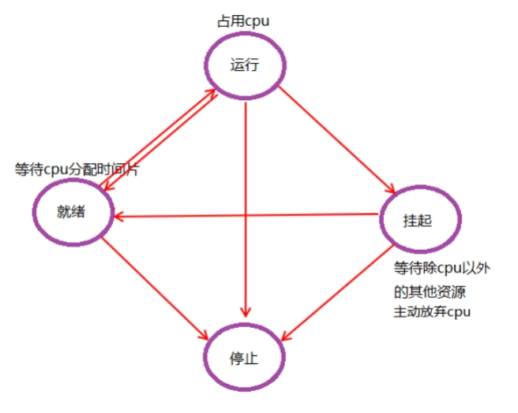

## 进程相关概念

### 并发和并行

- 并发：有处理多个任务的能力，不一定要同时。

- 并行：有同时处理多个任务的能力。

- 区别：是否**同时**。

### 单道和多道程序设计

- 单道程序设计

所有进程一个一个排对执行。若A阻塞，B只能等待，即使CPU处于空闲状态。而在人机交互时，阻塞的出现时必然的。

- 多道程序设计

在计算机内存中同时存放几道相互独立的程序，它们在管理程序控制之下，相互穿插的运行。多道程序设计必须有硬件基础作为保证。

实质上，并发是宏观并行，微观串行。


### CPU和MMU


- 虚拟地址: 可用的地址空间 有 4G

0x804a4000   int a = 10;

- 物理地址:1000

### 进程控制块（PCB，进程描述符）

Linux内核的进程控制块是task_struct结构体。

> /usr/src/linux-headers-3.16.0-30/include/linux/sched.h文件中可以查看struct task_struct 结构体定义。其内部成员有很多，掌握以下部分

- 进程id

- 进程的状态（就绪、运行、挂起、停止等）

- CPU寄存器信息（进程切换时有用）

- 虚拟地址空间的信息

- 控制终端的信息

- 当前工作目录

- umask掩码

- 文件描述符表（包含很多指向file结构体的指针）

- 和信号相关的信息

- 用户id和组id

- 会话（Session）和进程组

- 进程可以使用的资源上限

### 进程状态

进程基本的状态有5种。分别为初始态，就绪态，运行态，挂起态与终止态。其中初始态为进程准备阶段，常与就绪态结合来看



## 环境变量

### 常用环境变量

| 环境变量 | 含义               |
| -------- | ------------------ |
| PATH     | 可执行文件搜索路径 |
| SHELL    | 命令解析器         |
| TERM     | 当前终端类型       |
| LANG     | 语言环境           |
| HOME     | 用户主目录         |

### 函数

| 函数                                                         | 含义             |
| ------------------------------------------------------------ | ---------------- |
| char *getenv(const char *name);                              | 获取环境变量值   |
| int setenv(const char *name, const char *value, int overwrite); | 设置环境变量的值 |
| int unsetenv(const char *name);                              | 删除环境变量     |

## 进程控制

### fork函数

- 父子进程共享：
  1. 文件描述符(打开文件的结构体)  
  2. mmap建立的映射区 (进程间通信详解)

`pid_t fork(void);	`

- 失败返回-1；

- 成功返回：① 父进程返回子进程的ID(非负)	②子进程返回 0 

#### 循环创建子进程

for(i = 0; i < n; i++) { fork() }


```c
for (i = 0; i < 5; i++) {
  pid = fork();
  if (pid == -1) {
    perror("fork error:");
    exit(1);
  } else if (pid == 0) {
    break;
  }
}
```

## exec函数族

> 各个函数的参数使用方法/作用

fork创建子进程后，子进程需要调用exec函数以执行新的程序

> 当进程调用一种exec函数时，该进程的用户空间代码和数据完全被新程序替换，从新程序的启动例程开始执行。调用exec并不创建新进程，所以调用exec前后该进程的id并未改变。
>
> 将当前进程的.text、.data替换为所要加载的程序的.text、.data，然后让进程从新的.text第一条指令开始执行，但进程ID不变，换核不换壳。

其实有六种以exec开头的函数，统称exec函数：

```c
int execl(const char *path, const char *arg, ...);
int execlp(const char *file, const char *arg, ...);
int execle(const char *path, const char *arg, ..., char *const envp[]);
int execv(const char *path, char *const argv[]);
int execvp(const char *file, char *const argv[]);
int execve(const char *path, char *const argv[], char *const envp[]);
```


## 回收子进程

> 回收子进程的一般方式

- 孤儿进程：父进程先于子进程结束，子进程的父进程成为init进程【orphan.c】

- 僵尸进程：进程终止，父进程尚未回收，子进程残留资源（PCB）存放于内核中，变成僵尸（Zombie）进程。  【zoom .c】

特别注意，僵尸进程是不能使用kill命令清除掉的。因为kill命令只是用来终止进程的，而僵尸进程已经终止。													

### wait

父进程调用wait函数可以回收子进程终止信息。该函数有三个**功能**：

- 阻塞等待子进程退出 

- 回收子进程残留资源 

- 获取子进程结束状态(退出原因)。

`pid_t wait(int \*status);`	

成功：清理掉的子进程ID；失败：-1 (没有子进程)

### waitpid

作用同wait，但可指定pid进程清理，可以不阻塞。

`pid_t waitpid(pid_t pid, int \*status, in options);`

成功：返回清理掉的子进程ID；失败：-1(无子进程)

