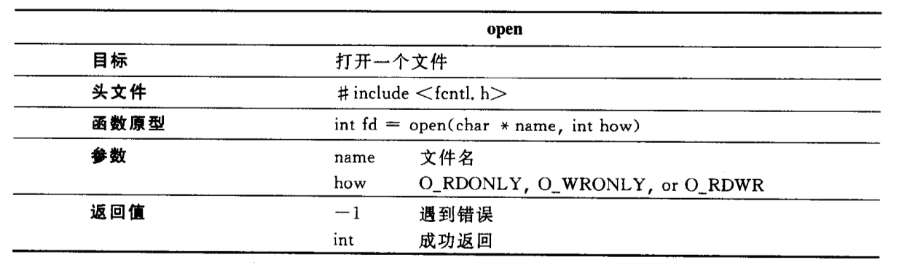
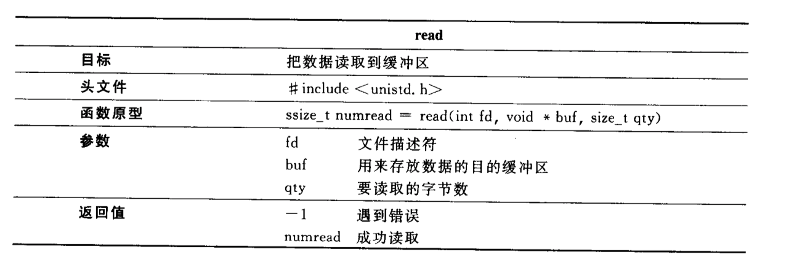
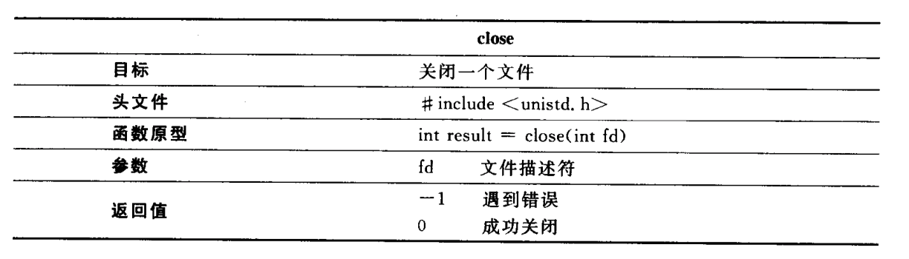
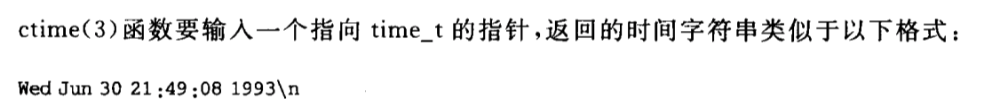

## 1 Unix系统编程概述

系统编程概念：进行系统调用（内核提供的服务），操作系统的资源和设备。

### 学习方法

1. 分析程序：首先分析现有的程序，了解它的功能及实现原理。
2. 学习系统调用：看程序都用到哪些系统调用，以及每个系统调用的功能和使用方法。
3. 编程实现：利用学到的原理和系统调用，自己编程实现原来程序所实现的功能。

以上 3 步可以通过下面 3 个问题来实现：

●它能做什么？●它是如何实现的？●能不能自己编写一个？

### 带参main函数

https://blog.csdn.net/abc_xixi111/article/details/79993899

```c
int main(int argc,char *argv[],char *envp[]) {
	int i = 0;
	for (i = 0; i < argc; i++) {
		printf("%s\n", argv[i]);
	}
	system("pause");
	return 0;
}
```

**main函数的三个参数**：

- 第一个参数 argc ，用于存放命令行参数的个数。默认为1

- 第二个参数 argv，是字符指针的数组，每个元素都是一个字符指针，指向一个字符串，即命令行中的每一个参数。
- 第三个参数 envp，是字符指针的数组，每个元素都是一个字符指针，指向系统的环境变量。

### more实践

```bash
gcc -g more01.c -o more01
./more01 text.txt
```

## 2 用户、文件操作：who命令

### 文件操作

> 文件描述符（file descriptor）：唯一标识进程和文件之间的连接。文件操作必须通过文件描述符进行。

```c
int fd = open(char *name, int how)
ssize_t numread = read(int fd, void *buf, size_t qut)
int result = close(int fd)
```

open的用法



read的用法



close的用法



```c
int main() {
    struct utmp current_record; /* read info into here       */
    int utmpfd;                 /* read from this descriptor */
    int reclen = sizeof(current_record);

    if ((utmpfd = open(UTMP_FILE, O_RDONLY)) == -1) {
        perror(UTMP_FILE); /* UTMP_FILE is in utmp.h    */
        exit(1);
    }

    while (read(utmpfd, &current_record, reclen) == reclen)
        show_info(&current_record);
    close(utmpfd);
    return 0; /* went ok */
}
```

### ctime



```c
#include        <time.h>

void showtime( long timeval )
/*
 *      displays time in a format fit for human consumption
 *      uses ctime to build a string then picks parts out of it
 *      Note: %12.12s prints a string 12 chars wide and LIMITS
 *      it to 12chars.
 */
{
        char    *cp;                    /* to hold address of time      */

        cp = ctime(&timeval);           /* convert time to string       */
                                        /* string looks like            */
                                        /* Mon Feb  4 00:46:40 EST 1991 */
                                        /* 0123456789012345.            */
        printf("%12.12s", cp+4 );       /* pick 12 chars from pos 4     */
}
```

## 3 目录、文件属性：ls命令