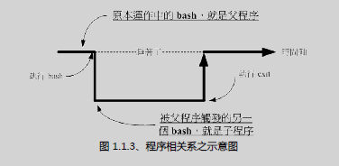
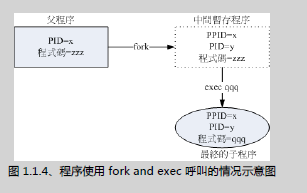
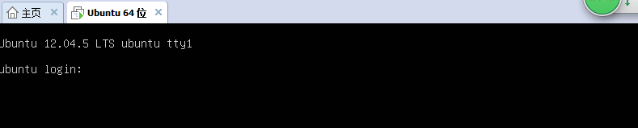
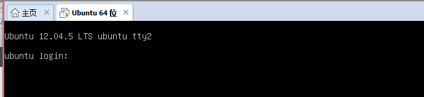

# 进程管理

## 什么是进程

### 程序(program)

通常为二进制程序放置在储存媒介中（如硬盘、光盘、软盘、磁带等），以物理文件的形式存在。

### 进程(process)

程序被触发后，执行者的权限与属性、程序的程序代码与所需数据等都会被加载到内存中，操作系统并给予这个内存内的单元一个标识符（PID），也就是说：**进程就是一个正在运行的程序**。

### 父子进程



```sh
jack@ubuntu:~$ ps -l
F S   UID    PID   PPID  C PRI  NI ADDR SZ WCHAN  TTY          TIME CMD
0 S  1000   【7261】   7253  0  80   0 -  7083 wait   pts/0    00:00:00 bash
0 T  1000  16097   【7261】  0  80   0 - 14574 signal pts/0    00:00:00 vim
0 R  1000  17246   【7261】  0  80   0 -  3484 -      pts/0    00:00:00 ps
```

可以看到， bash为父进程 PID为7261， 在这个bash中执行的 `ps`命令为bash的子进程。`wait`表示上图的虚线，bash睡着了。

F:代表进程标识(process flags)，说明进程的权限。

- 4 means “权限为root”
- 1 means “forked but didn't exec”

- 0 means that neither flag applies. 0 always means that none of the flags are set

S:表示基础的状态：

​	R-Running；S-Sleep；T-stop；Z-Zombie；D-不可被幻想的睡眠状态，通常为等待I/O。

### fork and exec

进程都会通过父进程以复制（fork）的方式产生一个一模一样的子进程，然后被复制出来的子进程再以exec的方式来执行实际要进行的进程，最终就成为一个子进程的存在。

系统先以fork的方式复制一个与进程相同的暂存进程，这个进程与父进程唯一的区别就是PID不同！但是这个暂存进程还会多一个PPID的参数。然后暂存进程开始以exec的方式加载实际要执行的程序，以上述图示来讲，新的进程名为qqq，最终子进程的程序代码就会变成qqq了。



### 系统或网络服务：常驻在内存的进程

- 对于文件相关的操作如：显示文件ls、新建文件touch、管理文件rm/mkdir/cp/mv、权限管理chmod/chown/passwd，命令所触发的PID很快就结束了。常用文件操作，查考[ ubuntu常用命令文件操作](http://blog.csdn.net/qq_24145735/article/details/51887625)
- 常驻在内存中的进程成为服务(daemon)，如：网络联机服务Apache、named、psotfix等，程序被执行后会启动一个可以负责网络监听的端口(port),提供外部客户端（client）的连接请求。

### linux的多用户，多任务环境

- 多用户：在linux系统上可以有多个用户，每个用户都可以有自己的环境设置（~/.bashrc）,和一个管理员（root）；每个用户都有对应的用户组。

```sh
jack@ubuntu:~$ adduser username  // 添加用户
```

- 多任务: 一个进程可以看做是一个任务，一个时间点只有一个进程再CPU上运行。但是得益于CPU的高达几个GHz的运作，在CUP的调度机制下，即使是多人同时登陆系统时，也会感觉整台主机好像只为自己一个人服务。这就是多用户，多任务的环境。
- 多重登陆环境的七个基本终端界面
  在linux中，默认提供了6个命令行界面登陆窗口和一个图形界面。使用[Alt]+[F1]~[F7]切换不同的终端机接口，并且每个终端机接口还可以是不同的人（利用adduser添加用户）。
- 在ubuntu的server版本中，默认登陆界面为tty1，使用[Alt]+[F1]~[F6]切换不同界面登录窗口。没有提供图形界面，需要手动安装。
- 在ubuntu的桌面版中，默认登录为图形界面，使用[Ctrl]+[Alt]+[F1]~[F7]切换不同登陆窗口。
  
  

**特殊进程管理行为**：如果tty1中的程序卡死了，可以切换到tty2，通过PID，用`kill`命令结束结束卡死的进程，在回到tty1

- bash环境下的工作管理（job control）
  前面提到了”父子进程”，当我们登陆tty1的bash之后就取得了一个PID，之后再bash中执行的命令都是他的子进程。
  当在命令行界面tty1工作时，如果要执行多个任务，比如在复制一个特别大的文件的同时，还想使用vim编辑文本，这时候就只有切换到tty2，创建一个新的bash进程来工作了，比较麻烦。不如图形界面工作的时候，可以通过[ctrl]+[alt]+[t]打开新的命令行编辑文本。

如何在tty1的bash进程中工作呢？，例：

```
jack@ubuntu:~$ cp file1 file2 &
12
```

重点在`&`，**把当前的进程放在后台运行**，依旧是在执行这个命令之后，在这一bash任然可以继续干其他操作，如vim编辑文本。
接下来我们重点看一下job control。

## # job control

**job control**：当我们登录系统取得bash shell之后，在单一终端机下同时进行多个工作的行为管理。如：我们登陆bash后，想要一边复制，一边进行数据查找，一遍vim编程，并且在一个bash内实现，不用通过不同tty的切换，不用在图形界面打开不同的bash。

```sh
//使用过IntelliJ的都知道，在运行`idea.sh`命令之后，会持续的输出相关内容，此时bash就不能在进行其他操作了，此时我们就可以通过job control把它放到后台运行。此处还需要使用输出重定向，把输出放到其他文件中，避免后台运行的输出跑到当前bash中。
// > :不存在文件就新建文件，存在则覆盖存在的文件。    #重定向#
// >> : 不存在文件就新建文件，存在则输出添加进文件。

jack@ubuntu:~$ idea.sh > ideash.out &
[1] 15705
jack@ubuntu:~$ jobs -l  #查看后台的程序
[1]+ 15705 Running                 idea.sh > ideash.out &

#再打开vim 编辑文件 ，[ctrl] + [z]暂停程序
jack@ubuntu:~$ vim ideash.out 
[2]+  Stopped                 vim ideash.out

jack@ubuntu:~$ jobs -l
[1]- 15705 Running                 idea.sh > ideash.out &
[2]+ 16097 Stopped                 vim ideash.out
#[1]:表示job number 为 1
# + ：表示最近一个被丢到后台的工作。  
# - ：表示倒数第二个被丢到后台的工作 。 之后的工作就不显示了
#15705：代表PID
#Running：工作的状态
#idea.sh > ideash.out & ：执行的命令

jack@ubuntu:~$ fg %2 #回到job 2 继续通过vim编辑。

jack@ubuntu:~$ bg %jobnumbers #让处于stop的job在后台运行。

#管理后台进程
jack@ubuntu:~$ kill  %1  //kill -signal %jobnumbers 
#signal --  1:类似于reload;  9：强制关闭;  15：正常关闭, 默认值

jack@ubuntu:~$ [ 919305]   WARN - api.vfs.impl.local.FileWatcher - Watcher terminated with exit code 143 
^C
[1]-  Terminated              idea.sh > ideash.out

jack@ubuntu:~$ jobs
[2]+  Stopped                 vim ideash.out
```

## 脱机管理

job control中的”后台”指的是bash下可以避免[ctrl] + [c]中断的一个情境，并不是系统的后台。如果当前bash结束后，在bash中正在执行的其他进程也将结束。通过`nohup`可以达到把任务房到系统后台中去。

```sh
jack@ubuntu:~$ nohup idea.sh & 
# 默认输出到nohup.out，相当于nohup idea.sh & >> nohup.out
```

## 进程管理

```sh
>ps -l #显示当前进程
>ps aux #显示系统所有进程
>kill -signal PID #管理进程，signal同上
```

## 挂起

```sh
ctrl+z
jobs #查看被挂起的进程
fg	#恢复进程到前台执行
bg  #命令恢复进程到后台执行
```


## ref

https://blog.csdn.net/qq_24145735/article/details/51888270

# GUN screen

## 安装

```bash
sudo apt-get install screen
```

## 语法

```bash
$> screen [-AmRvx -ls -wipe][-d <作业名称>][-h <行数>][-r <作业名称>][-s ][-S <作业名称>]

-A 　将所有的视窗都调整为目前终端机的大小。

-d   <作业名称> 　将指定的screen作业离线。

-h   <行数> 　指定视窗的缓冲区行数。

-m 　即使目前已在作业中的screen作业，仍强制建立新的screen作业。

-r   <作业名称> 　恢复离线的screen作业。

-R 　先试图恢复离线的作业。若找不到离线的作业，即建立新的screen作业。

-s 　指定建立新视窗时，所要执行的shell。

-S   <作业名称> 　指定screen作业的名称。

-v 　显示版本信息。

-x 　恢复之前离线的screen作业。

-ls或--list 　显示目前所有的screen作业。

-wipe 　检查目前所有的screen作业，并删除已经无法使用的screen作业。
```

## 常用screen参数

```bash
screen -S yourname -> 新建一个叫yourname的session

screen -ls         -> 列出当前所有的session

screen -r yourname -> 回到yourname这个session

screen -d yourname -> 远程detach某个session

screen -d -r yourname -> 结束当前session并回到yourname这个session
```

## 在Session下，使用ctrl+a(C-a) 

```bash
C-a ? -> 显示所有键绑定信息

C-a c -> 创建一个新的运行shell的窗口并切换到该窗口

C-a n -> Next，切换到下一个 window 

C-a p -> Previous，切换到前一个 window 

C-a 0..9 -> 切换到第 0..9 个 window

Ctrl+a [Space] -> 由视窗0循序切换到视窗9

C-a C-a -> 在两个最近使用的 window 间切换 

C-a x -> 锁住当前的 window，需用用户密码解锁

C-a d -> detach，暂时离开当前session，将目前的 screen session (可能含有多个 windows) 丢到后台执行，并会回到还没进 screen 时的状态，此时在 screen session 里，每个 window 内运行的 process (无论是前台/后台)都在继续执行，即使 logout 也不影响。 

C-a z -> 把当前session放到后台执行，用 shell 的 fg 命令则可回去。

C-a w -> 显示所有窗口列表

C-a t -> time，显示当前时间，和系统的 load 

C-a k -> kill window，强行关闭当前的 window

C-a [ -> 进入 copy mode，在 copy mode 下可以回滚、搜索、复制就像用使用 vi 一样

    C-b Backward，PageUp 

    C-f Forward，PageDown 

    H(大写) High，将光标移至左上角 

    L Low，将光标移至左下角 

    0 移到行首 

    $ 行末 

    w forward one word，以字为单位往前移 

    b backward one word，以字为单位往后移 

    Space 第一次按为标记区起点，第二次按为终点 

    Esc 结束 copy mode 

C-a ] -> paste，把刚刚在 copy mode 选定的内容贴上
```

## 常用操作

创建会话（-m 强制）：

```bash
screen -dmS session_name
# session_name session名称
```

关闭会话：

```bash
screen -X -S [session # you want to kill] quit
```

查看所有会话：

```bash
screen -ls
```

进入会话：

```bash
screen -r session_name
```


## ref

- https://blog.csdn.net/han0373/article/details/81352663