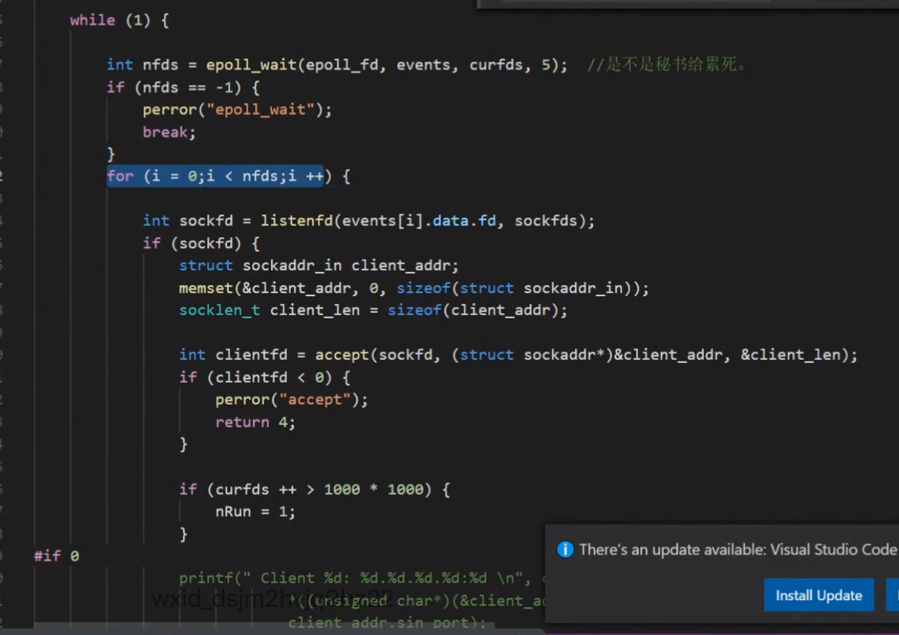
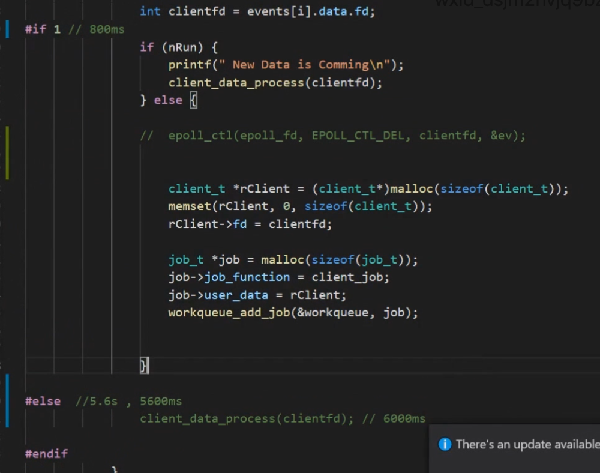
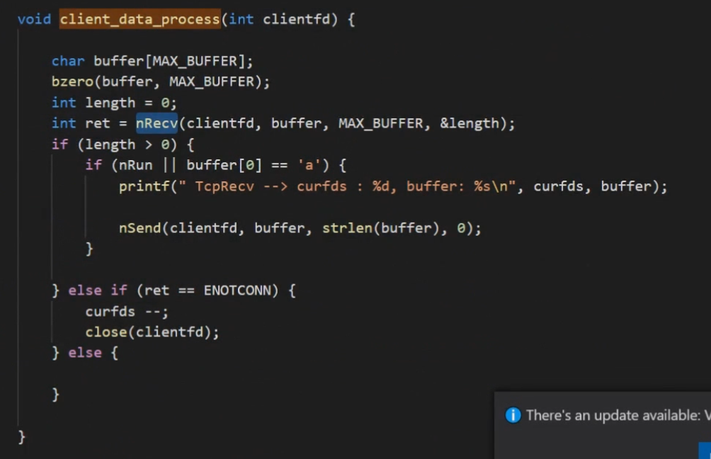
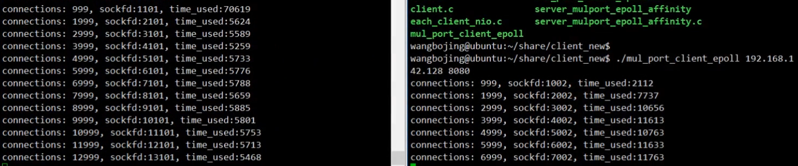
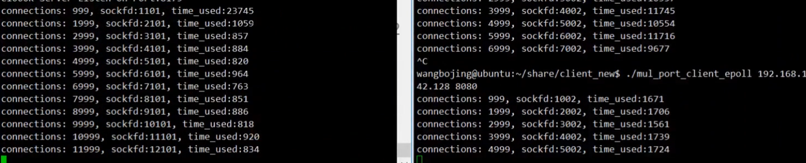

## 同步与异步

### 客户端角度

同步：客户端请求服务器，等待返回

同步方式，每一秒的请求不会很多

异步：提交后没有等待的操作，速度快

异步操作：1异步操作上下文；2销毁；3commit；4callback；

### 服务器端角度

epoll的写法：约定俗成的，即对已经就绪的IO进行编辑

#### 异步同步的体现

epoll_wait是检测IO有没有数据可读写，即是否就绪

recv和send是对数据进行读写操作

#### 同步与异步

同步：epoll_wait与recv和send在同一个流程中

异步：将就绪的IO放到线程池中，由线程池进行读写操作

#### 异步IO与IO异步操作

异步IO：AIO，IO中有数据，直接回调

IO异步操作：epoll_wait()，push_to_thread()，称为多线程异步

#### 代码

epoll代码：

异步与同步分别运行的代码：

同步：每增加1000个连接耗时5600ms左右

异步：每增加1000个连接耗时800ms左右

## 协程

同步与异步是用来形容两者之间的关系，只有一个对象则用阻塞和非阻塞

用同步的编程方式，拥有异步的性能

协程存在的必要性

