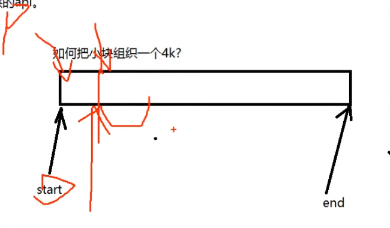
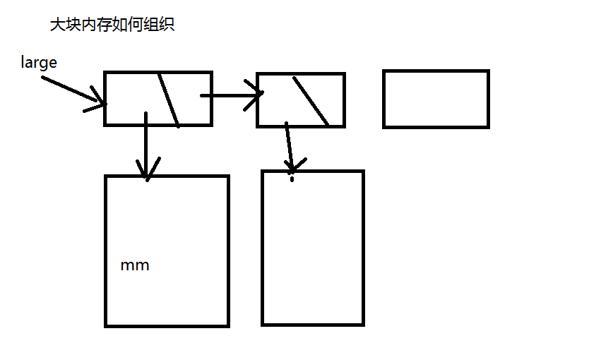
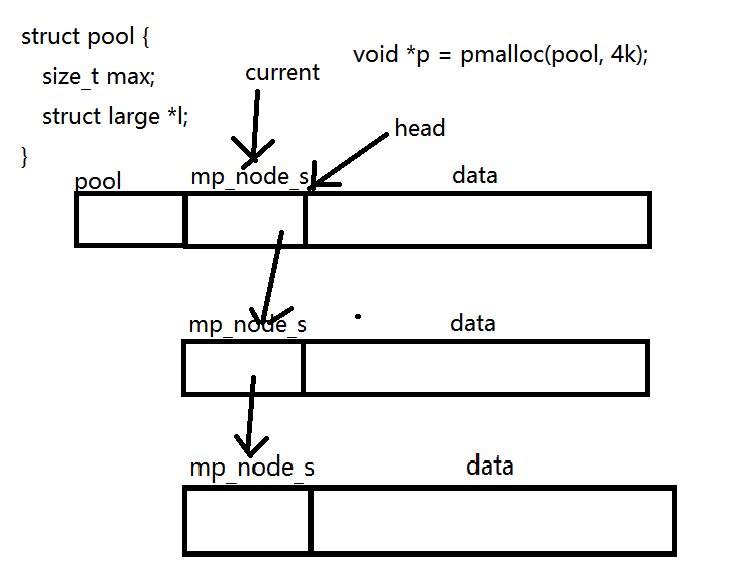

常见的开源内存池：tcmalloc（MySQL中使用），jemalloc（Tomcat中使用）

## 内存池定义

### 为什么需要内存池

客户端访问多时，服务器需要频繁地请求malloc/free内存。导致内存碎片化。

### 组件开发步骤

0. 宏定义
1. 定义结构体、基础数据结构
2. 写对应的函数，对外提供API
3. 测试函数

## 内存池结构组织

### 内存池的结构体

1. 小块内存：< 4K

   把若干个小块拼成一个页，保存到4K中

2. 大块内存：> 4K

### 小块组织成一个4K

使用start指针指向可用内存的开头，当分配一段内存后（`void *p = pmalloc(10);`），将start后移对应的长度



```c
struct node {
  unsigned char *start;
  unsigned char *end;
  struct node *next; 	// 指向下一个页
  int flag;			// 表示当前内存是否被使用
}
```


### 大块内存组织

使用链表



大块内存在需要时分配内存，使用结束后不进行free释放

```c
void *p = pmalloc(10); // 创建小块
void *p = pmalloc(pool, 4k);// 创建大块

struct mp_large_s {
	struct mp_large_s *next;
	void *alloc;
};
```

### 内存池的定义

```c
struct pool {
	size_t max; // 区分大块和小块
  struct block *n; // 小块
  struct large *l; // 大块
}
```


struct pool的存储：

在小块中，只有第一个节点要定义pool存放的空间

最先分配的空间应该包含pool和node_s的大小




### 程序调用

```c
void *p = palloc(pool, 100);
```

#### 小块内存

size < pool->max 4K

1. 判断当前mp_node_s是否为空
2. 遍历mp_node_s链表
3. 到mp_node_s结尾，malloc(4K);

否则，alloc_large()


