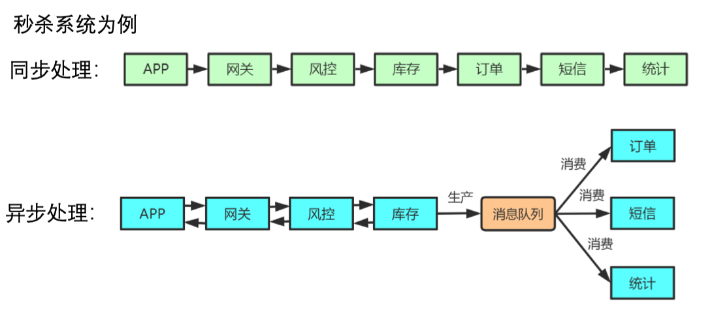
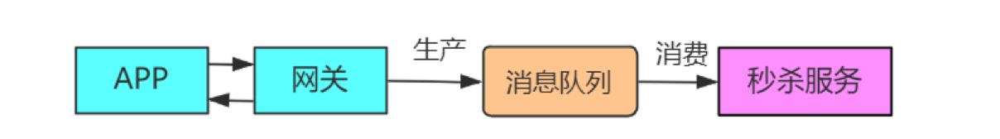
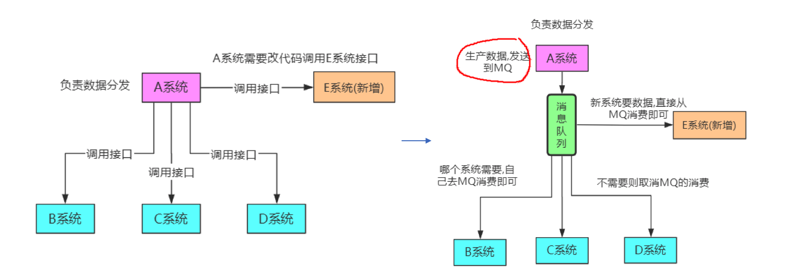
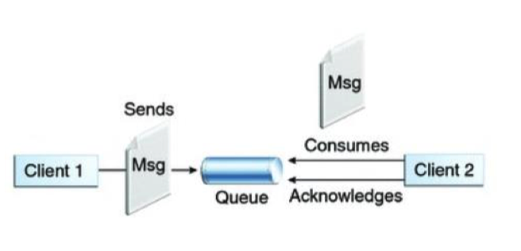
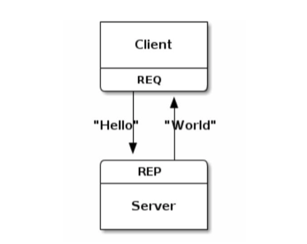
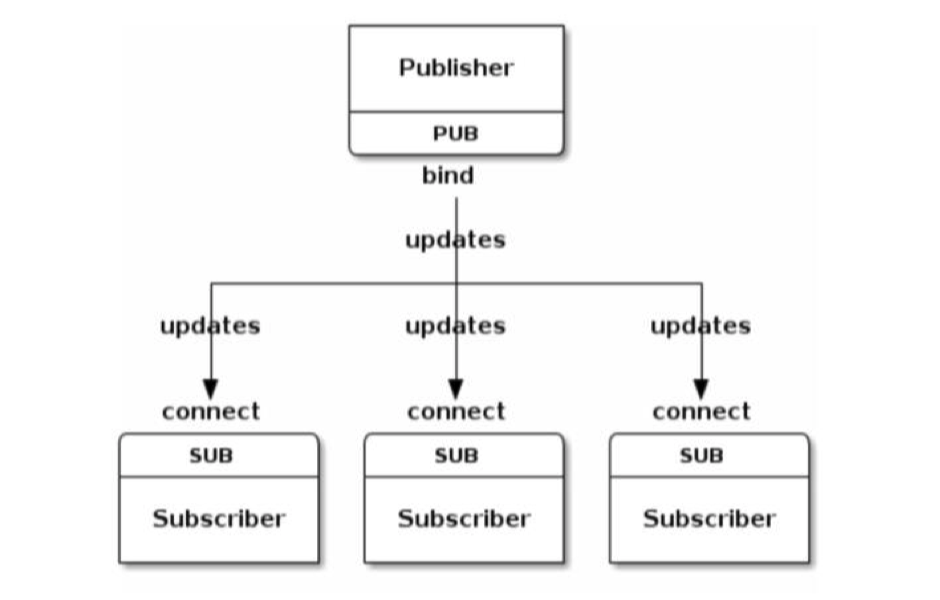
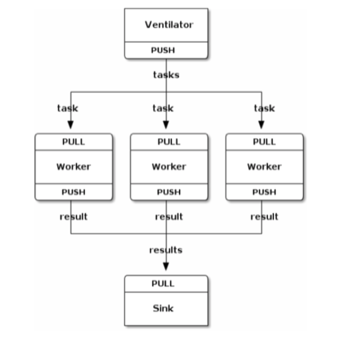
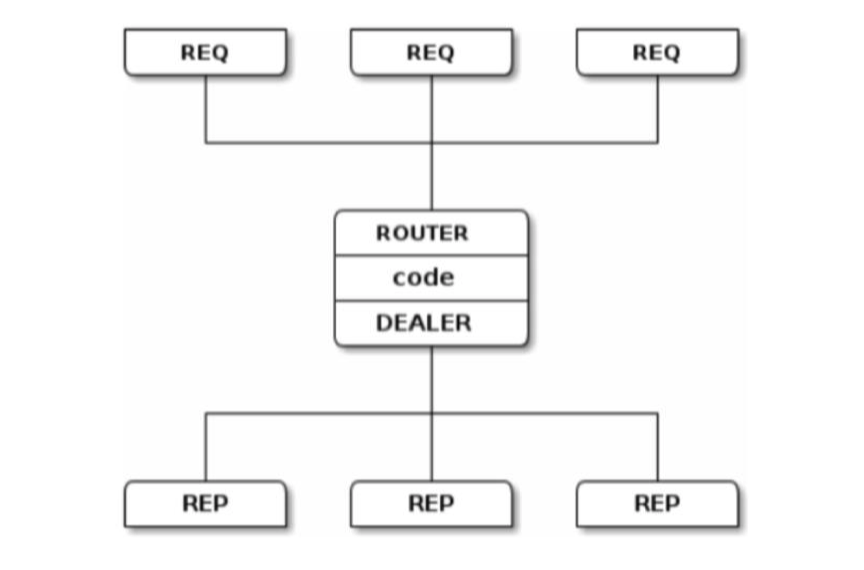

https://zguide.zeromq.org/

https://github.com/anjuke/zguide-cn

## 使用消息队列的场景

### 异步处理

短信通知、终端状态推送、App推送、用户注册等

更快速返回结果；减少等待，实现并发处理，提升系统总体性能。

### 流量控制（削峰）

秒杀场景下的下单状态：使用消息队列隔离网关和后端服务，以达到流量控制和保护后端服务的目的。

### 服务解耦

### 发布订阅

比如游戏里面跨服：

- 广播今天整体还剩多少把屠龙刀可以暴
- 广播用户暴的屠龙刀的消息

### 高并发缓冲

kafka日志服务、监控上报

## 基本概念和原理

- Broker：MQ的服务器
- 消息的生产者：发送消息到消息队列
- 消息消费者：从消息队列接收消息

### 点对点消息队列模型

- 消息生产者向一个特定的队列发送消息，消息消费者从该队列中接收消息；
- 消息的生产者和消费者可以不同时处于运行状态。
- 每一个成功处理的消息都由消息消费者签收确认（Acknowledge）。
- 如rabbitmq 点对点

### 发布订阅消息模型-Topic

发布订阅消息模型中，支持向一个特定的主题Topic发布消息，0个或多个订阅者接收来自这个消息主题的消息。在这种模型下，发布者和订阅者彼此不知道对方。

### 消息的ACK确认机制

当 Consumer确认消息已经被消费处理，发送一个ACK给消息队列，此时消息队列便可 以删除这个消息了。

如果Consumer宕机/关闭，没有发送ACK，消息队列将认为这 个消息没有被处理，会将这个消息重新发送给其他的Consumer重新消费处理。

### 传统网络编程的问题

- 调用的 socket 接口较多
- TCP 是一对一的连接（一对多，reactor 模式编程）
- 编程需要关注很多 socket 细节问题；
- 不支持跨平合编程；
- 需要自行处理分包、组包问题；
- 流式传输时需处理粘包、半包问题；
- 需自行处理网络异常，比如连接异常中断、重连等；
- 服务端和客户端启动有先后；
- 自行处理模型自行实现消息的缓存；
- 自行实现对消息的加密

## ZeroMQ模型

### REQ/REP 请求响应模型

### PUB/SUB 发布订阅模型

### Push/Pull 推拉模型

push即服务端主动发送数据给客户端。在服务端收到消息之后立即推送给客户端。
Push模型最大的好处就是实时性。因为服务端可以做到只要有消息就立即推送，所以消息的消费没有“额外”的延迟。

Pull模式由客户端主动从服务端获取消息。Broker不再需要维护Consumer的状态（每一次pull都包含了其实偏移量等必要的信息），状态维护在Consumer，所以Consumer可以很容易的根据自身的负载等状态来决定从Broker获取消息的频率

比较：

采用push方式：可以尽可能快地将消息发送给消费者，但是若消费者的处理消息的能力较弱（一条消息长时间处理），中间件会不断地向消费者push消息，消费者的缓冲区可能会溢出；

采用pull方式：会增加消息的延迟，即消息到达消费者的时间变长。

### Router/Dealer 模型

