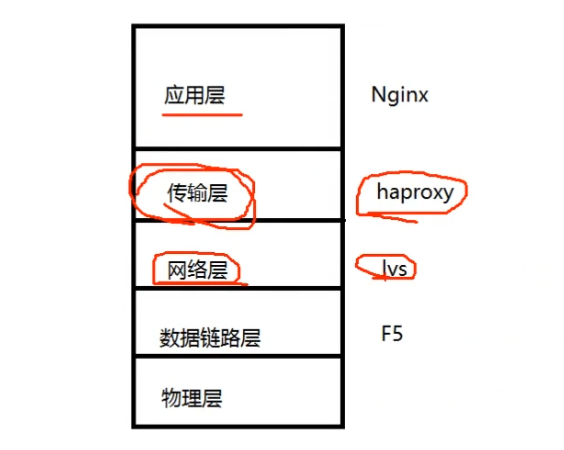
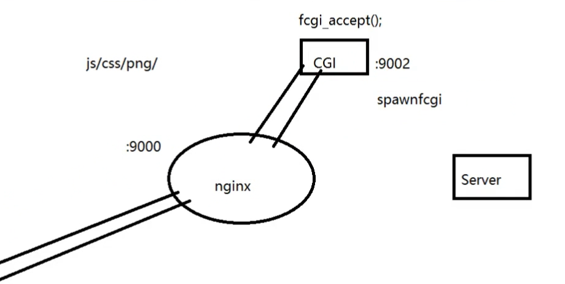

### 网络结构

路由器：数据网关，路由器通过NAT的端口映射，使外部只能访问Nginx

Nginx：应用层网关，nginx屏蔽了其他服务器

Nginx和其他服务器在同一个局域网内。


数据先访问路由器，然后到达nginx，由nginx代理局域网内的其他机器。

 

## 负载均衡



越往下层的代理网络性能越高

### 网络层lvs

lvs：通过虚拟IP，四个服务器共用一个IP地址（回环IP）


### DNS的负载均衡

配置好，其他不用管。通过一个域名映射到两个IP地址


## 安装与使用

```
nginx
pcre：负责做正则表达式.conf文件
openssl：做MD5验证、HTTP加密库的使用
pcre
zlib：压缩
```


> ./configure --prefix=/usr/local/nginx --with-http_realip_module --with-http_addition_module --with-http_gzip_static_module --with-http_secure_link_module --with-http_stub_status_module --with-stream --with-pcre=/home/ivan/nginx/pcre-8.41 --with-zlib=/home/ivan/nginx/zlib-1.2.11 --with-openssl=/home/ivan/nginx/openssl-1.1.0g

### 安装文件发生了什么

`sudo make install` 安装文件发生了什么？

把可执行文件安装到系统的bin文件下，可以直接使用命令调用


### conf文件

`/usr/local/nginx/conf/nginx.conf`


```bash
/usr/local/nginx/sbin/nginx –c ./conf/nginx.conf	  # 启动Nginx
/usr/local/nginx/sbin/nginx -s stop
```


```nginx
# 最简单的服务器配置文件
worker_processes 4; #启动的子进程数目

events {		# 对应的是事件，每一个连接都是事件 fd
        worker_connections 1024;  #每一个进程响应的连接数
}

http {	# http协议可以有多个server
				server{				#
								listen 8888;
								server_name localhost;
								
								client_max_body_size 100m; #http请求中的最大body
									
								location / {	# 请求根目录
												root /usr/local/nginx/html/;
								}
				}
}
```


## nginx代理

```nginx
								location / {	# 请求根目录
#												root /usr/local/nginx/html/;
      									proxy_pass http://192.168.170.128; # 代理服务器
								}
```

### 代理与跳转的区别

代理：


跳转：


### 代理多个服务器

128的请求次数是129的两倍，需要清空浏览器的缓存才能复现

```nginx
http {
  upstream backend {
    	server 192.168.142.128 weight=2;
    	server 192.168.142.129 weight=1;
  } 
  server {
  	location / {
#				root /usr/local/nginx/html/;
#				proxy_pass http://192.168.142.128;
				proxy_pass http://backend;
		}	
  }  
}
```

## 图片视频

http://192.168.170.132:8888/images/1.png

http://192.168.170.132:8888/1111.mp4

图片：直接播放

视频：下载

静态资源的配置方式：直接访问或下载

```nginx
http {
  server {
		location /images/ {
			root /usr/local/nginx/;
		}
		
		location ~ \.(mp3|mp4) {
			root /usr/local/nginx/media/;
		}		
  }  
}
```

## fastcgi

CGI：公共网关接口。应用：在线编译工具




CGI和后端server的区别：cgi是一个进程，对外提供输入输出流，将进程的计算结果传回给服务器；server通过http传递数据


spawn-fcgi.tar.gz：CGI接口工具，用以启动CGI程序

开源工具编译：./configure && make && make install

sudo cp spawn-fcgi /usr/local/nginx/sbin/


 fcgi.tar.gz：CGI开发库

在include/fcgio.h中加入头文件stdio.h

```sh
gcc -o zvoice_cgi zvoice_cgi.c -lfcgi
gcc zvoice_cgi.c -Wl,-rpath /usr/local/lib -lfcgi -o zvoice_cgi
```

编写CGI程序

```c
#include <stdio.h>
#include <fcgi_stdio.h>

int main() {
        while (FCGI_Accept() >= 0) {

                printf(" Content-type: text/html\r\n");
                printf("\r\n");
                printf("<title>Fast CGI hello!</title>");
                printf("<h1Voice cgi</h1>");
                printf("Thank you cgi\n");
        }

        return 0;
}
```


将CGI绑定端口

```sh
/usr/local/nginx/sbin/spawn-fcgi -a 127.0.0.1 -p 9001 -f /root/nginx/zvoice_cgi
spawn-fcgi: child spawned successfully: PID: 22349
netstat -anop | grep 9001
```

配置nginx 的conf文件

```nginx
	server {
		listen 9000;
		
		location ~ \.cgi {
			fastcgi_pass 127.0.0.1:9001;
			fastcgi_index index.cgi;
			fastcgi_param SCRIPT_FILENAME cgi$fastcgi_script_name;
			include ../conf/fastcgi_params;
		}
	} 
```

启动nginx后

cat logs/error

http://192.168.170.132:9000/zvoice_cgi.cgi


