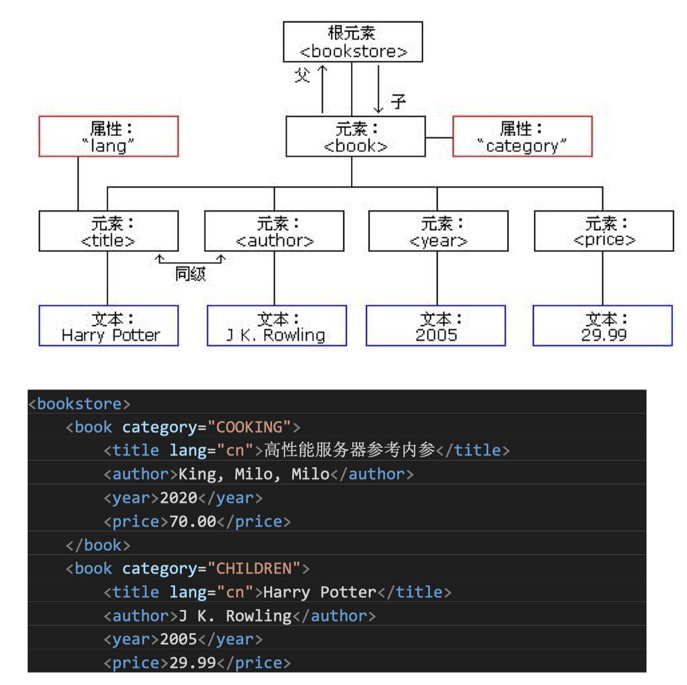

## XML简介

### XML和HTML区别

1. 语法要求不同：HTML不区分大小写，XML区分
2. 标记不同：HTML使用固有标记，XML没有固有标记
3. 作用不同：HTML用于显示页面，XML用于描述页面内容的数据，并将数据和显示区分。

### XML使用场景

XML相对于json数据冗余度大，解析速度也比json、protobuf慢

常作为配置文件，进行本地化配置

### XML在线代码工具

https://tool.oschina.net/codeformat/xml/

### XML树结构

### TinyXML2 

https://github.com/leethomason/tinyxml2

| 类             | 含义                                                         |
| -------------- | ------------------------------------------------------------ |
| XMLAttribute   | 是解析 XML 的属性的类，XML 中的属性都与 XML 的 Element 绑定，并且为 key-value 类型。 |
| XMLComment     | 主要是处理 XML 注释的类，注释的存储形式为""。                |
| XMLDeclaration | 主要是处理 XML 中声明的类，声明的存储形式为"<? declaration ?>"。 |
| XMLDocument    | 代表 XML 整个实体，TinyXML2 中只有 XMLDocument 类可以被实例化，其他的类必 须通过 XMLDocument 提供的 new 方法进行实例化， 而不能直接实例化。 XMLNode 的其他实体类把构造函数定义为 protected，不能被外部实例化，这样保证使用 XMLDocument 进行内存的管理，避免产生内存泄漏的风险。 |
| XMLElement     | XMLElement 类是 XMLNode 中最重要的一个类，其存储方式有<foo/>和<foo></foo> 两 种 形 式 ， 它 包 含 了 一 个 XMLAttribute 的 根 指 针 ， 这 个 root 指 针 指 向 XMLAttribute 的第一个属性键值对。 |
| XMLHandle      | 主要用来访问元素。                                           |
| XMLNode        | 是几乎 XML 所有元素(XMLAttribute 除外)的基类，XML 本质是一种树形结构，而 整个 XML 就是由许多的节点(XMLNode)组成，在 TinyXML2 中每个 XMLNode 节点都 保存了父亲、前驱、后继、孩子头节点和孩子尾节点信息，便于查询、插入、检 索。 |
| XMLPrinter     | 是 XMLVisitor 类的子类，主要实现的写 XML 的功能，其提供了两种书写方式，一 是构建 XMLDocument，二是直接 push 字段。 |
| XMLText        | 主要是处理 XML 文本的类，文本信息又分为 CDATA 和普通文本。CDATA 是有专属的 开始字符"<![CDATA["，而普通的文本存储形式如">text<"。 |
| XMLUnknown     | 存储形式为"<! unknown>"。                                    |
| XMLVisitor     | 访问者模式的基类，它主要定义了访问者的接口，而在 XMLNode 的子类的 accept 方法中调用这些方法来完成对自身的访问。 |

## Json简介

大括号保存对象，中括号保存数组

### Jsoncpp

https://github.com/open-source-parsers/jsoncpp

### cJSON

https://github.com/DaveGamble/cJSON

