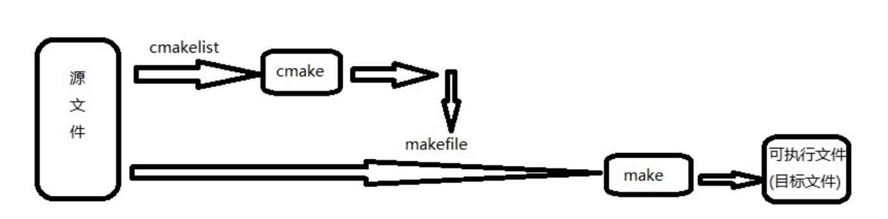
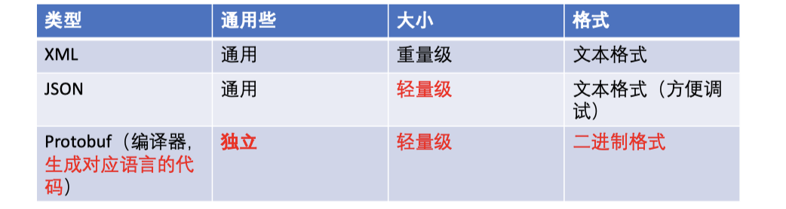
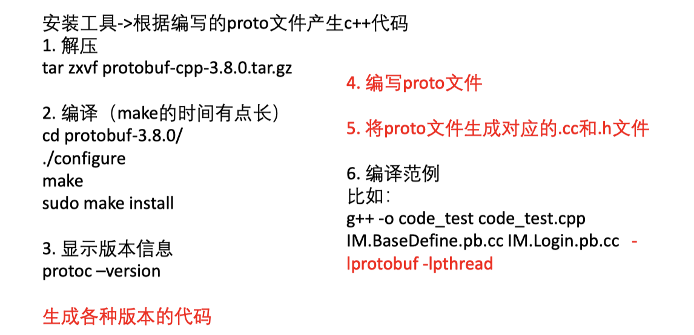
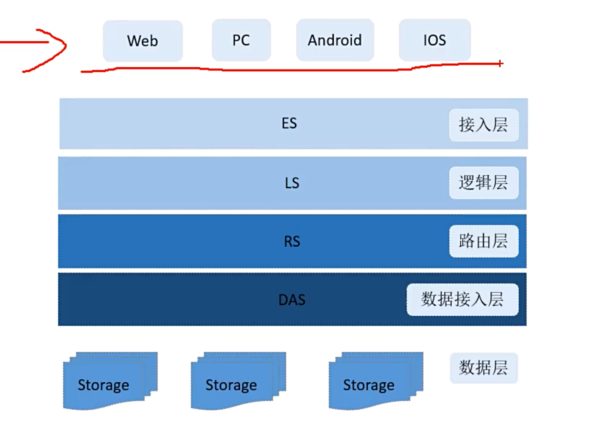
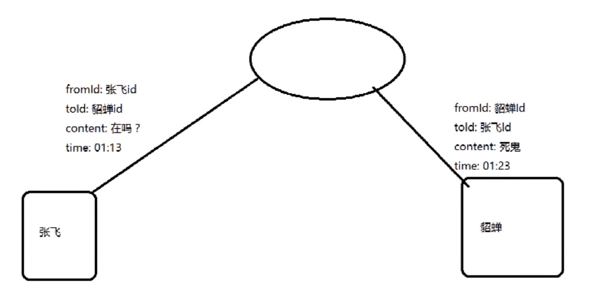
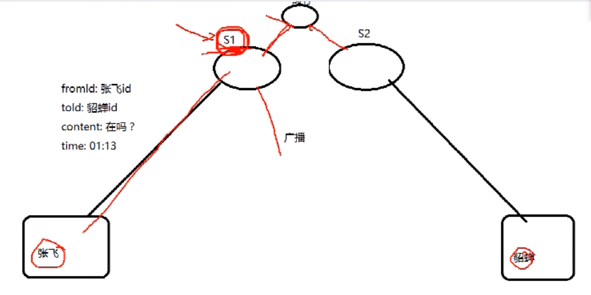
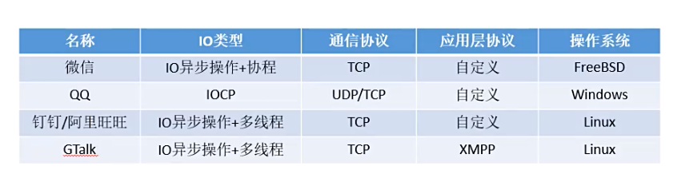
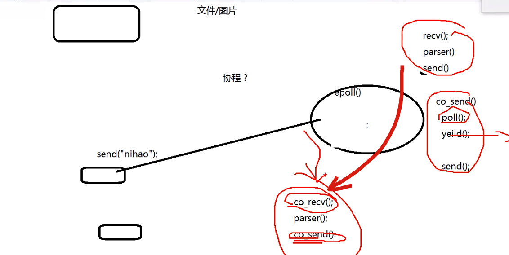
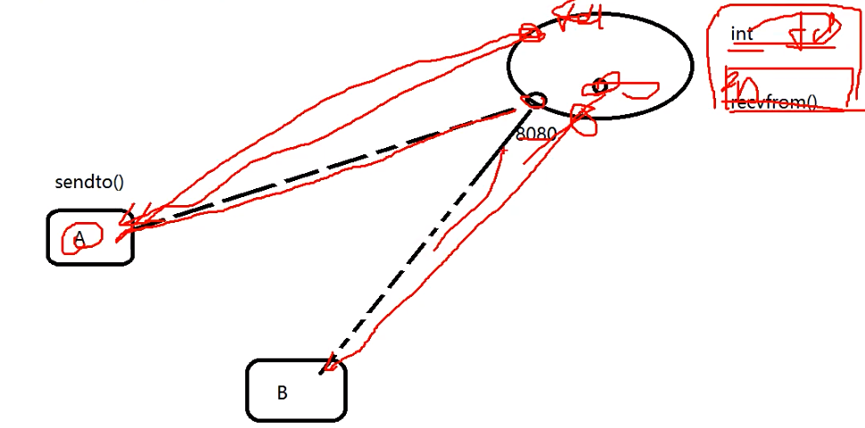

## json库

git clone https://github.com/DaveGamble/cJSON.git

git clone https://github.com/open-source-parsers/jsoncpp.git

git clone https://gitee.com/mirrors/RapidJSON.git

目前已经将文件集成到测试项目里面，不用再重新编译库文件。

## 协议设计

1. 序列化/反序列化
2. 判断包的完整性
3. 协议升级，升级后兼容性
4. 协议安全
5. 数据压缩

### cmake和make

make工具是一个自动化编译工具，你可以使用一条命令实现完全编译。需要编写一个规则文件makefile，make依据它来批处理编译

cmake工具能够根据cmakelist文件，输出各种各样的makefile或者project文件



### 序列化的方法

```sh
mkdir build
cd build
cmake ..
make
```


- TLV编码及其变体（TLV 是 tag, length 和 valuel 的缩写）：比如 Protobuf。文本流编码:比如XML/JSON
- 固定结构编码：基本原理是，协议约定了传输字段类型和字段含义，和 TLV 的方式类似，但是没有了 tag和 len, 只有 value，比如TCP/IP
- 内存 dump：基本原理是，把内存中的数据直接输出，不做任何序列化操作。反序列化的时候，直接还原内存。



**速度对比**


### 判断包的完整性

> TCP连接，客户端发3个包，服务端会收到几个包？

让对方知道给包分界的做法：

1. 以固定大小字节数目来分界，如每个包 100 个字节，对端每收齐 100 个字节，就当成个包来解析

2. 以特定符号来分界，如每个包都以特定的字符来结尾（如 \r\n），当在字节流中读取到该字符时，则表明上一个包到此为止；

3. 固定包头+包体结构，这种结构中一般包头部分是一个固定字节长度的结构，并且包头中会有一个特定的字段指定包体的大小。
   收包时，先接收固定字节数的头部解出这个包完整长度，按此长度接收包体。这是目前各种网络应用用的最多的一种包格式；

4. 在序列化后的 buffer 前面增加一个字符流的头部，其中有个字段存储包总长度，根据特殊字符（比如根据\n 或者\0）判断头部的完整性。
   这样通常比 3 要麻烦一些，HTTP 和 Redis 采用的是这种方式。收包的时候，先判断已收到的数据中是否包含结束符，收到结束符后解析包头，解出这个包完整长度，按此长度接收包体。


## protobuf使用

> python 使用protobuf出错：protoc: error while loading shared libraries: libprotoc.so.9: cannot open shared object file:No such...
>
> 解决方法：linux 敲击命令：export LD_LIBRARY_PATH=/usr/local/lib

https://github.com/protocolbuffers/protobuf



protobuf编码方式：https://www.yuque.com/docs/share/838ab0ba-5347-4829-803e-9a218a19bffd?

如果开头第一行不声明 `syntax = "proto3";`，则默认使用 proto2 进行解析。

```protobuf
syntax = "proto3";
message SearchRequest {
  required string query = 1;
  required int32 page_number = 2;
  optional int32 result_per_page = 3;
}
```


## 即时通讯protobuf

### 三类产品

1. QQ/VX，skype、陌陌、探探
2. 做即时通讯SDK，容联、极光
3. 开源软件，teamtalk

公司打算开发一个即时通讯

1. 1-2个工程师：商业SDK
2. 10个以下：开源的版本进行，如teamtalk
3. 几十个工程师：从头开始做一个

### 即时通讯框架



- 网络接入层：负责网络IO，epoll、receive、send，和操作系统最相关的，可以使用Libevent、协程框架等

- 逻辑层：负责协议解析。服务器分析从谁发给谁。

- 路由层：服务器变为集群。解决服务器间通信的问题。使用发布-订阅模式：

  

- 数据接入层：专门处理数据，以分离业务处理流程和数据处理

- 数据层：第三方存储，如MySQL，和代码没有直接的关系


### 接入层技术分析



微信开源的协程框架：libco

king老师开发：ntyco

#### 协程

阻塞时会自动进行切换



co_recv()：协程封装好的接口

#### QQ选择windows的原因

1. Linux没有epoll，select不完善，只能1个请求1个线程

   Linux早期更多作为嵌入式系统，epoll的出现使其在服务器市场占据一席之地

2.  windows服务器版有技术支持

#### QQ选择UDP的原因

- UDP存在脏数据（如果出现脏数据，只能丢弃）

使用UDP模拟TCP的三次握手：在第一个端口接收到信息后，服务器分配另一个专门的端口fd给客户端



- 一个进程能够打开的fd本身不足，UDP模拟后可以使fd比TCP多很多      
  - TCP操作系统的fd
  - UDP应用程序里定义fd


