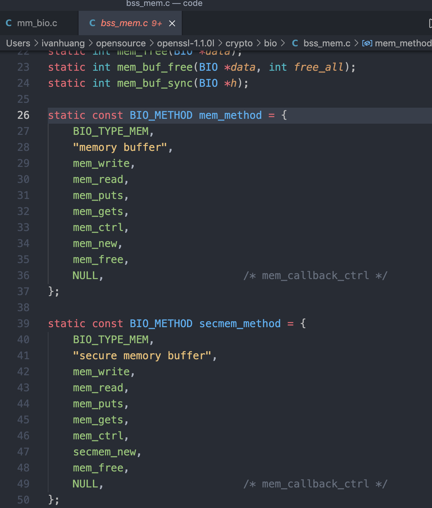

## 简介

https://study.0voice.com/document/openssl/

https://www.openssl.org/source/

### 重要内容

1. 哈希
2. BIO
3. base64
4. MD4，MD5，SHA1
5. 非对称加密RSA

### 解决的问题

10亿条数据，是否存在-->bitmap：通过一个bit来存储一个数据在与不在。

如何存储：分库分表

MongoDB：不解决存储问题，解决快速插入、最近的数据查询等问题

## hash

-lssl -lcrypto

非线程安全

```c
#include <openssl/lhash.h>
Person p1 = {"King", 170, "xxxx"};
// 创建
_LHASH* h = lh_new(NULL, person_cmp);
// 添加
lh_insert(h, &p1);
// 遍历
lh_doall(h, print_value);
// 查找
void* data = lh_retrieve(h, (const char*)"King");
// 释放
lh_free(h);
```

## 抽象IO

BIO: 抽象接口

file_operations: open、write、read（作为应用层再进行一次封装）

### BIO的实现

BIO是OpenSSL中对IO操作的一个抽象子系统

BIO能实现许多的功能

```c
BIO *b = BIO_new(BIO_s_mem());
```




## Base64编解码


## MD5

// md4, md5, SHA1, SHA256, SHA512


