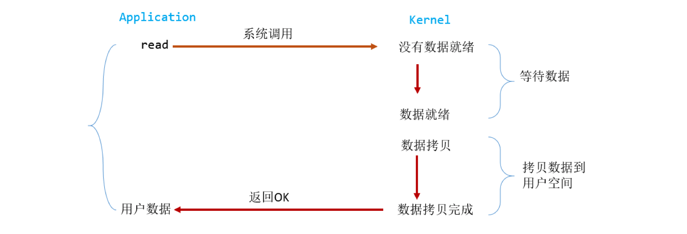
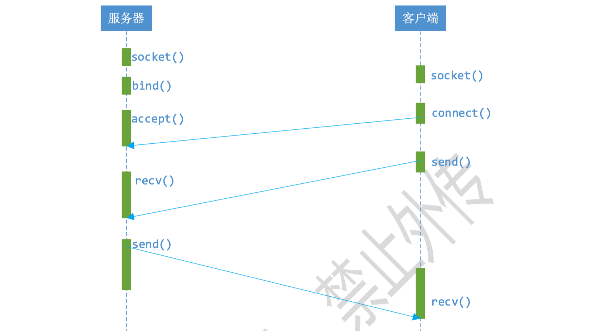
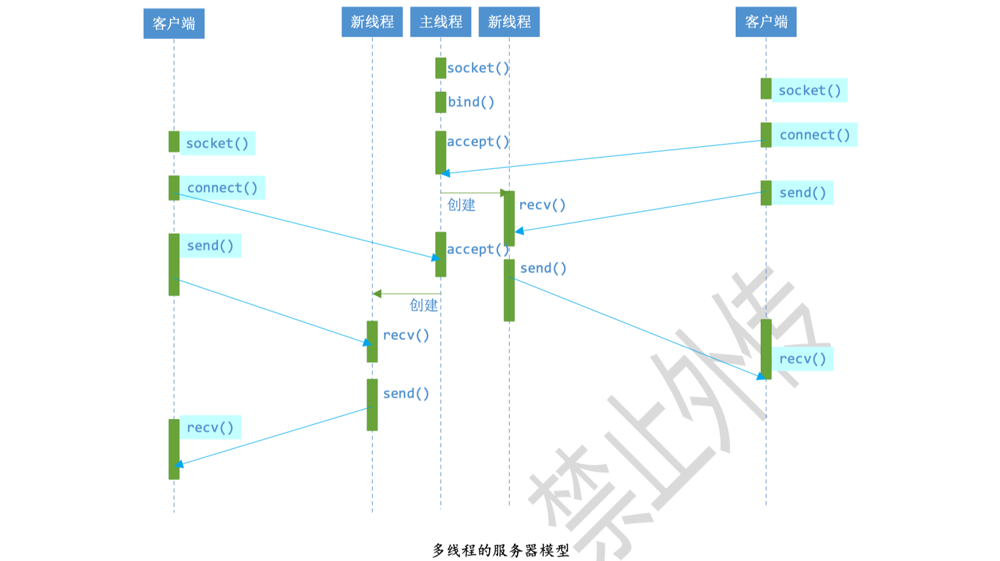
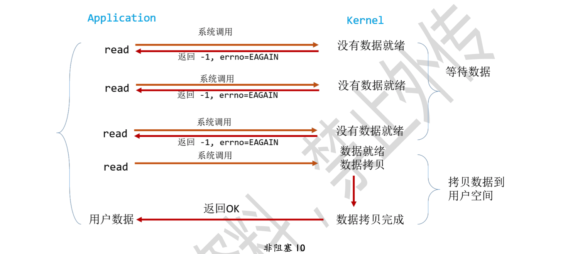
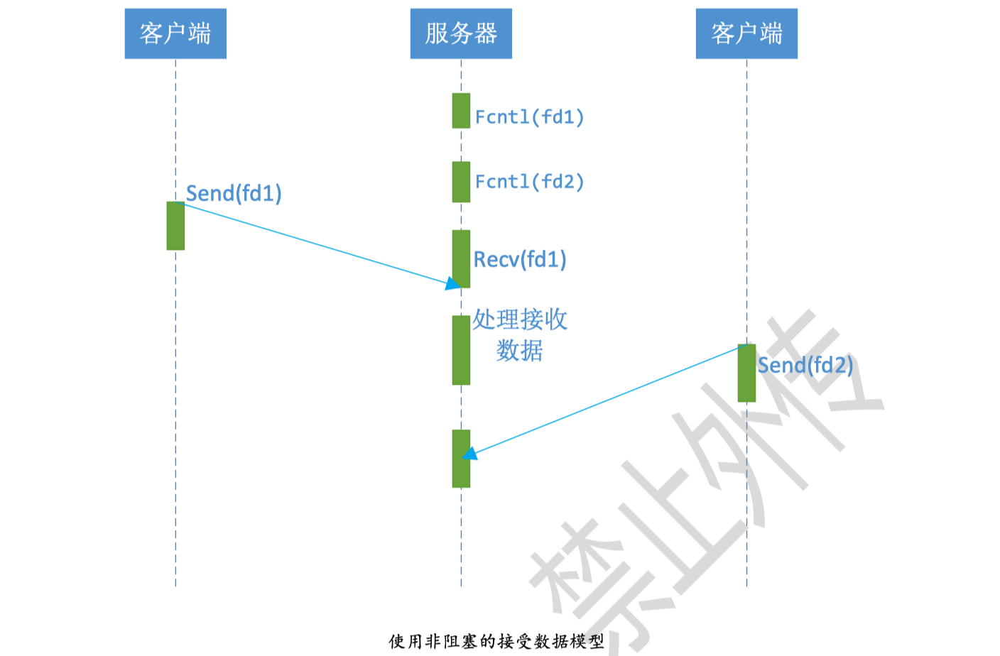
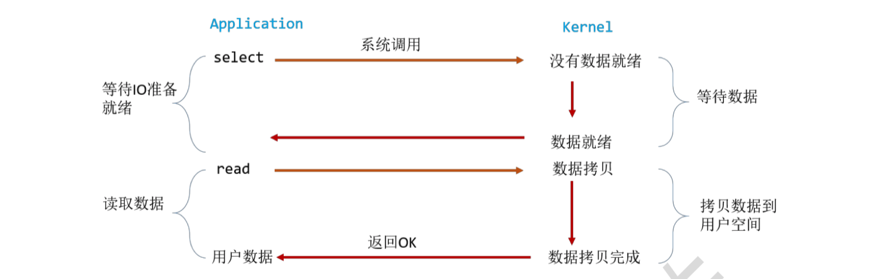
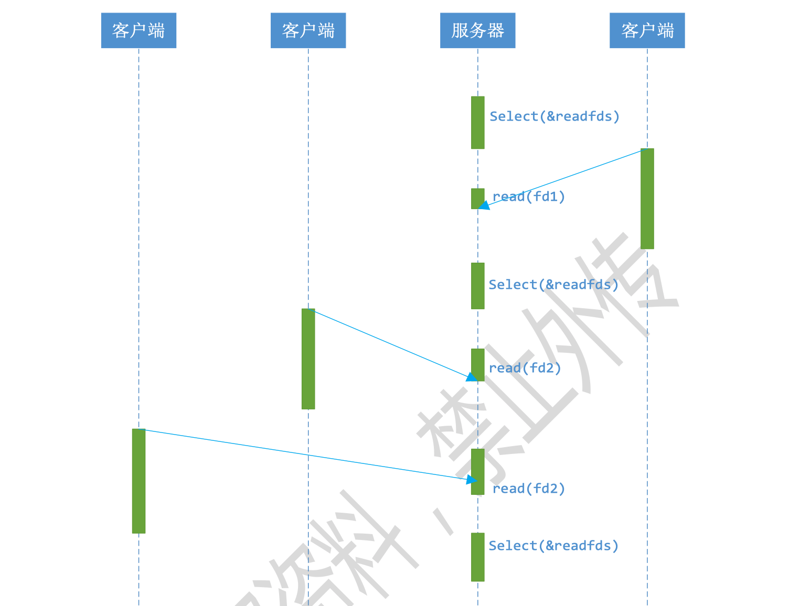
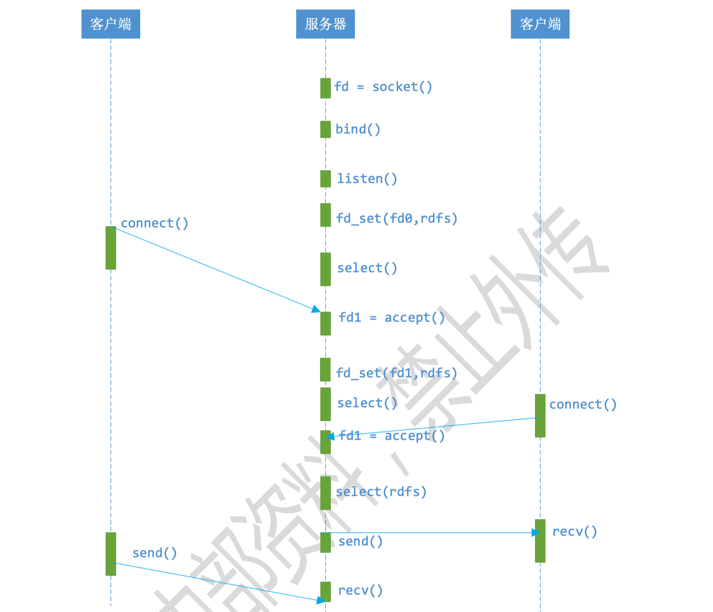
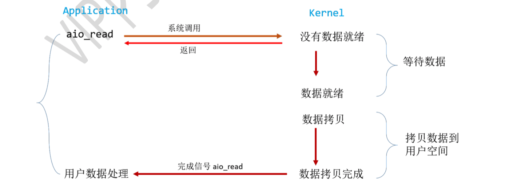
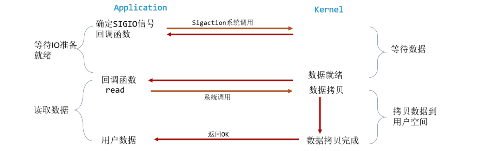

## 问题整理

### 为什么要有select/poll/epoll？

- 如果没有多路复用，处理多个IO的方法为：
  - 1多开线程，fd数量受限
  - 2 轮询recv所有IO，大量的recv是没有数据的
- select/poll/epoll的做法为：
  - 专门用一个组件，判别IO中是否有数据
  - select：是否可读、是否可写、是否出错
- select和epoll选择
  - 数量少时select更方便，数量大时epoll更快
  - epoll：使用红黑树组织所有节点

### sigaction回调函数

- 为什么不常用？频繁的信号操作影响内核性能：从内核态到用户态的转换。
- 异步怎么理解？如检测IO是否有数据，与读写数据，不在一个流程中，即为异步操作。异步形容两者之间的关系。

### 怎样理解阻塞非阻塞与同步异步的区别？

阻塞IO会一直阻塞到操作完成，非阻塞IO会在kernel还未处理完时返回。

阻塞和非阻塞，描述的是一种状态；同步与非同步描述的是行为方式，两者之间的关系

两个操作不在一个流程中：异步

### bind失败原因


### recv之前数据在哪里

> 协议栈实现时讲解

网卡->sk_buf->send/receive buf->recv(i, buffer, BUFFER_LEN,0); 

可读与可写：buf中有内容、buf中有空间


## 阻塞IO(blocking IO)

IO的两个执行阶段（等待数据和拷贝数据）都被阻塞



### CS服务器模型



### 多线程模型

一个改进方案：服务端使用多线程（或多进程），让每个连接都有独立的线程。



多线程模型进化：线程池或连接池。

## 非阻塞IO(non-blocking IO)

```c
fcntl(fd, F_SETFL, O_NONBLOCK);
```

- 非阻塞状态下，recv()在被调用后立刻返回。
- 用户进程需要不断主动询问kernel数据是否准备好。




### 非阻塞单线程模型

通过循环调用recv()，在单个线程内实现对所有连接的数据接收工作。



## 多路复用(IO multiplexing)

或称为事件驱动IO(event driven IO)。select/epoll不断轮询所负责的所有socket，当某个socket有数据到达，就通知用户进程。

优势：可以在一个线程内同时处理多个socket的IO请求



每一个socket都是非阻塞的，整个用户程序被select阻塞。

### 使用select的接收数据模型




### 使用select的基于事件驱动的服务器模型



### epoll的缺陷

将事件探测和事件响应夹杂在一起，若事件响应执行体太大，会影响事件探测的及时性。libevent库、libev库等可以解决该问题

## 异步IO(Asynchronous IO)



服务器处理数据异步，用户请求read为非阻塞。

## 信号驱动IO(signal driven IO, SIGIO)




### 