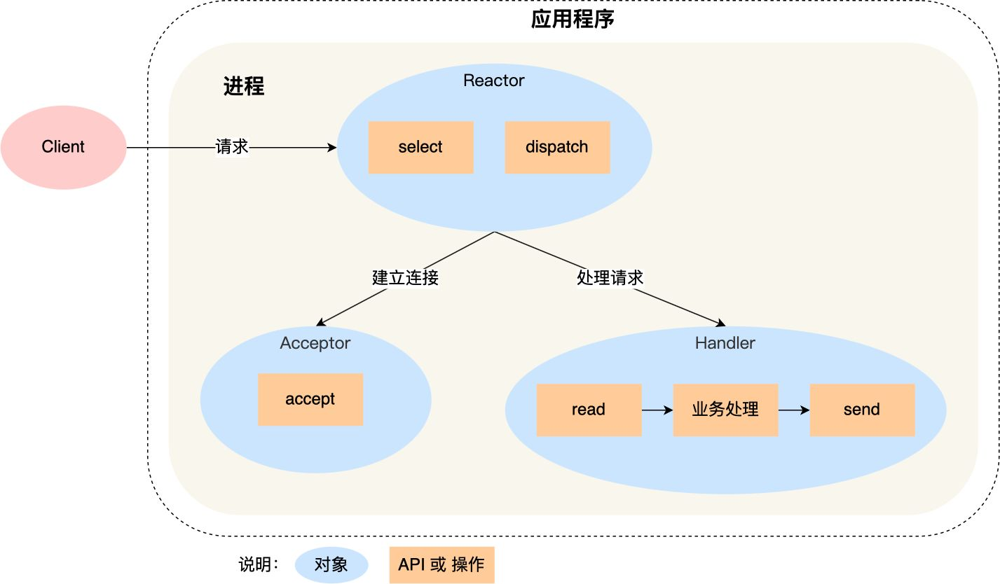
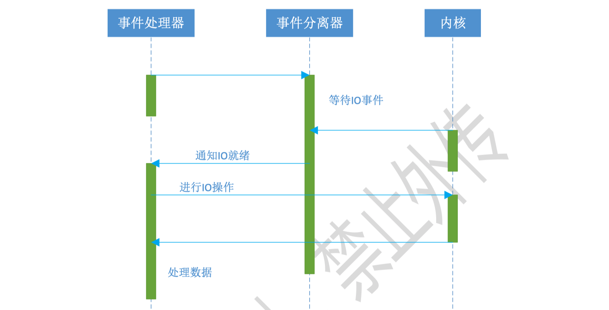
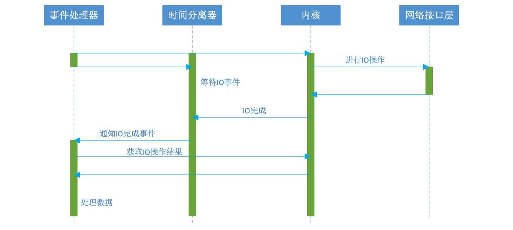

https://aceld.gitbooks.io/libevent/content/32_epollde_fan_ying_dui_mo_shi_shi_xian.html

网络连接上的消息处理一般可分为两个阶段：等待消息准备好、消息处理。

## Reactor模型

### 代码实现

1. 每一个IO对应哪些属性
2. 很多IO该如何存储

epoll：检测IO是否可读写，发生在IO操作之前

### 定义

- 应用程序不主动调用API，而是将接口注册到Reactor上，时间发生时Reactor回调那些接口
- 将所有要处理的IO时间注册到多路复用器上，主线程在多路复用器上阻塞
- IO事件到来或是准备就绪（文件描述符或socket可读写）时，多路复用器返回并将事件注册的IO事件分发到对应的事件处理器上。

### 组件

- 多路复用器（内核）：由操作系统提供，在 inux 上一般是 select, poll, epoll 等系统调用。
- 事件分离器：将多路复用器中返回的就绪事件分到对应的处理函数中
- 事件处理器：负责处理特定事件的处理函数。

### 流程

1. 注册读就绪事件和相应的事件处理器；
2. 事件分离器等待事件；
3. 事件到来，激活分离器，分离器调用事件对应的处理器；
4. 事件处理器完成实际的读操作，处理读到的数据，注册新的事件，然后返还控制权。

## Proactor模型

### 特点

- 使用异步IO，所有的IO操作都交给异步IO接口完成，工作线程只负责业务逻辑

### 流程

1. 处理器发起异步操作,并关注IO完成事件
2. 事件分离器等待操作完成事件
3. 分离器等待过程中,内核并行执行实际的IO操作,并将结果数据存入用户自定义缓冲区，最后通知事件分离器读操作完成
4. IO完成后，通过事件分离器呼唤处理器
5. 事件处理器处理用户自定义缓冲区中的数据

### 同步IO模拟Proactor