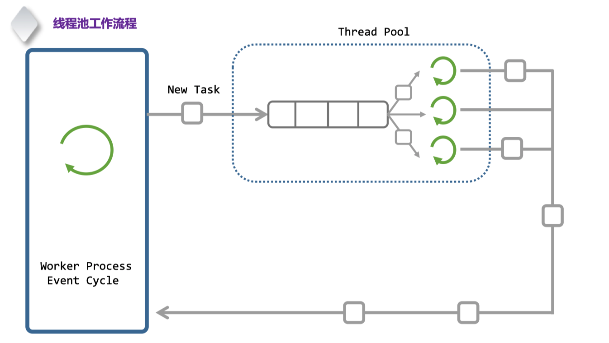
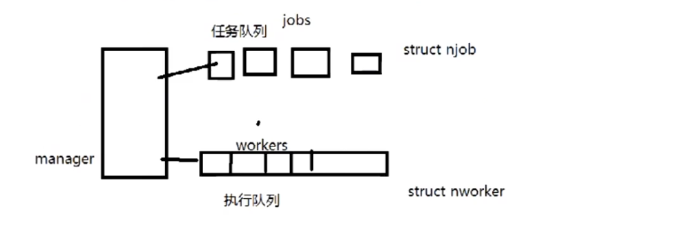

# 后台组件总结

并发量：服务器同时承载的客户端数量。

需要满足客户端相对应的客户端需求

1. 登陆注册

2. 聊天/发送图片/发送语音 

3. 红包/体现

## 数据存储

MySQL：持久化存储

Redis：访问速度快，用作缓存

方案一：先写Redis，同时异步写入MySQL

```c++
{
  write_to_redis();
  write_to_mysql();
}
```


方案二：直接写入MySQL，使用MySQL将数据同步到Redis

```c
{
  write_to_mysql();
  mysql_sync_redis();
}
```

例子：


消息队列MQ：跨机器做路由


# 线程池

## 作用

1. 对IO操作
2. 日志的存储

互斥量：避免两个线程执行同一个任务

## 工作原理







https://github.com/wangbojing/NtyCo