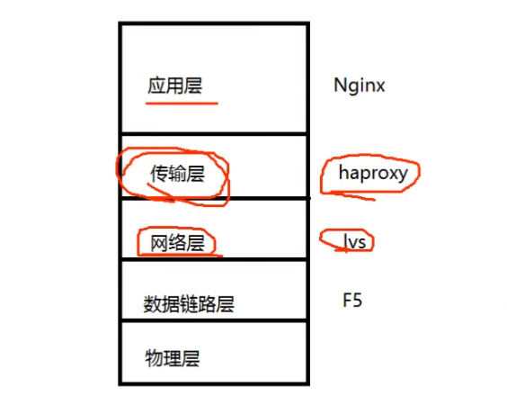
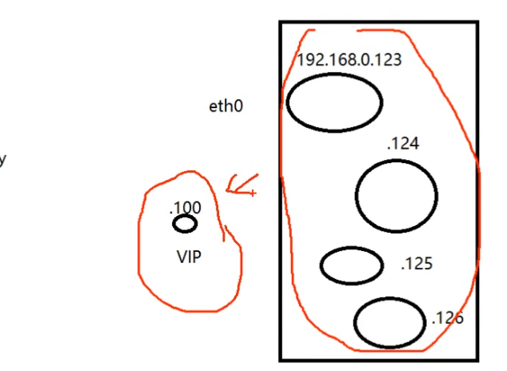

### 网络结构

路由器：数据网关，路由器通过NAT的端口映射，使外部只能访问Nginx

Nginx：应用层网关，nginx屏蔽了其他服务器

Nginx和其他服务器在同一个局域网内。


数据先访问路由器，然后到达nginx，由nginx代理局域网内的其他机器。

 

## 负载均衡



越往下层的代理网络性能越高

### 网络层lvs

lvs：通过虚拟IP，四个服务器共用一个IP地址（回环IP）



### DNS的负载均衡

配置好，其他不用管。通过一个域名映射到两个IP地址


## 安装与使用

```
nginx
pcre：负责做正则表达式.conf文件
openssl：做MD5验证、HTTP加密库的使用
pcre
zlib：压缩
```


> ./configure --prefix=/usr/local/nginx --with-http_realip_module --with-http_addition_module --with-http_gzip_static_module --with-http_secure_link_module --with-http_stub_status_module --with-stream --with-pcre=/home/ivan/nginx/pcre-8.41 --with-zlib=/home/ivan/nginx/zlib-1.2.11 --with-openssl=/home/ivan/nginx/openssl-1.1.0g

### 安装文件发生了什么

`sudo make install` 安装文件发生了什么？

把可执行文件安装到系统的bin文件下，可以直接使用命令调用


### conf文件

`/usr/local/nginx/conf/nginx.conf`


```bash
./sbin/nginx –c ./conf/nginx.conf	  //qi
/usr/local/nginx/sbin/nginx -s stop
./sbin/nginx -c vip_conf/vip.conf
```

