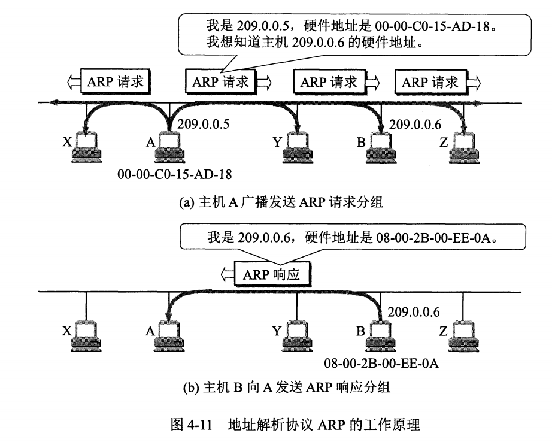
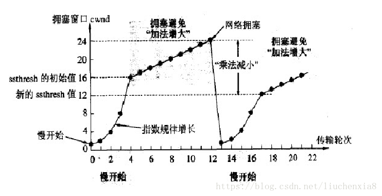
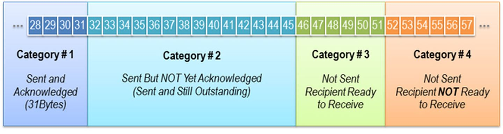

https://zhuanlan.zhihu.com/p/24001696

## 体系结构

## 网络层

### IP数据包格式

- 版本：4或6
- 首部长度、总长度（首部+数据部分）

- 生存时间：TTL。以路由器跳数为单位，当 TTL 为 0 时就丢弃数据报。

- 协议 ：指出携带的数据应该上交给哪个协议进行处理，例如 ICMP、TCP、UDP 等。
- 首部检验和 ：因为数据报每经过一个路由器，都要重新计算检验和，因此检验和不包含数据部分可以减少计算的工作量。

### IP地址分类

IP地址共32位，由两部分组成，网络号和主机号，其中不同分类具有不同的网络号长度，并且是固定的。

IP 地址 := `{< 网络号 >, < 主机号 >}`

- A类地址：1个字节的网络号，3个字节的主机号，用于少量的大型网络；
- B类地址：2个字节的网络号，2个字节的主机号，用于中等规模的网络；
- C类地址：3个字节的网络号，1个字节的主机号，用于小规模的网络。

### ARP协议

网络层实现主机之间的通信，而链路层实现具体每段链路之间的通信。因此在通信过程中，IP 数据报的源IP地址和目的IP地址始终不变，而 MAC 地址随着链路的改变而改变。

ARP 实现由 IP 地址得到 MAC 地址。

每个主机都有一个 ARP 高速缓存，里面有本局域网上的各主机和路由器的 IP 地址到 MAC 地址的映射表。

如果A不知道B的MAC地址，则A通过广播发送ARP请求，B接收到后发送ARP响应给A。

## 传输层

### TCP如何保持传输可靠性

- 校验和

  两个数据段 加和、取反、加上进位

  如果接收方比对校验和与发送方不一致，那么数据一定传输有误。

- 确认应答与序列号

  TCP传输时将每个字节的数据都进行了编号。TCP传输的过程中，每次接收方收到数据后，都会对传输方进行确认ACK应答。

- 超时重传

  两个原因：接收方未收到包、发送方未收到ACK。

  发送方在超过超时时间后，仍未收到ACK则重传。

  重传时间：每次判定超时重发的超时时间都是500ms的整数倍，以一个指数的形式增长。累计到一定的重传次数，强制关闭连接。

- 连接管理

  三次握手、四次握手

- 流量控制

  TCP头部的窗口大小，即接收端数据缓冲区的剩余大小。发送端根据窗口大小改变发送速度。

- 拥塞控制

  慢开始，快重传

https://blog.csdn.net/liuchenxia8/article/details/80428157

### 滑动窗口

- TCP对多个报文段发送一个ACK进行确认

- 滑动窗口动态调整：接收端可以根据自己的状况通告窗口大小，从而控制发送端的接收，进行流量控制

- 数据的四种状态

  

## 应用层

## 网络安全

## ref

- 路人甲：常见面试题整理--计算机网络篇（每位开发者必备）https://zhuanlan.zhihu.com/p/24001696

- CS-Notes: [计算机网络](http://www.cyc2018.xyz/%E8%AE%A1%E7%AE%97%E6%9C%BA%E5%9F%BA%E7%A1%80/%E7%BD%91%E7%BB%9C%E5%9F%BA%E7%A1%80/%E8%AE%A1%E7%AE%97%E6%9C%BA%E7%BD%91%E7%BB%9C%20-%20%E7%9B%AE%E5%BD%95.html)

