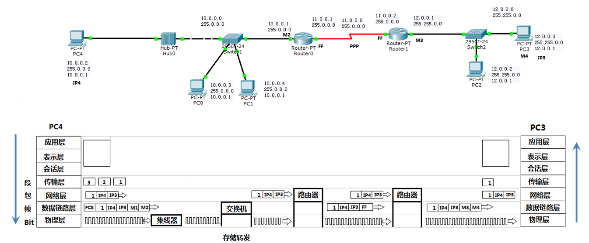

## 网络

### 实际开发中网络为几层，每一层都做什么

五层。

- 应用层负责处理业务。
- 传输层负责端到端的通信，TCP将应用层需要传递的文件分段，在客户端与服务端之间建立会话，提供可靠的传输
- 网络层负责在不同网络间尽力转发数据包，不负责数据包的顺序和丢包重传
- 数据链路层负责在网络的两个相邻节点间提供正确的数据传输
- 物理层传输比特流

### 数据通过网络，在两台机器间的传递过程

> https://www.cnblogs.com/niwotaxuexiba/p/9700764.html

（各个网络层的描述，越详细越好）

- 服务器通过socket、bind、listen、accept监听端口，客户端socket、connect与b机器通过三次握手建立TCP连接

- socket中的三次握手

  

- 客户端connect时，在网络层就是在网络间，把SYN数据包尽力发给服务器，数据包可能会丢失。这时TCP会通过超时重传等机制保证服务器能收到SYN数据包，以完成三次握手

- 在两个网络节点之间发送数据包时，链路层会把数据包封装成数据帧，添加首部、尾部，实现差错检测，保证数据帧的正确性

### HTTP协议包的格式

请求报文：请求行+请求头+请求体

响应报文：状态行+响应头+响应体

### TCP粘包和半包

#### TCP 黏包问题

> https://interview.huihut.com/#/?id=tcp-黏包问题

##### 原因

TCP 是一个基于字节流的传输服务（UDP 基于报文的），“流” 意味着 TCP 所传输的数据是没有边界的。所以可能会出现两个数据包黏在一起的情况。

设计一个带包头的应用层报文结构就能解决。包头定长，以特定标志开头，里带着负载长度，这样接收侧只要以定长尝试读取包头，再按照包头里的负载长度读取负载就行了，多出来的数据都留在缓冲区里即可。

##### 解决

- 发送定长包。如果每个消息的大小都是一样的，那么在接收对等方只要累计接收数据，直到数据等于一个定长的数值就将它作为一个消息。
- 包头加上包体长度。包头是定长的 4 个字节，说明了包体的长度。接收对等方先接收包头长度，依据包头长度来接收包体。
- 在数据包之间设置边界，如添加特殊符号 `\r\n` 标记。FTP 协议正是这么做的。但问题在于如果数据正文中也含有 `\r\n`，则会误判为消息的边界。
- 使用更加复杂的应用层协议。

### 如何判断收到的HTTP包的完整性

浏览器判断HTTP响应是否完全接受完毕是通过Content-Length或者transfer-encodeing头的chunked结束标志来判断响应是否全部收到的，因此所谓的完整性检验仅仅只是判断HTTP响应是否完整，而不判断内容是否被拦截篡改

### GET和POST的区别

**数据分别放哪儿？属于包体or包头？**

GET主要是请求URL，放在HTTP的请求头中

POST像服务器发送数据，放在HTTP的响应体中

**包体和包头的分割？**

一个空行

**如何知道包体存放的数据大小？**

content-length

**网页的HTML属于HTTP数据包的包体or包头？**

请求体

### select()函数的使用

1. 设置几个fd_set和timeout
2. 调用select，第一个参数为监听的fd的数量，返回发生事件的fd数量
3. 遍历所有的文件描述符，进行业务处理

### epoll()的LT和ET

边缘触发中：b给a发10个字节，a接收5个，再发10个，是否会触发？

会

### Reactor和Proactor模型

## 操作系统

### 进程和线程的区别

**一个进程至少有一个线程是这样吗？**

如果一个程序中的1个进程当中有5个线程，如果某一个线程因为一些问题挂掉了，会导致整个进程退出吗？

一般每个线程需要自己处理异常，如果发生异常没有catch，会导致线程终止，进而进程终止。

### 线程同步

条件变量的虚假唤醒

什么问题会造成死锁

## 数据库

### Redis的基本数据结构

### 评论存储的算法题

设计一个数据结构，存储博客系统下的评论信息。

高效地存储评论以及评论的回复。

做一个数据库表设计？

