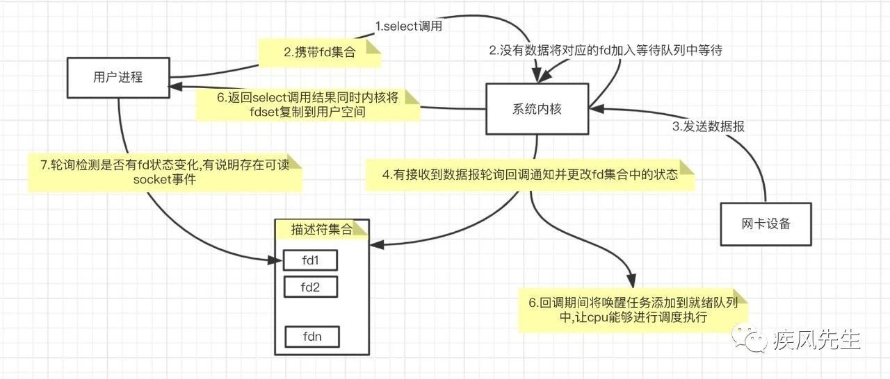

## 西安腾讯CSIG

> 作者：xd69
> 链接：https://www.nowcoder.com/discuss/666397?type=0&order=0&pos=3&page=1&channel=-1&source_id=discuss_tag_nctrack
> 来源：牛客网

###  1.vector list区别，讲讲map？

vector底层是数组，list底层是链表，二者的区别就是数组和链表的区别

map是一个key-velue的容器，内部红黑树自动排序，查找O(log n)

### map和unorderedmap区别？

map底层是一个红黑树

unordered_map底层是一个hash表，是一种不定序容器，查找更快，占用内存更高

###   2.内联函数和define的区别？

内联函数在编译时将函数体嵌入到调用处，类似宏替换

- 编译器会对内联函数的参数做安全检查或自动类型转换
- 内联函数可以访问类的成员变量

###   3.多态的理解？

- 多态即多种形态，同一个东西可以有不同的意思
- 多态以封装和继承为基础
  - 类模板、函数模板
  - 运算符重载、函数重载
  - 运行时多态：虚函数

### 讲虚函数， 纯虚函数，虚表的原理

纯虚函数是一种特殊的虚函数。

相比于普通函数在编译时生成，虚函数在运行时动态绑定。动态绑定的过程只在调用函数时发生。

虚函数表是在编译时生成的，每个派生类都有一个虚函数表。

###  析构函数可以是虚函数吗？

可以，如果不是虚函数，那么一个指向派生类的基类指针析构时将无法调用派生类的析构函数。

### 构造函数可以是虚函数吗？

不可以

构造函数需要在编译时确定。vtable在编译时确定，vptr在运行时确定。

如果构造函数虚函数，那么需要vptr来指向vtable，编译时还没有vtable

###   4.C++11的新特性用过什么 

- 智能指针：把指针和内存绑定，自动进行内存的销毁和创建
- lambda表达式：创建匿名函数对象
- std::bind：生成一个函数适配器，可以改变参数顺序
- auto
- nullptr
- for

###   5. 进程线程区别

- 基本单位
- 通信方式
- 包含关系
- 内存

###   6.线程通信方式

- 互斥锁
- 条件变量
- 信号量
- 读写锁

### 多线程读写一个文件的过程 

如果是读，可以共享

如果是写，需要使用锁或者信号量

读写：读写锁

###   7.select epoll原理

> https://cloud.tencent.com/developer/article/1596048
>

#### select原理

1. 用户向内核发起select调用，并将文件描述符集合从用户空间拷贝到内核
2. 内核将fd加入到等待队列中
3. 内核接收到数据包时，轮询找到可读的socketfd，并更新fd集合中的描述符状态
4. ？在轮询唤醒的过程中,如果有对应的socket描述符是可读的,那么此时会将read_process加入到cpu就绪队列中,让cpu能够调度执行read_process任务
5. 用户调用select返回，用遍历fd集合进行操作

#### poll

poll使用链表的方式存储描述符fd,不受数组大小影响

#### epoll

- select中需要将fdset拷贝，epoll在内核中存储一份数据来记录N个socket的变化
- 当有就绪事件的时候,循环遍历将监听变化的事件拷贝到用户空间中,并且会将就绪事件socket添加到epitem的就绪队列ready_list上

水平触发和边缘触发

- 水平触发：遍历epoll下的等待队列的每个entry，唤醒entry节点之后从ready_list移除当前socket事件，再轮询当前item收集可用的事件，最后添加到ready_list以便于调用epoll_wait的时候能够检查到socket事件可用
- 边缘触发：遍历epoll下的等待队列的每个entry，唤醒entry节点之后从ready_list移除当前socket事件，再轮询当前item收集可用的事件。然后唤醒执行的业务处理read_process

###   8.TCP三次握手为什么不是两次和四次

- 若只有两次：客户端发出的连接请求报文多次到达服务端，导致建立多个连接
- 三次原因：双方都需要确认对方的初始序号

###   9.短连接和长连接

- 短连接：一次连接传输一次数据
- TCP长连接：keep-alive机制，TCP有保活时间
- 应用层实现探活：每隔一段时间发送一个心跳包

###   10.cookies和session的区别 

二者都是HTTP服务器用来记录用户状态的机制，因为HTTP是无状态的协议

存储位置不同，客户端or服务器端。

session在服务器端，所以更安全、对用户不可见，但是消耗服务器资源。

## 美团后台

> 作者：努力努力努力学
> 链接：https://www.nowcoder.com/discuss/622878?type=0&order=0&pos=18&page=1&channel=-1&source_id=discuss_tag_nctrack
> 来源：牛客网

### 2 合并两个有序链表，如果其中一个无序呢？ 

先把无序链表排序，再合并

排序算法：归并排序

###  3 TCP为什么三次握手？ 

- 第三次握手是为了防止客户端收到多次连接请求消息，建立多个连接
- 三次握手就是客户端和服务器端交换并确认双方的消息序列号

### 4 select、poll、epoll

都是IO多路复用，用一个线程来处理多个网络连接

- 以select为例，当用户调用select时，将fdset拷贝到内核
- 内核将fd都添加到等待队列
- 内核接收到数据包，轮询队列找到对应的fd
- 用户线程select返回

### 5 红黑树

性质

- 根节点是黑色，叶子节点是黑色
- 红色节点的子节点是黑色
- 从根节点到叶子节点经过相同数量的黑色节点

###   6 winsocket

  \7. linux查看磁盘使用情况，如果文件层级深度太深，du加载太慢怎么办？ 

  \8. 怎么实现一个日志的滚动输出？（不会。。。扯到了head） 

  \9. tail -f 用过吗？ 

  \10. tail 呢？ 

  \11. awk sed用过吗？ 

  \12. [redis]()一类的中间件用过吗？（没有） 

  \13. 反问 

## 美团后台

作者：betterpig
链接：https://www.nowcoder.com/discuss/565141?type=0&order=0&pos=17&page=1&channel=-1&source_id=discuss_tag_nctrack
来源：牛客网

1. 三次握手和四次挥手  
   - 为什么要等待2MSL 
   - 讲一下拥塞控制和滑动窗口，主要是为了解决什么问题 
   - 如果发送方发送速度太快，接收方会出现什么问题 
   - 了解TCP的拆包和粘包吗，怎么解决粘包 
2. 线程切换的过程  
   - 进程调度策略及优缺点 
   - 时间片轮转策略是公平的吗，当时间片到期时，下一个被选择的进程是基于什么策略选择的 
3. Reactor和proactor模型的区别  
   - 为什么reactor模型要有主线程和工作线程的区分 
4. 时间轮的实现原理  
   - 单个时间轮会有什么问题，多时间轮有什么好处 
5. 编程题：实现阻塞队列 

### 二面（10.21） 51min

1. 对于服务器来说，应该关注的cpu指标有哪些 

2. CPU、内存和磁盘的数据交互过程是怎样的 

3. Hashmap的原理（我答桶哈希）  

   - Key是string的情况下怎么设计哈希函数能让数据均匀分布（我答进制法） 

4. 怎么设计线程池 

5. 事务特性  

   - 事务怎么保证这四个特性 
   - Binlog存的是什么 
   - MySQL有哪几种索引 
   - 如何判断sql语句是否走索引 
   - Explain结果要关注哪些字段 
   - 为什么MySQL的索引要用B+树而不用[二叉树]() 
   - 了解update和replace语句的区别吗 
   - 在事务执行过程中，什么时候开始写redolog和undolog 

6. 工厂模式有哪几种实现方式  

   - 为什么要有抽象工厂模式 
   - 了解创建者模式 

7. Linux服务器模型有哪几种  

   - Select、poll和epoll的区别 

   

## C++后端总结

https://www.nowcoder.com/discuss/637559?type=0&order=0&pos=19&page=2&channel=-1&source_id=discuss_tag_nctrack

作者：华中大守门员
链接：https://www.nowcoder.com/discuss/637559?type=0&order=0&pos=19&page=2&channel=-1&source_id=discuss_tag_nctrack
来源：牛客网

学习路线及推荐学习时间：
 一、C++基础（3个月）
 1、面向对象的三大特性：封装、继承、多态
 2、类的访问权限：private、protected、public
 3、类的构造函数、析构函数、赋值函数、拷贝函数
 4、移动构造函数与拷贝构造函数对比
 5、深拷贝与浅拷贝的区别
 6、空类有哪些函数？空类的大小？
 7、内存分区：全局区、堆区、栈区、常量区、代码区
 8、C++与C的区别
 9、struct与class的区别
 10、struct内存对齐
 11、new/delete与malloc/free的区别
 12、内存泄露的情况
 13、sizeof与strlen对比
 14、指针与引用的区别
 15、野指针产生与避免
 16、多态：动态多态、静态多态
 17、虚函数实现动态多态的原理、虚函数与纯虚函数的区别
 18、继承时，父类的析构函数是否为虚函数？构造函数能不能为虚函数？为什么？
 19、静态多态：重写、重载、模板
 20、static关键字：修饰局部变量、全局变量、类中成员变量、类中成员函数
 21、const关键字：修饰变量、指针、类对象、类中成员函数
 22、extern关键字：修饰全局变量
 23、volatile关键字：避免编译器指令优化
 24、四种类型转换：static_cast、dynamic_cast、const_cast、reinterpret_cast
 25、右值引用
 26、std::move函数
 27、四种智能指针及底层实现：auto_ptr、unique_ptr、shared_ptr、weak_ptr
 28、shared_ptr中的循环引用怎么解决？（weak_ptr）
 29、vector与list比较
 30、vector迭代器失效的情况
 31、map与unordered_map对比
 32、set与unordered_set对比
 33、STL容器空间配置器

 参考书籍：《C++ Primer》（第5版）、《STL[源码]()剖析》、《深度探索C++对象模型》

 二、计算机网络（1个月）
 1、OSI7层网络模型：应用层、表示层、会话层、运输层、网络层、链路层、物理层
 2、TCP/IP四层网络模型：应用层、运输层、网际层、接口层
 综合OSI与TCP/IP模型，学习五层网络模型：
 从上向下架构：应用层、运输层、网络层、链路层、物理层
 链路层：
 3、MTU
 4、MAC地址
 网络层：
 5、地址解析协议
 6、为啥有IP地址还需要MAC地址？同理，为啥有了MAC地址还需要IP地址？
 7、网络层转发数据报的流程
 8、子网划分、子网掩码
 9、网络控制报文协议ICMP
 10、ICMP应用举例：PING、traceroute
 运输层：
 11、TCP与UDP的区别及应用场景
 12、TCP首部报文格式（SYN、ACK、FIN、RST必须知道）
 13、TCP滑动窗口原理
 14、TCP超时重传时间选择
 15、TCP流程控制
 16、TCP拥塞控制（一定要弄清楚与流量控制的区别）
 17、TCP三次握手及状态变化。为啥不是两次握手？
 18、TCP四次挥手及状态变化。为啥不是三次挥手？
 19、TCP连接释放中TIME_WAIT状态的作用
 20、SYN泛洪攻击。如何解决？
 21、TCP粘包
 22、TCP心跳包
 23、路由器与交换机的区别
 24、UDP如何实现可靠传输
 应用层：
 25、DNS域名系统。采用TCP还是UDP协议？为什么？
 26、FTP协议（了解）
 27、HTTP请求报文与响应报文首部结构
 28、HTTP1.0、HTTP1.1、HTTP2.0对比
 29、HTTP与HTTPS对比
 30、HTTPS加密流程
 31、方法：GET、HEAD、POST、PUT、DELETE
 32、状态码：1**、2**、3**、4**、5**
 33、cookie与session区别
 34、输入一个URL到显示页面的流程（越详细越好，搞明白这个，网络这块就差不多了）

 参考书籍：《计算机网络》（第5版）、《TCP/IP详解卷1：协议》、《图解HTTP》

 三、操作系统（1个月）
 1、进程与线程区别
 2、线程同步的方式：互斥锁、自旋锁、读写锁、条件变量
 3、互斥锁与自旋锁的底层区别
 4、孤儿进程与僵尸进程
 5、死锁及避免
 6、多线程与多进程比较
 7、进程间通信：PIPE、FIFO、消息队列、信号量、共享内存、socket
 8、管道与消息队列对比
 9、fork进程的底层：读时共享，写时复制
 10、线程上下文切换的流程
 11、进程上下文切换的流程
 12、进程的调度[算法]()
 13、阻塞IO与非阻塞IO
 14、同步与异步的概念
 15、静态链接与动态链接的过程
 16、虚拟内存概念（非常重要）
 17、MMU地址翻译的具体流程
 18、缺页处理过程
 19、缺页置换[算法]()：最久未使用[算法]()、先进先出[算法]()、最佳置换[算法]()

 参考书籍：《Unix环境高级编程》、《Linux多线程服务器端编程》
 ps:操作系统的内容看起来不是很多，实际上每个问题答案的底层原理要弄懂还是很考验基本功的。比如：互斥锁与自旋锁的区别，实际上涉及到阻塞时线程的状态是不一样的。互斥锁阻塞的线程是挂起的，此时系统会优先执行其它可执行的线程，就会将阻塞的线程切换到可执行线程，而当临界区执行的时间非常短时，此时线程切换频繁、开销较大，此时就会采用自旋锁的方式，让阻塞的线程处于忙等状态。

 四、网络编程（1个月）
 1、IO多路复用：select、poll、epoll的区别（非常重要，几乎必问，回答得越底层越好，要会使用）
 2、手撕一个最简单的server端服务器（socket、bind、listen、accept这四个API一定要非常熟练）
 3、线程池
 4、基于事件驱动的reactor模式
 5、边沿触发与水平触发的区别
 6、非阻塞IO与阻塞IO区别

 参考书籍：《Unix网络编程》
 ps:网络编程掌握以上几点就够了，要搞明白还是要花很久时间的。

 五、数据结构与[算法]()及[刷题]()（2个月）
 1、数组
 2、[链表]()
 3、栈
 4、队列
 5、堆
 6、[二叉树]()：二叉搜索树、平衡树、[红黑树]()
 7、B树、B+树
 8、[哈希表]()及哈希冲突
 9、[排序]()[算法]()：冒泡[排序]()、简单选择[排序]()、插入[排序]()、希尔[排序]()、归并[排序]()、堆[排序]()、快速[排序]()
 （要求能够面试时手写出堆[排序]()和快速[排序]()）
 10、二分法：[旋转数组]()找target
 11、回溯法：全排列、复原IP地址
 12、[动态规划]()（掌握基本的[动态规划]()的几个题其实就够了，如：[斐波那契数列]()、接雨水、股票的最佳买入时机）

 参考书籍：《大话数据结构》
 ps:建议[刷题]()与数据结构[算法]()同时进行，这样理解得更深入。[刷题]()网站[leetcode]()，刷完《[剑指offer]()》其实就能解决大部分面试手撕了。

 五、mySQL数据库（7天~15天）
 1、数据存储引擎：InnoDB、myISAM、Memory
 2、数据库索引类型及原理：B+树索引、[哈希表]()索引
 3、锁：悲观锁、乐观锁
 4、事务：事务的四大特性（ACID）、事务并发的三大问题、事务隔离级别及实现原理
 5、多版本并发控制实现机制（MCVV）原理

 参考书籍：《高性能MySQL》
 ps:这里也可以参考本人写的博客：mysql知识点总结。

 六、[项目]()（2个月）
 如果时间够的话就可以写一个[项目]()，当然大部分人写的[项目]()都是一个烂大街的[项目]()，也就是“web高性能服务器”。其实就是根据陈硕大神写的《Linux高性能服务器编程：使用muduo C++网络库》进行改编，当然啦，读懂这本书还是很耗时的，学习其中的思想也会受益匪浅的。

## bilibili视频云

作者：Catlyn
链接：https://ac.nowcoder.com/discuss/582851?type=0&order=0&pos=4&page=1&channel=-1&source_id=discuss_tag_nctrack
来源：牛客网

### 一面

#### C++：

- new、malloc区别
  返回类型、分配失败返回值、分配大小、数组的处理方式、是否调用构造函数 
- 多态
  编译时多态、运行时多态 
- 虚函数实现
  vptr、vtable 
- 重载原理
  符号表 
- map
  [红黑树]()，定义，自旋 

#### 网络：

- UDP可靠实现
  序列号、ACK、重传、定时器 
- DNS细节
  不会 
- Listen(2),backlog参数
  The backlog argument defines the maximum length to which the queue of pending connections for sockfd may grow. 
- 浏览器输入网址到实现
  略 

#### 操作系统：

- C程序的虚拟内存空间
  stack、heap、bss、data、text 
- 页机制
  换页、缺页异常、TLB 
- IPC
  管道、信号、消息队列、信号量+共享内存 

#### Linux

- 常用命令 

### 算法题

- 最大子序和
  dp 

### 二面

### 网络

- 拥塞控制
  慢启动、拥塞避免、快速重传、快速恢复 
- select(2)、epoll(7)
  [红黑树]()、边缘触发、节省用户态内核态拷贝 
- [红黑树]()原理，与AVL的区别
  定义、自旋，rebalance频率相对低，适合大量插入删除node的场景 

### 操作系统

- 多进程和多线程的选择
  多进程可靠性高，创建销毁切换开销大，多线程反之 
- Linux下C程序的调试
  breakpoint、coredump 
- 静态链接、动态链接
  libc库，避免代码庞大，节省内存，更新时不需全部重新编译，提高可维护性 
- 内存泄漏
  valgrind 

### 算法题

- n个整数，找出平均数最大且长度为k的连续子数组，输出最大平均数
  easy题，滑动窗口
- 如果长度大于等于k？
  n^2超时，面试结束看了题解，用的二分，这是个hard题

## 腾讯天美

https://blog.csdn.net/weixin_42278880/article/details/104829248