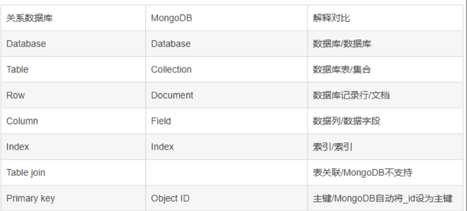

越久远的数据访问次数越少，越近的数据访问次数越多

聊天记录、朋友圈


## NoSQL介绍

NoSQL是Not Only SQL的缩写。它指的是非关系型的数据库，是以key-value形式存储。

优势：简单的扩展、快速的读写、低廉的成本、灵活的数据模型

不足：不提供对SQL的支持、支持的特性不够丰富、传统的商业智能应用

### 逻辑关系对比



MongoDB里面的集合对应于关系型数据库里的表，但是集合中没有列，行和关系的 概念， 集合中只有文档，一个文档相当于一条记录。

### 数据存储结构

MySQL的数据存储结构: MySQL的每个数据库存放在一个与数据库同名的文件夹中。 MyISAM存储引擎,数据厍文件类型就包括.frm、.MYD、.MYI。 InnoDB存储引擎,数据厍文件类型就包括.frm、.ibd。 /var/lib/mysql

MongoDB的数据存储结构:MongoDB的默认数据目录是 /data/db,它负责存储所有的 MongoDB的数据文件。

## MongoDB安装与使用

### 下载安装

1.下载MongoDB wget https://fastdl.mongodb.org/linux/mongodb-linux-x86_64-ubuntu1604-4.2.6.tgz

2.解压.压缩包 tar -zxvf mongodb-linux-x86_64-ubuntu1604-4.2.6.tgz

3.将解压包拷贝到指定目录 mv mongodb-linux-x86_64-ubuntu1604-4.2.6 /opt/mongodb

创建数据库文件夹(默认的数据库文件的位置是/data/db,启动时会自动创建)

提示:mongodb没有具体的安装过程，解压文件包后，可以直接使用，非常高效和方便。

 touch /opt/mongodb/logs

### 初始设置

创建文件夹或文件 

```
sudo mkdir -p /data/db 
sudo mkdir -p /opt/mongodb/logs 
sudo touch /opt/mongodb/logs/mongodb.log
```

在mongodb安装位置/bin目录 sudo vim mongodb.conf

```
#数据文件存放目录
dbpath=/data/db
#日志文件存放目录
logpath=/opt/mongodb/logs/mongodb.log
#以守护程序的方式启用，即在后台运行
fork=true
#远程连接
bind_ip=0.0.0.0
```

启动服务端

```
运行mongod命令 
sudo /opt/mongodb/bin/mongod 
后台启动
mongodb sudo /opt/mongodb/bin/mongod --config /opt/mongodb/bin/mongodb.conf
```

启动客户端

```
sudo /opt/mongodb/bin/mongo
```

### Unix系统指令

```sh
ps aux |grep mongod
```

注意:不要用kill -9 PID来杀死MongoDB进程，这样可能回导致MongoDB的数据损坏， 用kill -2杀死进程。

在Linux中用Kill-2和Kill-9都能够结束进程,他们的区别为:

Kill -2:功能类似于Ctrl+C是程序在结束之前,能够保存相关数据,然后再退出。

Kill -9:直接强制结束程序。 

在用nohup挂起程序时,当想要结束这个程序,最好用kill -2。