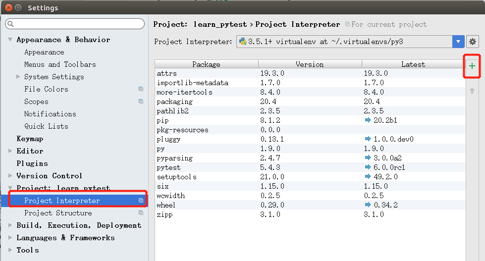

# pytest框架

安装：`pip install -U pytest`

在pycharm下导入pytest包




### 编写测试用例

- 无需在测试类下编写测试用例，可以直接编写测试函数
- 测试函数名中必须包含test_、\_test


```python
import pytest

def test_01():
    print("执行test_01")
    assert 1  # 断言成功

def test_02():
    print("执行test_02")
    assert 0  # 断言失败

if __name__ == '__main__':
    pytest.main("-s test_case_01.py")
```

`pytest.main("-s test_case_01.py")`

- -s ：输出的是详细的测试结果
- 执行的py文件的文件名


### 查看执行结果

- `. ` 表示用例执行通过
- `F` 表示用例执行失败


### setup和tearDown

模块module级别：对整个.py文件作用

​	`setup_module/teardown_module`

函数function级别：对测试用例作用

​	`setup_function/teardown_function`

类class级别：对测试类作用

​	`setup_class/teardown_class`

方法method级别：对测试类中的测试用例作用

​	`setup_method/teardown_method`


**测试类的写法**

- 测试类的类名以Test开头
- 测试类中的测试方法，与测试函数的编写规则一致


```python
# 模块级别和函数级别
import pytest

# 函数级别的setup/teardown
def setup_function():
    print("setup_function在测试用例执行前执行")

def teardown_function():
    print("teardown_function在测试用例执行后执行")

    
# 模块级别setup/teardown
def setup_module():
    print("setup_module模块级别在模块运行前执行")

def teardown_module():
    print("teardown_module模块级别在模块运行后执行")

def test_01():
    print("执行test_01")
    assert 1  # 断言成功

def test_02():
    print("执行test_02")
    assert 0  # 断言失败


if __name__ == '__main__':
    pytest.main("-s test_case_02.py")
```


```python
# 类级别和方法级别
import pytest

class TestCase:
    # 类级别的setup&teardown
    def setup_class(self):
        print("setup_class在类执行前执行一次")

    def teardown_class(self):
        print("teardown_class在类执行后执行一次")

    # 方法级别的setup和teardown
    def setup_method(self):
        print("setup_method在测试方法执行前执行一次")

    def teardown_method(self):
        print("teardown_method在测试方法执行后执行一次")

    # 测试方法
    def test_a(self):
        print("执行测试用例a")
        assert 1

    def test_b(self):
        print("执行测试用例b")
        assert 1


if __name__ == '__main__':
    pytest.main("-s test_case_03.py")

```


### 配置文件

**pytest运行方式**

- 在主函数中执行

```python
if __name__ == '__main__':
    pytest.main("-s test_case_03.py")
```

- 在命令行中运行pytest
  - 在测试用例所在目录下运行
  - `pytest -s test_case_03.py`
    - 即`pytest [参数] 执行文件`

- pytest.ini

```python
[pytest]
# 命令行的执行参数
addopts = -s
# 添加测试用例所在文件夹
testpaths = scripts
# 添加测试文件.py
python_files = test_*.py
# 添加测试类
python_classes = Test*
# 添加测试方法
python_functions = test*
```


### 常用插件

#### pytest-html

**测试报告** 

安装：`pip install pytest-html`

在`pytest.ini`文件中加入语句

`addopts = -s --html=report/report.html`


#### pytest-ordering

**控制测试用例执行顺序**

在被执行的用例前添加

`@pytest.mark.run(order=x)`

- 同正或同负：值越⼩，优先级越⾼

- 正数和负数同时存在：正数优先级⾼


#### pytest-rerunfailures

**失败重试**

命令⾏格式：`pytest --reruns n `

​	n为失败后重试的次数

在pytest.ini中配置

`addopts = -s --html=report/report.html --reruns=3`


