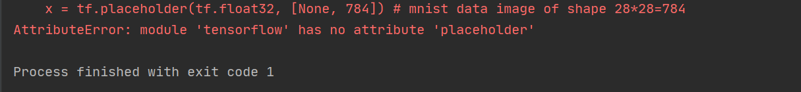

# Anaconda的使用

## 参考

- [Anaconda完全入门指南](https://www.jianshu.com/p/eaee1fadc1e9)

## conda环境配置

vi ~/.bash_profile

[Anaconda之Python环境配置(Mac版)](https://www.jianshu.com/p/b9eac8419c8d)


## 一些conda命令

### 环境管理

| 命令                                  | 含义                             |
| ------------------------------------- | -------------------------------- |
| conda update conda                    | 升级conda                        |
| activate                              | 进入base环境                     |
| conda info --envs                     | 查看所有的python环境             |
| conda activate 某环境                 | 环境激活                         |
| source activate 环境名称              | mac下进入环境                    |
| conda create -n [envir_name] python=3 | 创建python环境                   |
| conda remove -n mytest --all          | 删除一个名为 mytest 的环境或库。 |
| conda env export > environment.yaml   | 将包信息存入yaml文件中           |
| conda env create -f environment.yaml  | 重新创建一个相同的虚拟环境       |
| conda search --full --name tensorflow | 查看当前有哪些可以使用的包版本   |

-n为该环境或库的名字，–all 说明删除 mytest 环境下的所有内容

### 包管理

| 命令 | 含义 |
| ---- | ---- |
| conda list                | 查看所有包           |
| conda install 包名=版本号 | 安装包               |
| conda search 包名         | 查找包               |
| conda remove 包名         | 移除包               |
| conda update 包名         | 升级包               |
|                           |                      |

## 使用清华源

### pip

```bash
pip install -i https://pypi.tuna.tsinghua.edu.cn/simple ipykernel     
```

### conda

先查看是否已经安装相关镜像源，windows系统在`cmd`窗口中执行命令：

```bash
conda config --show
```

如果channels中显示已有则跳过以下步骤

依次安装清华的

```bash
conda config --add channels https://mirrors.tuna.tsinghua.edu.cn/anaconda/cloud/pytorch/
conda config --add channels https://mirrors.tuna.tsinghua.edu.cn/anaconda/cloud/menpo/
conda config --add channels https://mirrors.tuna.tsinghua.edu.cn/anaconda/cloud/bioconda/
conda config --add channels https://mirrors.tuna.tsinghua.edu.cn/anaconda/cloud/msys2/
conda config --add channels https://mirrors.tuna.tsinghua.edu.cn/anaconda/cloud/conda-forge/
conda config --add channels https://mirrors.tuna.tsinghua.edu.cn/anaconda/pkgs/main/
conda config --add channels https://mirrors.tuna.tsinghua.edu.cn/anaconda/pkgs/free/
```

设置搜索时显示通道地址

```bash
conda config --set show_channel_urls yes
```


## 升级pip

python -m pip install --upgrade pip


## 升级jupyterlab

参考：https://blog.csdn.net/qq_37555071/article/details/107166105

### 安装toc插件

3种方法：

- `conda update -c conda-forge jupyterlab`
- 在Anaconda Navigator 界面升级
- 在[anaconda官网](https://anaconda.org/)下载jupyterlab的安装文件，然后执行`conda install 文件名`


conda update jupyter_core jupyter_client

[
关于 jupyter lab 安装 toc 后无法在侧边栏显示的问题](https://github.com/neolee/wop-community/issues/211#)

```

找到python安装目录的lib\site-packages\jupyterlab\commands.py文件，
第83行：

   self.proc = self._create_process(
        cwd=cwd,
        env=env,
        stderr=subprocess.STDOUT,
        stdout=subprocess.PIPE,
        universal_newlines=True
    )
修改为：

    self.proc = self._create_process(
        cwd=cwd,
        env=env,
        stderr=subprocess.STDOUT,
        stdout=subprocess.PIPE,
        universal_newlines=True,
        encoding="UTF-8"
    )
也就是增加一个参数encoding="UTF-8"，就可以了
```


### jupyterlab插件命令

- 更新插件：`jupyter labextensio update 插件名`
- 更新所有插件：`jupyter labextension update --all`
- 卸载插件：`jupyter labextensio uninstall 插件名`
- 安装插件：`jupyter labextensio install 插件名`
- 远程仓库安装插件：`jupyter labextension install 参考地址`
- 安装制定版本插件：`jupyter labextensio install 插件名=版本号`
- 查看已安装插件：`jupyter labextension list`

### ipykernel内核管理

参考：[用conda进行python虚拟环境创建、管理以及jupyter和pycharm使用此环境](https://zhuanlan.zhihu.com/p/64100305)

首先activate想要加入的python内核，在python中安装ipykernel包

```python
pip install ipykernel
pip install -i https://pypi.tuna.tsinghua.edu.cn/simple ipykernel     
其中xxx是你要安装的第三方库   ,其中的y.y.y就是xxx的版本
```

运用下面的命令，安装内核

```python
#第二个Python35 为安装内核后，在jupyterlab中显示的内核名字（可自定义）。其他命令不用改

#查看jupyter notebook kernel
jupyter kernelspec list
#删除notebook kernel
jupyter kernelspec remove kernelname

acitvate py35   (or source activate py35)
python -m ipykernel install --name py35
deactivate (or source deactivate)
```


# Pytorch安装

我的电脑上conda安装无法识别cuda，使用pip安装可以了

## conda官网安装

使用pytorch官方文档：https://pytorch.org/

从清华源下载：

参考：https://cloud.tencent.com/developer/article/1588508

先查看是否已经安装相关镜像源，windows系统在`cmd`窗口中执行命令：

```bash
conda config --show
```

如果channels中显示已有则跳过以下步骤

依次安装清华的

```bash
conda config --add channels https://mirrors.tuna.tsinghua.edu.cn/anaconda/cloud/pytorch/
conda config --add channels https://mirrors.tuna.tsinghua.edu.cn/anaconda/cloud/menpo/
conda config --add channels https://mirrors.tuna.tsinghua.edu.cn/anaconda/cloud/bioconda/
conda config --add channels https://mirrors.tuna.tsinghua.edu.cn/anaconda/cloud/msys2/
conda config --add channels https://mirrors.tuna.tsinghua.edu.cn/anaconda/cloud/conda-forge/
conda config --add channels https://mirrors.tuna.tsinghua.edu.cn/anaconda/pkgs/main/
conda config --add channels https://mirrors.tuna.tsinghua.edu.cn/anaconda/pkgs/free/
```

设置搜索时显示通道地址

```bash
conda config --set show_channel_urls yes
```


```bash
#pytorch官网的代码
conda install pytorch torchvision cudatoolkit=10.2 -c pytorch
#修改，删除最后的-c pytorch
conda install pytorch torchvision cudatoolkit=10.2
```


参考

[win10安装CUDA和cuDNN的正确姿势](https://zhuanlan.zhihu.com/p/94220564?utm_source=wechat_session)

[在windows下用anaconda安装 pytorch](https://blog.csdn.net/qq_40589781/article/details/104091782?utm_medium=distribute.pc_aggpage_search_result.none-task-blog-2(all)sobaiduend~default-1-104091782.nonecase&utm_term=anaconda%E6%80%8E%E6%A0%B7%E5%8D%B8%E8%BD%BDpytorch)

[解决PyTorch与CUDA版本不匹配](https://blog.csdn.net/weixin_42069606/article/details/105198845?utm_medium=distribute.pc_relevant.none-task-blog-BlogCommendFromMachineLearnPai2-1.channel_param&depth_1-utm_source=distribute.pc_relevant.none-task-blog-BlogCommendFromMachineLearnPai2-1.channel_param)

[windows系统快速安装pytorch的详细教程](https://www.cnblogs.com/gzyc/p/12315831.html)

## cuda和pytorch版本对应

| cuda版本 | 可用pytorch版本                     |
| -------- | ----------------------------------- |
| 7.5      | 0.4.1 ，0.3.0， 0.2.0，0.1.12-0.1.6 |
| 8.0      | 1.0.0 ，0.4.1                       |
| 9.0      | 1.1.0，1.0.1, 1.0.0，0.4.1          |
| 9.2      | 1.6.0，1.5.0，1.4.0，1.2.0，0.4.1   |
| 10.0     | 1.2.0，1.1.0，1.0.1 ,1.0.0          |
| 10.1     | 1.6.0，1.5.0， 1.4.0 ，1.3.0        |
| 10.2     | 1.6.0，1.5.0                        |

```python
#查看当前pytorch版本:
import torch
print(torch.__version__)
```


## 下载cuda

https://developer.nvidia.com/cuda-toolkit-archive

```python
#查看cuda版本
nvcc -V
nvcc --version
```

## 卸载pytorch

```bash
conda uninstall pytorch
conda uninstall libtorch
```

## 安装pytorch

https://pytorch.org/

```bash
conda install pytorch torchvision cudatoolkit=10.2 -c pytorch
pip install torch===1.6.0 torchvision===0.7.0 -f https://download.pytorch.org/whl/torch_stable.html
```

## 查看pytorch对应的cuda版本

```python
python
import torch
print(torch.version.cuda)
torch.cuda.is_available()
```


# TensorFlow环境配置

成功安装：https://zhuanlan.zhihu.com/p/37086409

官网：https://tensorflow.google.cn/install

### 未安装成功的版本

```
conda install --channel https://mirrors.tuna.tsinghua.edu.cn/anaconda/pkgs/main tensorflow
conda update --channel https://mirrors.tuna.tsinghua.edu.cn/anaconda/pkgs/main tensorflow
```

参考：https://www.cnblogs.com/jicongcong/p/12897891.html

```bash
#安装TensorFlow虚拟环境
pip install tensorflow -i https://pypi.tuna.tsinghua.edu.cn/simple some-package 

#tensorflow虚拟环境加载python3.7
conda create -n tensorflow python=3.7

#使用activate tensorflow切换到tensorflow环境：
activate tensorflow

#查找对应的tensorflow版本
anaconda search -t conda tensorflow

#在tensorflow环境中输入
anaconda show paulyim/tensorflow

#加载tensorflow中各种包
conda install --channel https://conda.anaconda.org/paulyim tensorflow

#之后 tensorflow环境下输入python,进入python编译环境
#输入：import tensorflow as tf
```

# 环境配置问题集合

## OpenCV安装问题

`sudo apt-get install python-numpy`


ImportError: libSM.so.6: cannot open shared object file: No such file or directory

安装opencv时候缺少库，无脑解决方案

apt-get update

apt-get install -y libsm6 libxext6 libxrender-dev

pip install opencv-python

## TensorFlow

### 安装

pip问题

```
python -m pip install --upgrade pip
pip install ipykernel
```

代码

```bash
jupyter kernelspec remove python-tensorflow
conda remove -n tensorflow --all
conda create -n tensorflow python=3.6
conda activate tensorflow

conda search --full --name ipykernel
conda install ipykernel
python -m ipykernel install --name Python-tensorflow

conda search --full --name tensorflow
conda install tensorflow
conda install ipython matplotlib scipy pandas numpy seaborn
```


### 版本问题 'placeholder'

此博客链接：https://www.cnblogs.com/ping2yingshi/p/12920537.html

当你出现这个问题时，说明在tf2下使用了tf1的API。




1.参看版本号是否使用错误。

在pycharm下，找到工程，然后输出下面命令参看版本

```
import tensorflow as tf  #载入tensorflow环境

print(tf.__version__)    #查看tensorflow版本
```

如果显示下图所示，说明你用的是tf2.

 

 2.把代码进入tf环境中下面的代码

```
import tensorflow as tf
```

替换成下面代码。

```
import tensorflow.compat.v1 as tf
tf.disable_v2_behavior()
```

运行程序。程序正确。


### keras

```
pip install keras_resnet
```

tensorflow和keras对应关系https://docs.floydhub.com/guides/environments/