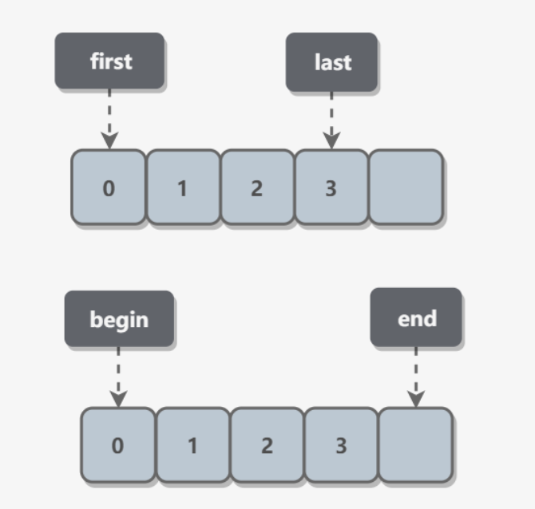

# 代码可读性

## ref

- https://github.com/CyC2018/CS-Notes/blob/master/notes/%E4%BB%A3%E7%A0%81%E5%8F%AF%E8%AF%BB%E6%80%A7.md

## 变量命名

### 常用单词替换

命名中最好带有代码的含义

| 单词    | 可替代单词                                         |
| ------- | -------------------------------------------------- |
| send    | deliver、dispatch、announce、distribute、route     |
| find    | search、extract、locate、recover                   |
| start   | launch、create、begin、open                        |
| make    | create、set up、build、generate、compose、add、new |
| i、j、k | user_i、number_i                                   |

### 名字长短准则

名字长短的准则：作用域越大，名字越长

### 布尔型

加上 is、can、should、has 等前缀

### 数组

- 用 min、max 表示数量范围；
- 用 first、last 表示访问空间的包含范围；
- begin、end 表示访问空间的排除范围，即 end 不包含尾部。



## 注释

### 排列整齐

```java
int a = 1;   // 注释
int b = 11;  // 注释
int c = 111; // 注释
```

### 忌繁琐

可以直接看出含义的代码不需要编写注释，比如简单的 getter 和 setter 方法，注释会使代码可读性下降

### 标记特殊情况

用 TODO 等做标记：

| 标记  | 用法                   |
| ----- | ---------------------- |
| TODO  | 待做                   |
| FIXME | 待修复                 |
| HACK  | 粗糙的解决方案         |
| XXX   | 危险！这里有重要的问题 |

### 简介明了

第一种 < 第二种

```java
// The first String is student's name
// The Second Integer is student's score
Map<String, Integer> scoreMap = new HashMap<>();
```

```java
// Student's name -> Student's score
Map<String, Integer> scoreMap = new HashMap<>();
```

### 测试用例

```java
// ...
// Example: add(1, 2), return 3
int add(int x, int y) {
    return x + y;
}
```

### 专有名词

使用专业名词来缩短概念上的解释，比如用设计模式名来说明代码。

## 拆分长表达式

### 引入解释变量

```python
if line.split(':')[0].strip() == "root":
    ...
```

```python
username = line.split(':')[0].strip()
if username == "root":
    ...
```

### 逻辑表达式

```python
if line.split(':')[0].strip() == "root":
    ...
```

```python
username = line.split(':')[0].strip()
if username == "root":
    ...
```

## 减少变量

### 控制流变量

去除控制流变量，取代以在循环中使用 break 或 return

```java
boolean done = false;
while (/* condition */ && !done) {
    ...
    if ( ... ) {
        done = true;
        continue;
    }
}
```

```java
while(/* condition */) {
    ...
    if ( ... ) {
        break;
    }
}
```

### 减小变量作用域

作用域越小，越容易定位到变量所有使用的位置

#### JS使用闭包

以下代码中 submit_form 是函数变量，submitted 变量控制函数不会被提交两次。

第一个实现中 submitted 是全局变量，第二个实现把 submitted 放到匿名函数中，从而限制了起作用域范围。

```js
submitted = false;
var submit_form = function(form_name) {
    if (submitted) {
        return;
    }
    submitted = true;
};
```

```js
var submit_form = (function() {
    var submitted = false;
    return function(form_name) {
        if(submitted) {
            return;
        }
        submitted = true;
    }
}());  // () 使得外层匿名函数立即执行
```

### 减少使用全局变量

JS中没有使用 var 声明的变量都是全局变量。

## 抽取函数

明确一个函数的高层次目标，对不是直接为了该目标工作的代码，抽取出来放到独立的函数中。

抽取过多也可能会导致可读性的降低。

## 伪代码


