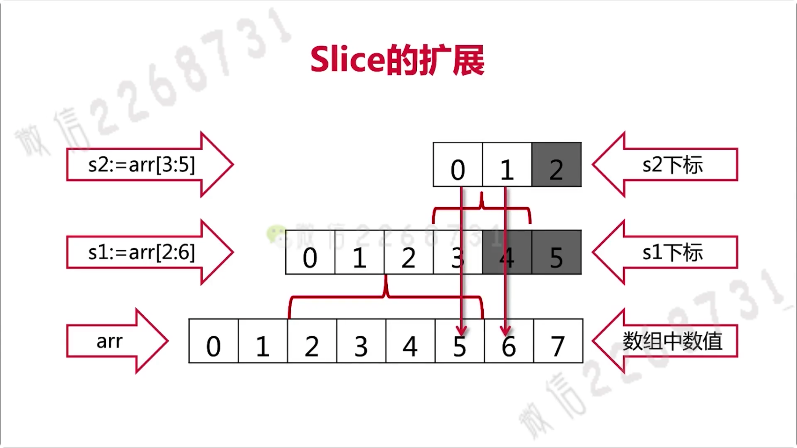
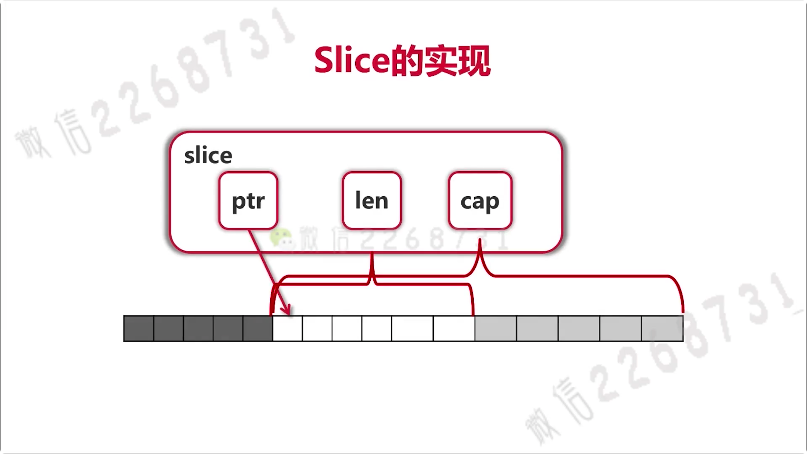

https://coding.imooc.com/class/180.html

## 安装

https://golang.org/

https://studygolang.com/dl

国内镜像设置

https://goproxy.cn/

go env显示如下

```
GOPROXY="https://proxy.golang.org,direct"
GOPROXY="https://goproxy.cn,direct"
```

在终端输入

```sh
export GO111MODULE=on
export GOPROXY=https://goproxy.cn
# 下载goimports
go get -g -v golang.org/x/tools/cmd/goimports
# 生成go mod
go mod init learngo
```

## 2 基础语法

### 变量定义

使用var关键字

- var a, b, c bool
- var s1, s2 string = "hello", "world"
- var a, i, s = true, 3, "abc"

使用:=

- a, i, s := true, 3, "abc"
- 只能在函数内使用 

### 内建变量类型

- bool, string
- (u)int, (u)int8-(u)int64, uintptr
- byte, rune
- float32, float64, complex64,  complex128

### 强制类型转换

类型转换是强制的，go没有隐式类型转换

```go
	var a, b int = 3, 4
	var c float64
	c = math.Sqrt(float64((a*a + b*b)))
```

### 常量与枚举

const数值可作为各种类型使用

```go
	const (
		filename = "abc.txt"
		a, b     = 3, 4
	)
```

枚举：普通枚举类型、自增值枚举类型

```go
	const (
		b = 1 << (10 * iota)
		kb
		mb
		gb
		tb
		pb
	)
```

### 条件语句

**if**

if的条件里不需要括号

if的条件里可以赋值，其中的变量作用域为if语句

```go
	if contents, err := ioutil.ReadFile(filename); err != nil {
		fmt.Println(err)
	} else {
		fmt.Printf("%s\n", contents)
	}
```

**switch**

switch会自动跳转break，除非使用fallthrough

```go
switch op {
  case "+":
  	result = a + b
  case "-":
  	result = a - b
default:
  panic("unsuported:" + op)
}
// switch 后可以没有表达式
switch {
	case score < 0 || score > 100:
		panic(fmt.Sprintf(
			"Wrong score: %d", score))
	case score < 60:
		g = "F"
	case score < 90:
		g = "B"
	case score <= 100:
		g = "A"
}
```

### 循环

**for**

- for的条件里不需要括号
- for的条件里可以省略初始条件、结束条件、递增表达式

### 函数

函数返回多个值时可以起名字，适用于简单的函数

```go
func div(a, b int) (q, r int) {
  q = a / b
  r = a % b
  return
}
```

- 函数可以作为参数
- 有可变参数列表，没有默认参数、可选参数

### 指针

指针不能运算

Go语言只有值传递

## 3 内建容器

### 数组

数组的定义

```go
	var arr1 [5]int
	arr2 := [3]int{1, 3, 5}
	arr3 := [...]int{2, 4, 6, 8, 10}
	var grid [4][5]int

	for i, v := range arr3 {
		fmt.Println(i, v)
	}
```

数组做函数参数时是值传递，但是一般不直接使用数组

```go
func printArray(arr [5]int) {}
// 引用传递，使用指向数组的指针
func printArray(arr *[5]int) {}
```

### slice切片

slice本身没有数据，是对底层array的一个view

```go
func updateSlice(s []int) {}
```

#### slice的拓展



slice的实现：slice可以向后扩展，不能向前扩展



```go
arr := [...]int{0, 1, 2, 3, 4, 5, 6, 7}
s1 := arr[2:6]
fmt.Printf("s1=%v,len(s1)=%d,cap(s1)=%d", s1, len(s1), cap(s1))
// 2,3,4,5 | 4 | 6
fmt.Println()
s2 := s1[3:5]
fmt.Printf("s2=%v,len(s2)=%d,cap(s2)=%d", s2, len(s2), cap(s2))
// 5,6 | 2 | 3
```

#### slice添加

```go
s3 := append(s2, 8)
```

- 添加元素如果超越cap，系统会自动分配更大的底层数组
- 调用append时必须接受返回值
- s = append(s, val)

#### slice操作

当append时，数组的cap成倍增长

slice创建

```go
// 3. 长度10 cap = 32(下面数组)
	s3 := make([]int, 10, 32)
```

slice拷贝

```go
copy(s2, s1) // s1拷贝进s2
```

slice删除

```go
s2 := []int{2, 4, 6, 8, 0, 0, 0, 0, 0, 0, 0, 0, 0, 0, 0, 0}
s2 = append(s2[:3], s2[4:]...)
// :3 不包括3  4: 从4开始; 加三个点代表所有元素
```

### Map

- map是无序的hashmap
- 除了slice、map、function的内建类型都可以作为key
- struct不含上述字段，也可作为key

创建

```go
m := map[string]string{
  "name":    "ccmouse",
  "course":  "golang",
}
m2 := make(map[string]int) // m2 == empty map
var m3 map[string]int // m3 == nil  nil可以参与运算
```

遍历

```go
for k, v := range m {
	fmt.Println(k, v)
}
```

获取单个值

- 若key不存在，获取value类型的初始值

```go
courseName, ok := m["course"]
```

删除值

```go
delete(m, "name")
```

### 字符串处理

rune相当于go的char

```go
// 另外开了一个rune数组
for i, ch := range []rune(s) {
  fmt.Printf("(%d %c) ", i, ch) 
}
//  (0 啊) (1 切) (2 h) (3 o) (4 m) (5 e)
```

其他字符串操作

- Fields, Split, Join  
- Contains, Index
-  ToLower, ToUpper
-  Trim, TrimRight, TrimLeft

## 4 面向对象

- go语言仅支持封装，不支持继承和多态
- go语言只有struct，没有class

### 结构的创建

- 使用自定义工厂变量
- 返回了局部变量的地址

```go
func CreateNode(value int) *Node {
	return &Node{Value: value}
}

root.Left.Right = CreateNode(2)
```

结构创建在堆上还是栈上？

- 不需要知道，由编译器判断

### 给结构定义方法

```go
type Node struct {
	Value       int
	Left, Right *Node // 指针指向左右节点
}

// 前面括号是接收者,类似this, 也是传值
func (node Node) Print() {
	fmt.Print(node.Value, " ")
}

/**
	结构体定义方法
   使用指针，会修改值
*/
func (node *Node) SetValue(value int) {
	if node == nil {
		fmt.Println("Setting Value to nil " +
			"node. Ignored.")
		return
	}
	node.Value = value
}
```

### 包和封装

-  为结构定义的方法必须放在同一个包内
- 可以是不同文件

### 扩充已有类型

定义别名、使用组合


## 5 依赖管理

依赖管理的三个阶段：GOPATH, GOVENDOR, go mod

govendor: 每个项目有自己的vendor目录，存放第三方库，有大量第三方依赖管理工具：glide、dep、go dep

```sh
go env
# 在当前窗格下设置环境变量
export GO111MODULE=off
```

### go mod

添加依赖

https://github.com/uber-go/zap

1. 命令行输入

```sh
# 初始化
go mod init 
# 增加依赖
go get -u go.uber.org/zap@v1.11
# 删除无用的依赖
go mod tidy
# 编译，迁移旧项目
go build ./...
```

2. 在import中输入

```go
import (
	"go.uber.org/zap"
	"github.com/gin-gonic/gin"
)
```

### 目录管理

每个含有main函数的文件要在自己单独的目录中

```sh
go build ./... # 不产生可执行文件
go install ./... # 会在GOPATH目录下生成可执行文件
go env GOPATH
```

## 6 接口

> Java接口的详解：使用Google Guice实现依赖注入

- Go是一个强类型的系统，静态语言需要处理类型
- 接口不需要实现

```go
type Traversal interface {
  Traverse()
}

func main() {
  traversal := getTraversal()
  traversal.Traverse()
}
```

### duck typing

大黄鸭是鸭子吗？“像鸭子走路，像鸭子叫，那么就是鸭子”

#### Python中duck typing

- 运行时才知道传入的retriever有没有get
- 需要注释来说明接口

```python
def download(retriever):
  return retriever.get("www.baidu.com")
```

#### C++中duck typing

- 编译时才知道传入的retriever有没有get
- 需要注释来说明接口

```cpp
template <class R>
string download(const R& retriever) {
  return retriever.get("www.baidu.com");
}
```

#### java中的类似代码

- 传入的参数必须实现Retriever接口，只有get方法不行
- 不需要注释
- 不是duck typing

```java
<R extends Retriever>
String download(R r) {
  return r.get("www.baidu.com");
}
```

#### go语言中的duck typing

- 同时需要Readable, Appendable怎么办？Java不能同时实现两个接口
- 同时具有python，C++的灵活性：即只要实现了get方法就可使用
- 又具有java的类型检查

### 接口的定义


- 接口由使用者定义
- 实现者只需要实现方法即可


## 7 函数与闭包

- 函数的参数、变量、返回值都可以是函数
- 高阶函数
- 闭包

## 8 错误处理和资源管理

### defer调用

确保调用在函数结束时发生

defer内有一个栈，先进后出


