# VSCode使用GDB调试虚拟机中CPP

## VSCode离线安装C/C++插件

原因：VSCode按F5，会卡在`正在下载 C/C language components (Linux / x86_64)`

### ref

- https://github.com/microsoft/vscode-cpptools/issues/4453
- https://zhuanlan.zhihu.com/p/101264218

知乎给的方法试了没用，继续卡在依赖下载页面。最后用了issue里的方法成功了，但不清楚知乎的方法有没有起作用，就是只用issue的方法行不行

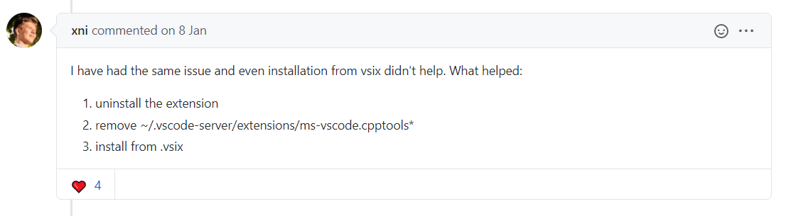

### 步骤

1. 卸载VSCode在服务器平台已经安装的C/C++拓展，重启VSCode

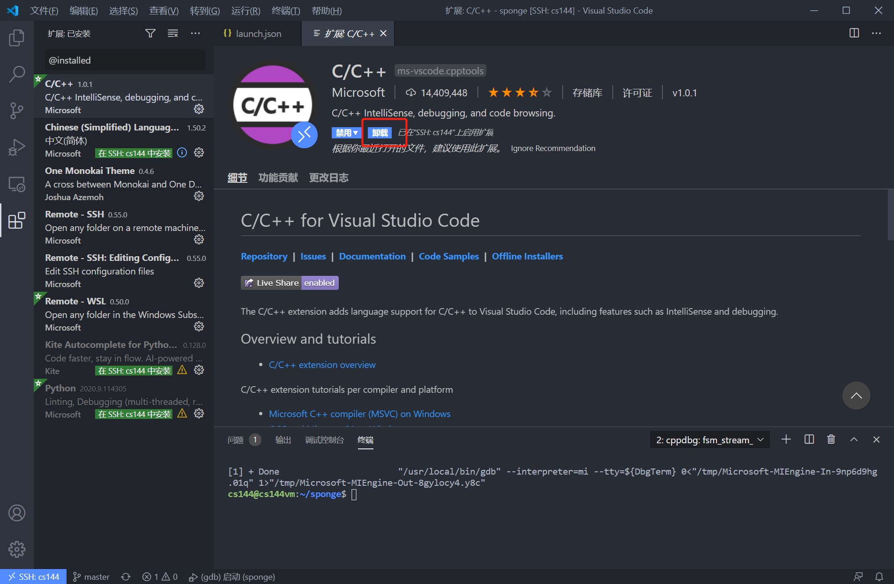

2. 像如上issue中删除文件
3. 从官网下载`.vsix`文件并导入

https://github.com/Microsoft/vscode-cpptools/releases

导入方法如下图

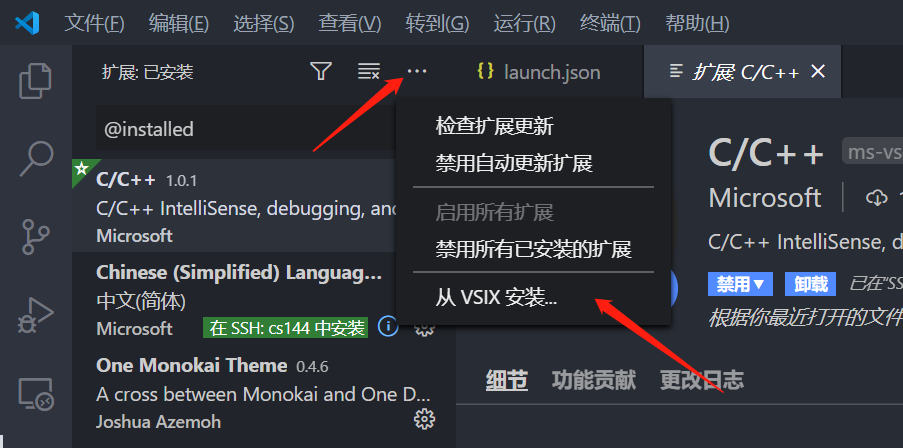

## Remote-SSH远程编辑与无密码登录

### ref

https://www.pianshen.com/article/24781180564/

### 环境需求

1. Windows端装有open-ssh客户端, 并添加到PATH环境变量中（一般win10默认已安装）
2. Linux端装有ssh server(一般默认ubuntu已安装，如果没有安装的话，apt-get install openssh-server）
3. Windows端安装Vscode

### 远程连接步骤

1. 安装**Remote-SSH**插件 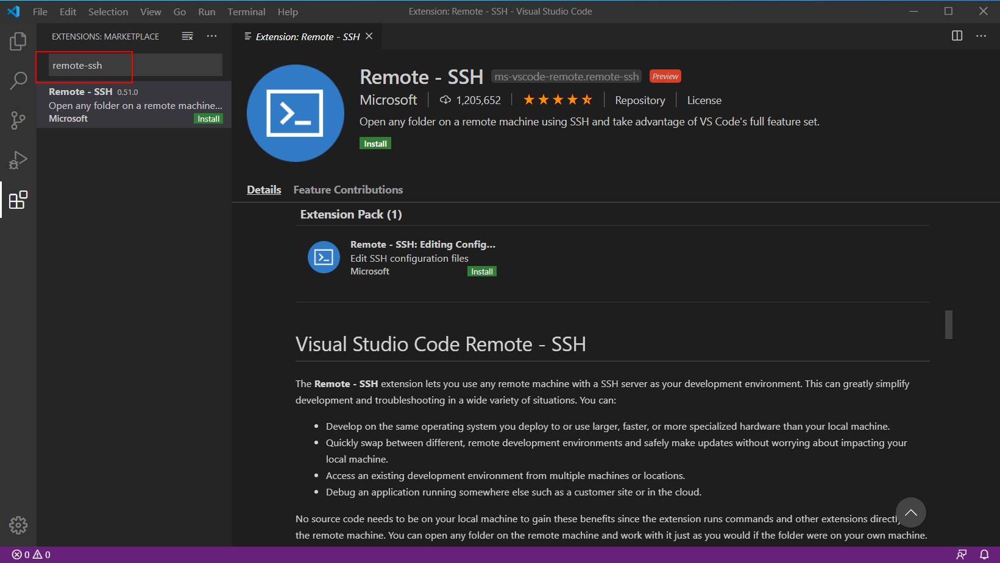
2. 打开左下角的图标，打开远程连接窗口，并选择 **Remote-SSH: Connect to Host...** 。
3. 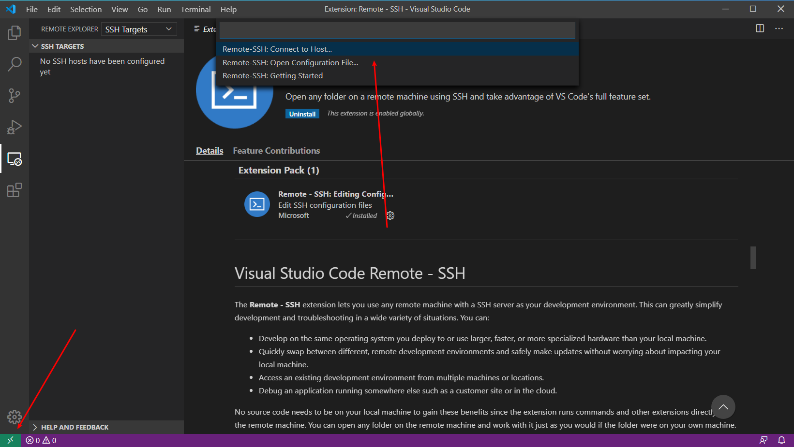
4. 选择 **Configure SSH HOST... ,** 接着选择配置保存的文件（选择第一个），即可打开配置文件，并填写配置文件保存。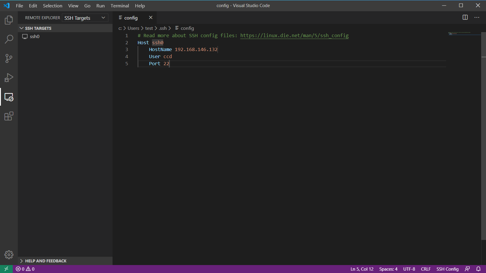
5. 再次点击右下角打开远程，选择**Remote-SSH: Connect to Host...，**接着选择刚才填写Host名字 **ssh0**。如果没有弹窗警告，这代表已经连接成功。
6. 点击 **File** ，然后点击 **Open Floder..**.。这样就连接成功，打开远程文件目录了。

### 无密码登录步骤

1. 生成秘钥，在本地使用`ssh-keygen -t rsa`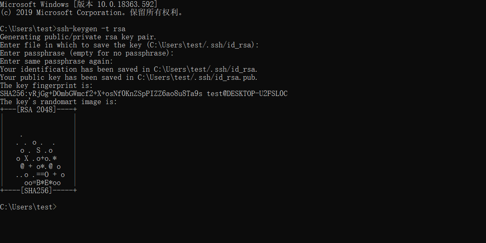
2. 上传公钥到远程。 使用ssh-copy-id即可很轻松上传（需要本地安装git，在git-bash环境下使用）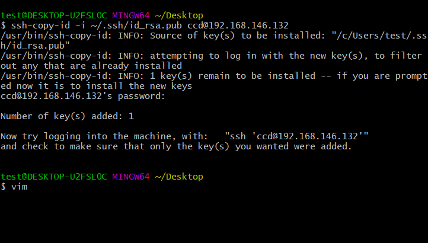

## VirtualBox虚拟机Ubuntu重置root密码

### ref

https://www.cnblogs.com/bigsister/p/10728506.html

### 步骤

在开机时，进入系统进度条时**长按shift** 或者 **按下ESC** 或者 **按下e键，进入 GNU GRUB 界面**

1. 选择Ubuntu 高级选项，按下enter

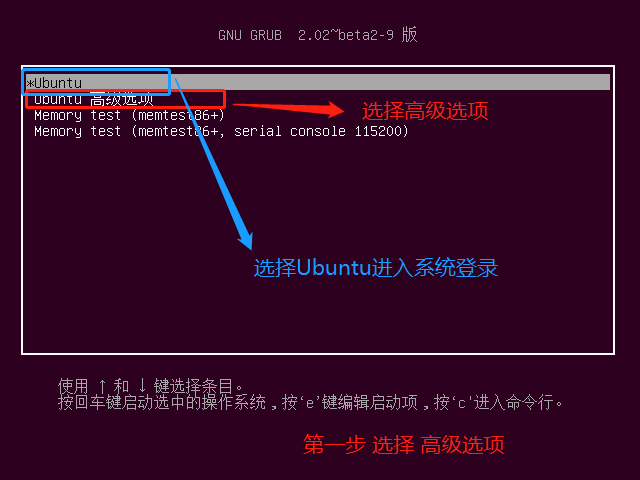

2. 选择recovery mode, 按下**键盘e键**（e键 不是enter键），便捷启动项

3. 按下e键进入如下界面，按下 ↓ 键，将光标定位到linux 一行

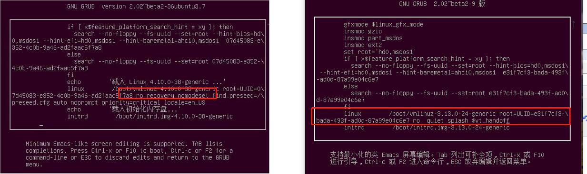

如左图 linux行 出现recovery nomodeset ，删除recovery nomodeset及之后的代码

如右图 linux行 没有出现 可不处理

在该行行末输入`quiet splash rw init=/bin/bash`， 按下**F10（或者Fn+F10）,** 接着进入下图页面重置root密码即可

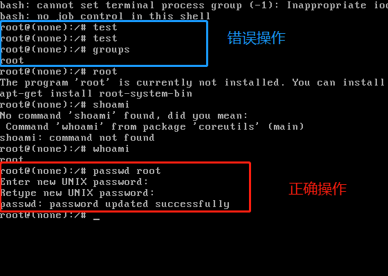

## Ubuntu离线安装gdb

`which gdb` 查看gdb安装位置，如果已经安装则无需进行

`gdb -v` 查看版本

### ref

https://blog.csdn.net/chengsi101/article/details/79424083

### 在线安装

受网络环境与配置限制

```bash
apt-get update
sudo apt-get install gdb 
```

### 离线安装

1. 在网址：http://ftp.gnu.org/gnu/gdb下载gdb源码包（这里楼主选的是8.0.1版本）；

   或者直接在linux系统中用wget命令下载：wget http://ftp.gnu.org/gnu/gdb/gdb-8.0.1.tar.gz

2. 拷贝到Ubuntu中，用``tar -zxvf xx.tar.gz`命令解压

3. 生成makefile文件

   ```bash
   #在到解压好gdb目录下
   ./configure
   make（这个需要的时间比较长，耐心等待哟~）
   sudo make install
   ```

   

## 配置`launch.json`文件并调试

### ref

https://code.visualstudio.com/docs/editor/debugging#_launch-configurations

### 配置

使用VSCode连接SSH并打开文件之后，按 F5 打开调试，系统自动在当前目录下生成`.vscode/`文件夹，需要配置其中的`launch.json`文件

需要注意的行已在下图中列出，其中

- “program”为待调试的可执行文件
- 后面两个为调试器和调试器的位置，在ubuntu中可以用`which gdb`查看

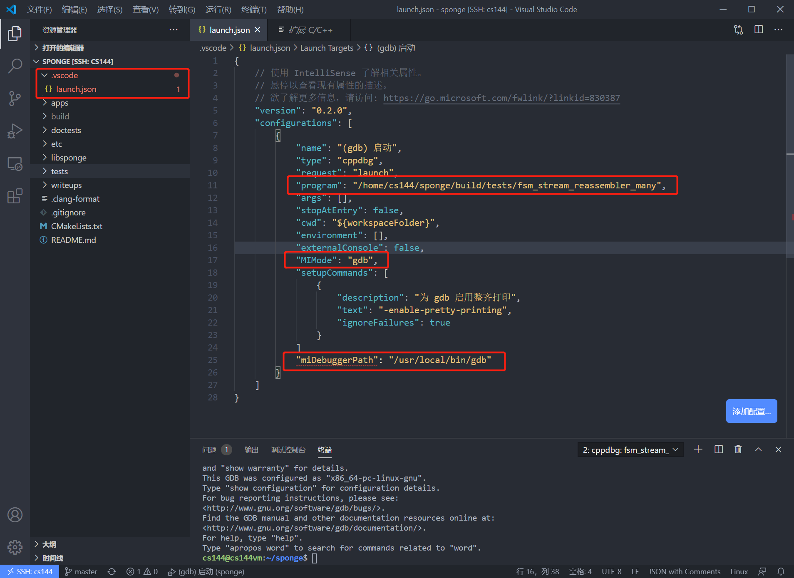


### 调试

最后在`*.c`文件中打上断点，按F5调试即可，如下图为正在调试

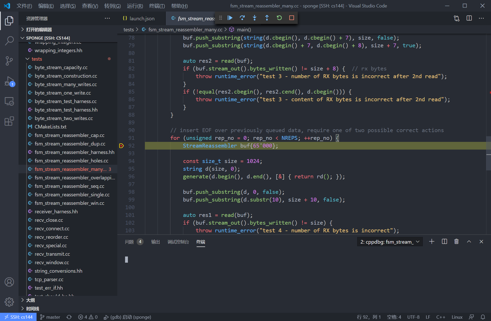

## VSCODE报无法打开“printf.c”的解决方法

https://blog.csdn.net/weixin_43814616/article/details/110338126

在Ubuntu中使用VSCODE调试C代码时，出现如下错误 ：无法打开“printf.c”: 无法读取文件’/build/glibc-YYA7BZ/glibc-2.31/stdio-common/printf.c’ (Error: 无法解析不存在的文件"/build/glibc-YYA7BZ/glibc-2.31/stdio-common/printf.c")，这是因为没有安装glibc的缘故。

解决方法：需要在错误提示中的路径’/build/glibc-YYA7BZ’中安装glibc，版本V2.31。安装步骤如下：
1、创建目录，目录名需与错误提示中目录名一致

sudo mkdir -p /build/glibc-YYA7BZ
1
2、下载glibc

cd /build/glibc-YYA7BZ
sudo wget http://ftp.gnu.org/gnu/glibc/glibc-2.31.tar.gz
1
2
3、解压glibc

sudo tar -zxvf glibc-2.31.tar.gz

## VSCode printf无输出

printf里的内容都是在输出缓冲区中，并没有打印出来，

解决方法有两个，第一个是输出的内容最后加上\n，第二个是将fflush(stdout);紧跟在printf后面。

https://blog.csdn.net/j___t/article/details/99704646


# 大括号

https://blog.csdn.net/qq_43657442/article/details/112302740