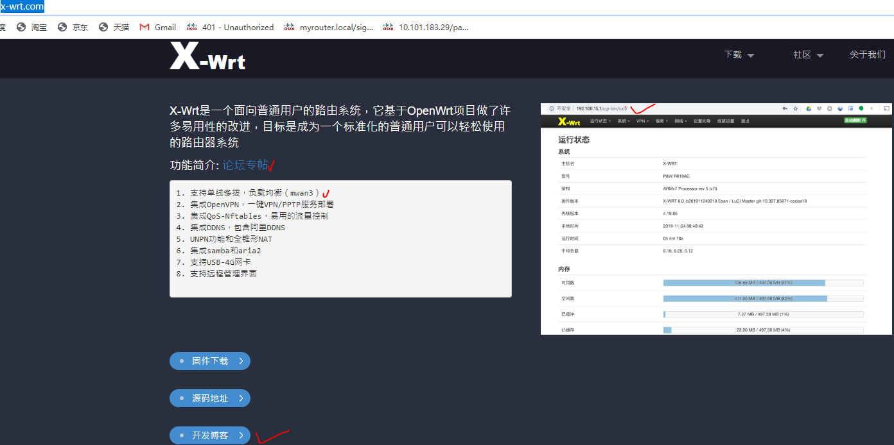

# 刷机教程

第一 步：

下载openwrt固件 (下载地址）：

http://bob-nio2020.dynv6.net:488/index.php?share/file&user=1&sid=XaUkcYiT

下载到连接路由器的电脑上就可以.

第二步：

进入路由管理界面，依次点击：1administration-2firmware upgrade-3manual upgrade-4选择档案 ，从电脑路径中选中刚刚下载的固件。

第三步：

点击start upgrade,路由器开始固件刷新，完毕后路由自动重启，并进入openwrt系统。

第四步：Openwrt教程：x-wrt.com,

新的系统路由登陆地址:192.168.15.1,root,admin

第五步:如何切换回原固件 ？

openwrt系统在断电重启过程中断电三次，第四次通电将自动切换为原系统。

注意事项:刷机过程请选择网线连接.

第六步： 安装 SS

先开启SSH远程权限

下载putty登陆:

*#我们使用https下载软件源*sed -i 's/http:/https:/g' /etc/opkg/distfeeds.conf
*#更新官方源信息* opkg --no-check-certificate update
opkg --no-check-certificate install luci-app-shadowsocks-libev

opkg --no-check-certificate install shadowsocks-libev-config

opkg --no-check-certificate install shadowsocks-libev-ss-local

opkg --no-check-certificate install shadowsocks-libev-ss-redir

opkg --no-check-certificate install shadowsocks-libev-ss-rules

opkg --no-check-certificate install shadowsocks-libev-ss-server 

opkg --no-check-certificate install shadowsocks-libev-ss-tunnel

opkg --no-check-certificate install socat

安装可道云

​    luci-app-kodexplorer

opkg --no-check-certificate install luci-app-kodexplorer

# 设置教程

尊敬的闲鱼用户，欢迎购买我家的E4200V2/EA4500,注意事项如下:

地址:192.168.1.1

1.两次断电间隔要在15秒以上。不要随意刷机。

2.默认用户名:admin

3.密码为admin 或 google

4.不要随便升级

5.openwrt系统使用教程:

https://blog.x-wrt.com/

6.openwet与原系统切换: 一个系统启动过程中断电（大约通电后8秒），连续三次后，通电，自动切换为另一个系统 。

[恩山无线论坛](https://www.right.com.cn/forum/)*»*[论坛](https://www.right.com.cn/forum/forum.php)*›*[无线设备硬件相关板块](https://www.right.com.cn/forum/forum.php?gid=55)*›*[新手入门及其它(硬件)](https://www.right.com.cn/forum/forum-31-1.html)*›*[求思科E4200V2的设置教程](https://www.right.com.cn/forum/thread-137550-1-1.html)

 *发表于 2014-3-12 14:07* | [只看该作者](https://www.right.com.cn/forum/forum.php?mod=viewthread&tid=137550&page=1&authorid=6)

     