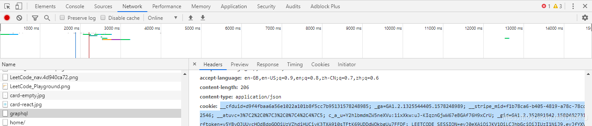
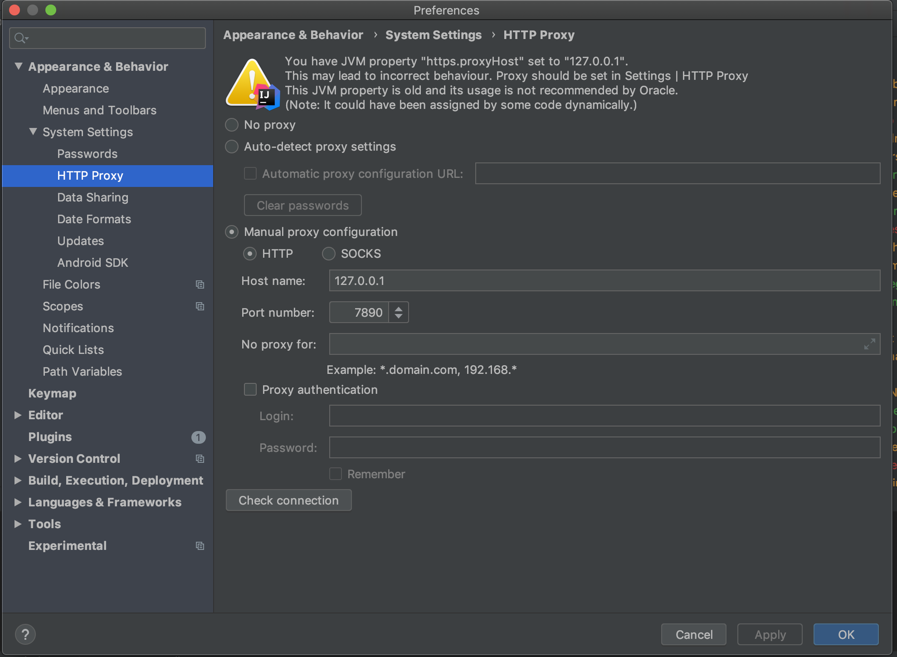

# idea下leetcode插件安装

## ref

- https://blog.csdn.net/yxf19034516/article/details/106087994/

## 安装

点击File->Setting->Plugins

搜索leetcode

如果搜不到，可以尝试重新打开Setting重新搜，还没有的话，可以去官网插件库下载，然后导入就可以了。链接：https://plugins.jetbrains.com/plugin/12132-leetcode-editor/versions/

## 设置

CodeFileName

```
$!velocityTool.camelCaseName(${question.titleSlug})
```

CodeTemplate

```
package leetcode.editor.en;

${question.content}
public class $!velocityTool.camelCaseName(${question.titleSlug}) {
    public static void main(String[] args) {
        Solution solution = new $!velocityTool.camelCaseName(${question.titleSlug})().new Solution();
        
    }
    
    ${question.code}
}
```

TemplateConstant

```
${question.title}	题目标题	示例:两数之和
${question.titleSlug}	题目标记	示例:two-sum
${question.frontendQuestionId}	题目编号
${question.content}	题目描述
${question.code}	题目代码
$!velocityTool.camelCaseName(str)	转换字符为驼峰样式
$!velocityTool.snakeCaseName(str)	转换字符为蛇形样式
```

获取cookie

用你的账号在浏览器上登录leetcode.com网站 > 按F12 > 选择network > F5 刷新网页 > 找到graphql这个文件 > 点击后查看 Headers > 下滑找到cookie字段 > 复制**cookie: 后**的字符（**不要** 把 `cookie:`也带上了）



## 设置http代理



