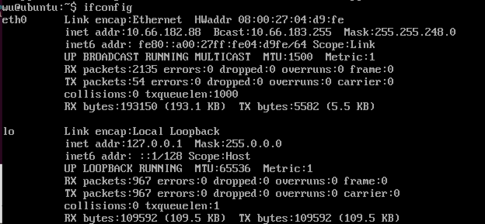

## 安装tools

当无法自动安装时，自行找文件手动安装

https://blog.csdn.net/dengjin20104042056/article/details/106396644/

## 主机SSH连接虚拟机

https://www.cnblogs.com/bjwu/p/9853498.html

1. 将虚拟机设置为桥接，保证主机能ping通虚拟机
2. 虚拟机安装ssh

在ubuntu虚拟机上安装ssh server：

```bash
sudo apt-get install openssh-server
```

安装结束后，确认本机ssh服务是否打开，输入

```bash
ps -e | grep ssh
```

如果看到sshd说明ssh服务已经打开了，如果没有sshd，可以输入以下命令开启ssh服务：

```bash
sudo /etc/init.d/ssh start
```

3. IP地址

找到ubuntu的IP地址，即可以通过在terminal输入：

```shell
ifconfig
```

会出现下面的东西：



找到拥有inet的那一行，后面的地址即为该虚拟机的IP地址。这里可以看到，该虚拟机的IP地址为`10.66.182.88`

4. 连接

https://www.cnblogs.com/bjwu/p/9853498.html

5. 免密配置