# mermaid

## 参考

- 知乎专栏：https://zhuanlan.zhihu.com/p/172635547?utm_source=wechat_session&utm_medium=social&utm_oi=60916607483904
- 官方文档：https://support.typora.io/Draw-Diagrams-With-Markdown/
- mermaid文档：https://mermaid-js.github.io/mermaid/#/
- mermaid使用教程：https://blog.csdn.net/fenghuizhidao/article/details/79440583


## 流程图graph

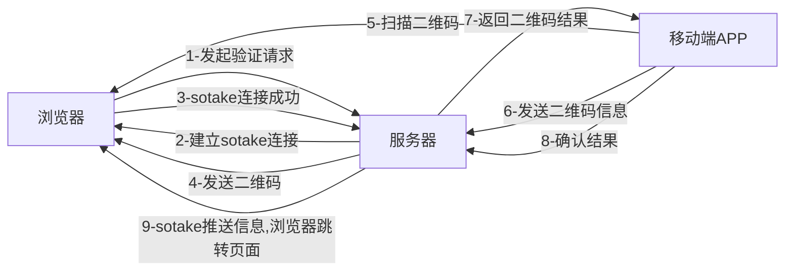

### 方向描述

| 语法  | 含义     |
| ----- | -------- |
| TB/TD | 从上到下 |
| BT    | 从下到上 |
| LR    | 从左向右 |
| RL    | 从右到左 |

### 节点定义

即流程图中每个文本块，包括开始、结束、处理、判断等。Mermaid 中每个节点都有一个 id，以及节点的文字。

| 表述          | 说明           |
| ------------- | -------------- |
| `id[文字]`    | 矩形节点       |
| `id(文字)`    | 圆角矩形节点   |
| `id((文字))`  | 圆形节点       |
| `id>文字]`    | 右向旗帜状节点 |
| `id{文字}`    | 菱形节点       |
| `id[[文字]]`  | 双矩形         |
| `id[(文字)]`  | 圆柱形         |
| ` id{{文字}}` | 六角形         |
| `id[/文字/]`  | 平行四边形     |
| `id[\文字\]`  | 平行四边形     |
| `id[/文字\]`  | 梯形           |
| `id[\文字/]`  | 梯形           |

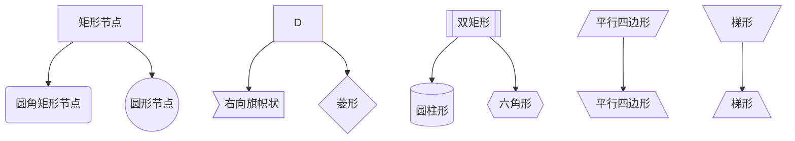

如果节点的文字中包含标点符号，需要时用双引号包裹起来。

### 节点间的连线

| 表述        | 说明           |
| ----------- | -------------- |
| `>`         | 添加尾部箭头   |
| `-`         | 不添加尾部箭头 |
| `--`        | 单线           |
| `==`        | 粗线           |
| `-.-`       | 虚线           |
| `--text-->` | 单线加文字     |
| `---|text|` | 单线加文字2    |
| `==text==`  | 粗线加文字     |
| `-.text.-`  | 虚线加文字     |

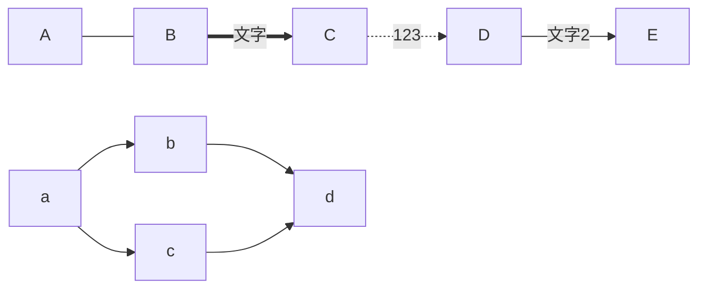

### 子图表

使用以下语法添加子图表

```
subgraph 子图表名称
    子图表中的描述语句...
end
```

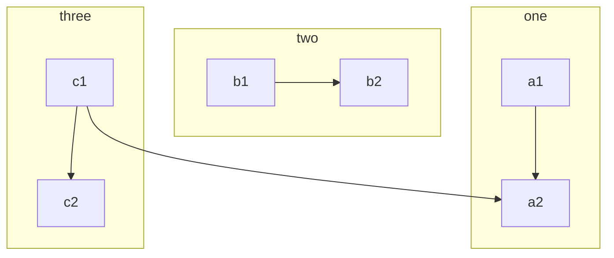

### 注释


```
%% this is a comment A -- text --> B{node}
```

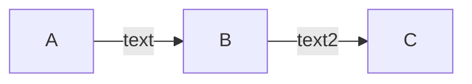

### 链接

```text
graph LR;
    A
    click A "https://www.baidu.com" "Open this in a new tab"
```

### 样式

#### 使用id

```
    style id2 fill:#bbf,stroke:#f66,stroke-width:2px,color:#fff,stroke-dasharray: 5 5
```

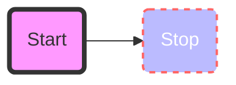

#### 使用class

方法1：使用类定义语句`class B,C,D class2`

方法2：使用`:::`操作符将类名附加到节点

```
graph LR
   A:::class1 --> B
   classDef class1 fill:#aaa;
   
   classDef class2 fill:#f9f,stroke:#333,stroke-width:4px;
   class B,C class2;
   
```

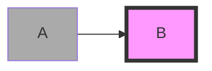


## 箭头图flowchart

### 节点间的连线

flowchart LR
    A --o B --x C
    D o--o E <--> G x--x H

| 表述   | 说明         |
| ------ | ------------ |
| `--o`  | 添加尾部圆点 |
| `--x`  | 添加尾部叉叉 |
| `<-->` | 多向箭头     |

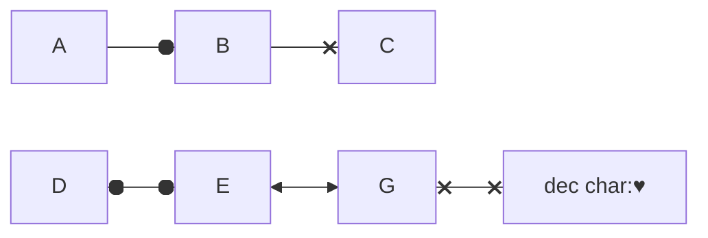

### 子图间的边

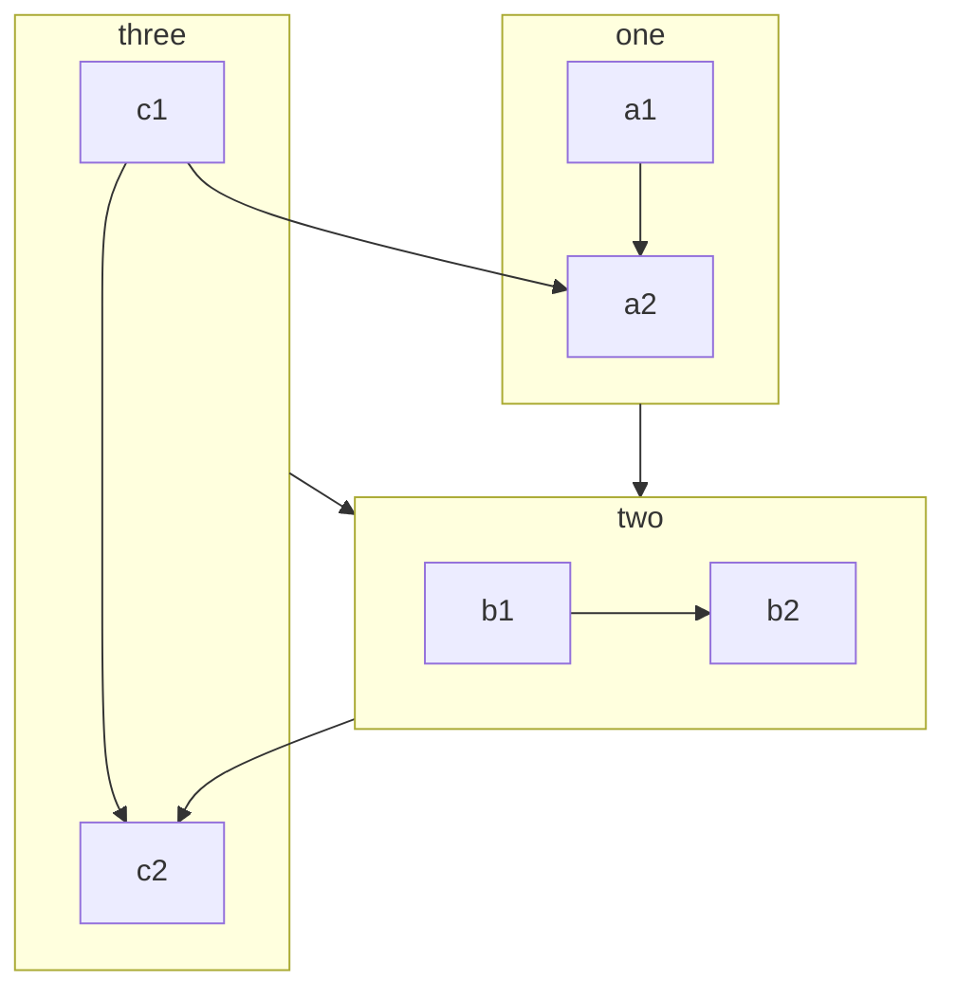


## 序列图sequenceDiagram

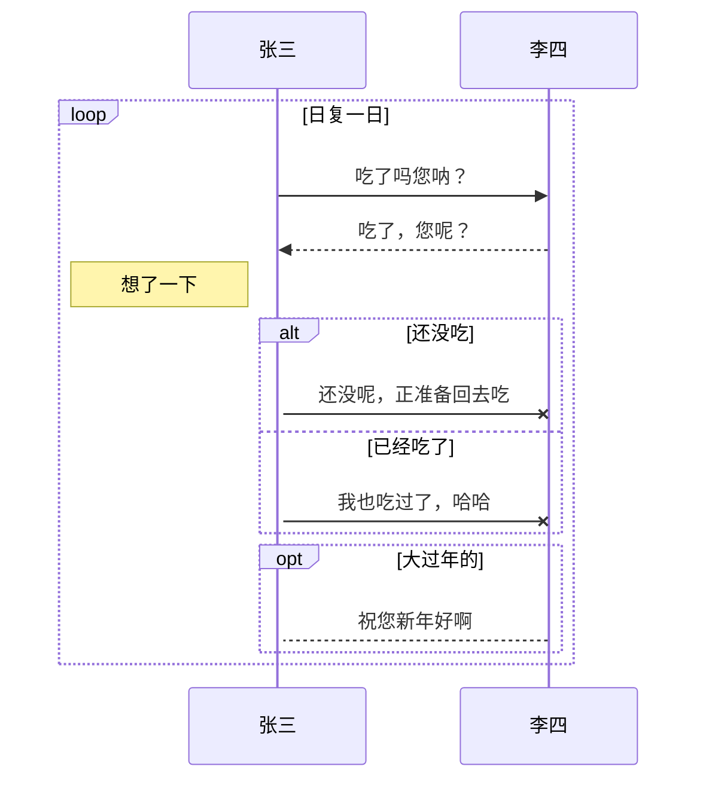


### 消息线

| 表述       | 说明           |
| ---------- | -------------- |
|`->`|无箭头的实线|
|`-->`|无箭头的虚线|
|`->>`|有箭头的实线|
|`-->>`|有箭头的虚线|
|`-x`|末端为叉的实线（表示异步）|
|`--x`|末端为叉的虚线（表示异步）|

### 标注

语法如下

```
Note 位置表述 参与者: 标注文字1
```

其中位置表述可以为

| 表述     | 含义                       |
| -------- | -------------------------- |
| right of | 右侧                       |
| left of  | 左侧                       |
| over     | 在当中，可以横跨多个参与者 |

### 循环

语法如下

```
loop 循环的条件
    循环体描述语句
end
```

### 判断

```
alt 条件 1 描述
    分支 1 描述语句
else 条件 2 描述 # else 分支可选
    分支 2 描述语句
else ...
    ...
end
```

如果遇到可选的情况，即没有 else 分支的情况，使用如下语法：

```
opt 条件描述
    分支描述语句
end
```


### 


## 状态图stateDiagram

语法解释：`[*]` 表示开始或者结束，如果在箭头右边则表示结束。

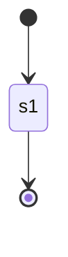

## 类图classDiagram

语法解释：`<|--` 表示继承，`+` 表示 `public`，`-` 表示 `private`，学过 Java 的应该都知道。

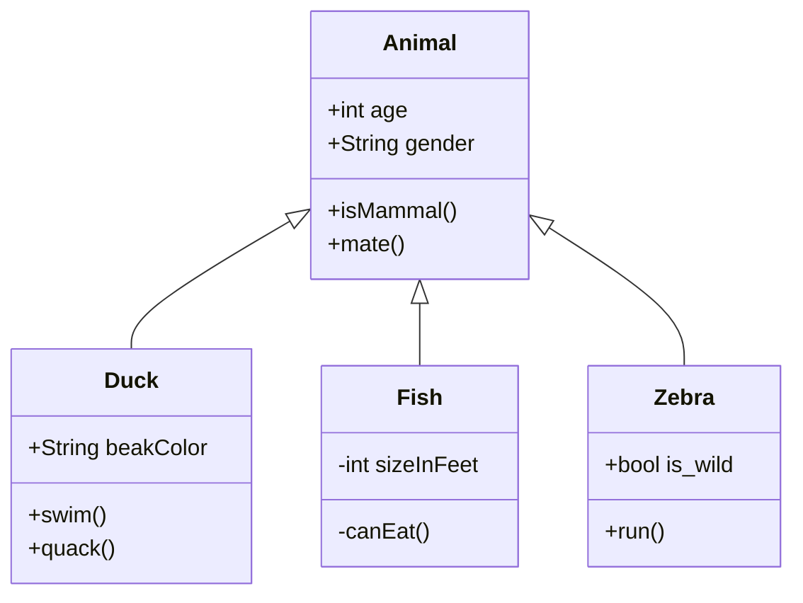

## **饼图**pie

饼图使用 `pie` 表示，标题下面分别是区域名称及其百分比。

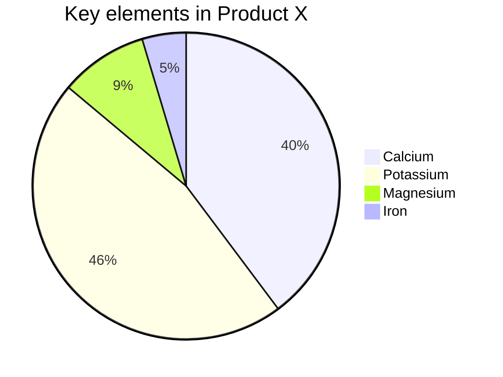

## 甘特图gannt

### eg

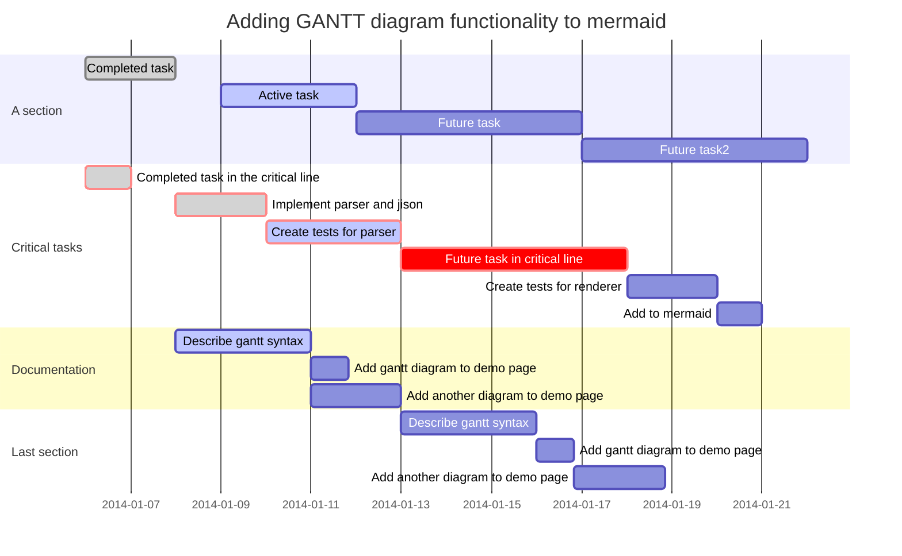


# typora 其他图

## flow图

```flow
st=>start: Start
op=>operation: Your Operation
cond=>condition: Yes or No?
e=>end

st->op->cond
cond(yes)->e
cond(no)->op
```

## sequence图

```sequence
Alice->Bob: Hello Bob, how are you?
Note right of Bob: Bob thinks
Bob-->Alice: I am good thanks!
```