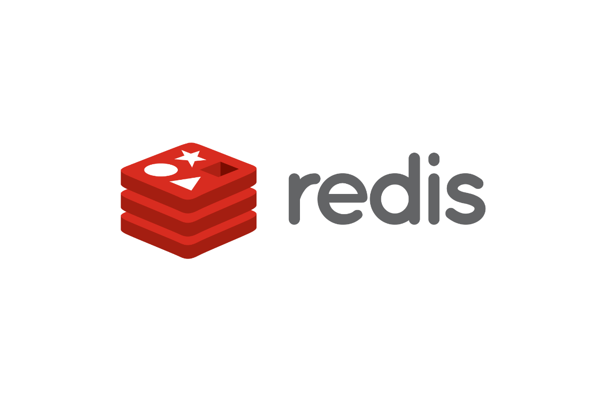

【大厂面试系列】吊打面试官之Redis高频面试题（最新版）

https://leetcode-cn.com/circle/discuss/eX58OT/

[清平乐L3](https://leetcode-cn.com/u/qing-ping-le-k/)发起于 2020-11-06

**概述**

1. 什么是 Redis？
2. Redis 有哪些优缺点？
3. 为什么要用 Redis / 为什么要用缓存？
4. 为什么要用 Redis 而不用 map/guava 做缓存?
5. Redis 为什么这么快？

**数据类型**

1. Redis 有哪些数据类型？
2. Redis 的应用场景？

**持久化**

1. 什么是 Redis 持久化？
2. Redis 的持久化机制是什么？各自的优缺点？
3. 如何选择合适的持久化方式
4. Redis 持久化数据和缓存怎么做扩容？
5. 过期键的删除策略
6. Redis 的过期键的删除策略
7. Redis key 的过期时间和永久有效分别怎么设置？
8. 我们知道通过 expire 来设置 key 的过期时间，那么对过期的数据怎么处理呢?

**内存相关**

1. MySQL 里有 2000w 数据，redis 中只存 20w 的数据，如何保证 redis 中的数据都是热点数据
2. Redis 的内存淘汰策略有哪些
3. Redis 主要消耗什么物理资源？
4. Redis 的内存用完了会发生什么？
5. Redis 如何做内存优化？

**线程模型**

1. Redis 线程模型

**事务**

1. 什么是事务？
2. Redis 事务的概念
3. Redis 事务的三个阶段
4. Redis 事务相关命令
5. 事务管理（ACID）概述
6. Redis 事务支持隔离性吗
7. Redis 事务保证原子性吗，支持回滚吗
8. Redis 事务其他实现

**集群方案**

1. 哨兵模式
2. 官方 Redis Cluster 方案(服务端路由查询)
3. 基于客户端分配
4. 基于代理服务器分片

**Redis 主从架构**

1. Redis 集群的主从复制模型是怎样的？
2. 生产环境中的 redis 是怎么部署的？
3. 说说 Redis 哈希槽的概念？
4. Redis 集群会有写操作丢失吗？为什么？
5. Redis 集群之间是如何复制的？
6. Redis 集群最大节点个数是多少？
7. Redis 集群如何选择数据库？

**分区**

1. Redis 是单线程的，如何提高多核CPU的利用率？
2. 为什么要做 Redis 分区？
3. 你知道有哪些 Redis 分区实现方案？
4. Redis 分区有什么缺点？

**分布式问题**

1. Redis 实现分布式锁
2. 如何解决 Redis 的并发竞争 Key 问题
3. 分布式 Redis 是前期做还是后期规模上来了再做好？为什么？
4. 什么是 RedLock

**缓存异常**

1. 缓存雪崩
2. 缓存穿透
3. 缓存击穿
4. 缓存预热
5. 缓存降级
6. 热点数据和冷数据
7. 缓存热点 key

**常用工具**

1. Redis 支持的 Java 客户端都有哪些？官方推荐用哪个？
2. Redis 和 Redisson 有什么关系？
3. Jedis 与 Redisson 对比有什么优缺点？

**其他问题**

1. Redis 与 Memcached 的区别
2. 如何保证缓存与数据库双写时的数据一致性？
3. Redis 常见性能问题和解决方案？
4. Redis 官方为什么不提供 Windows 版本？
5. 一个字符串类型的值能存储最大容量是多少？
6. Redis 如何做大量数据插入？
7. 假如 Redis 里面有 1 亿个 key，其中有 10w 个 key 是以某个固定的已知的前缀开头的，如果将它们全部找出来？
8. 使用 Redis 做过异步队列吗，是如何实现的
9. Redis 如何实现延时队列
10. Redis 回收进程如何工作的？
11. Redis 回收使用的是什么算法？