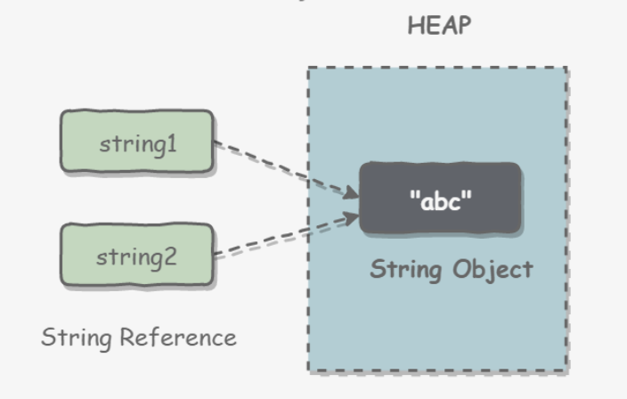

## 输入输出

1.使用Scanner类：

(1)使用java.util包。  import java.util.*;

(2)构造Scanner类对象，它附属于标准输入流System.in。   Scanner s = new Scanner(System.in);

(3)常用的next()方法系列：       

| 方法           | 含义                           |
| -------------- | ------------------------------ |
| `nextInt()`    | 输入int                        |
| `nextDouble()` | 输入double                     |
| `nextLine()`   | 输入字符串                     |
| `next()`       | 输入字符串（以空格作为分隔符） |


```JAVA
import java.util.*;  
public class DEMO_1 {  
    public static void main(String[] args){  
        Scanner s = new Scanner(System.in);  
        System.out.print("输入你的姓名：");  
        String name = s.nextLine();  
        System.out.print("输入你的年龄：");  
        int age = s.nextInt();  
        System.out.println("姓名：" + name + "  年龄：" + age );  
        s.close();         //若没有关闭Scanner对象将会出现警告  
    }  
} 
```

# 数据类型

## 基本类型

- byte/8
- char/16
- short/16
- int/32
- float/32
- long/64
- double/64
- boolean/\~

### Boolean

boolean 只有 true 和 false，可以使用 1 bit 来存储。

JVM在编译时期会把 boolean 转化为 int，使用 1 来表示 true，0 表示 false。

JVM 支持 boolean 数组，但是是通过读写 byte 数组来实现的。

### ref

- [Primitive Data Types](https://docs.oracle.com/javase/tutorial/java/nutsandbolts/datatypes.html)
- [The Java® Virtual Machine Specification](https://docs.oracle.com/javase/specs/jvms/se8/jvms8.pdf)

## 包装类型

基本类型都有对应的包装类型

二者之间的赋值为自动装箱和拆箱

```java
Integer x = 2;     // 装箱 调用了 Integer.valueOf(2)
int y = x;         // 拆箱 调用了 X.intValue()
```

## 缓存池

### Interger

[StackOverflow : Differences between new Integer(123), Integer.valueOf(123) and just 123](https://stackoverflow.com/questions/9030817/differences-between-new-integer123-integer-valueof123-and-just-123)

new Integer(123) 与 Integer.valueOf(123) 的区别在于：

- new Integer(123) 每次都会新建一个对象；
- **Integer.valueOf**(123) 会使用缓存池中的对象，多次调用会取得同一个对象的引用。

```java
Integer x = new Integer(123);
Integer y = new Integer(123);
System.out.println(x == y);    // false
Integer z = Integer.valueOf(123);
Integer k = Integer.valueOf(123);
System.out.println(z == k);   // true
```

valueOf() 方法的实现比较简单，就是先判断值是否在缓存池中，如果在的话就直接返回缓存池的内容。

在 Java 8 中，Integer 缓存池的大小默认为 -128\~127。

编译器会在自动装箱过程调用 valueOf() 方法，因此多个值相同且值在缓存池范围内的 Integer 实例使用自动装箱来创建，那么就会引用相同的对象。

```java
Integer m = 123;
Integer n = 123;
System.out.println(m == n); // true
```


**特殊性**

在 jdk 1.8 所有的数值类缓冲池中，Integer 的缓冲池 IntegerCache 很特殊，这个缓冲池的下界是 - 128，上界默认是 127，但是这个上界是可调的，在启动 jvm 的时候，通过 -XX:AutoBoxCacheMax=&lt;size&gt; 来指定这个缓冲池的大小，该选项在 JVM 初始化的时候会设定一个名为 java.lang.IntegerCache.high 系统属性，然后 IntegerCache 初始化的时候就会读取该系统属性来决定上界。

### 其他基本类型

基本类型对应的缓冲池如下：

- boolean values true and false
- all byte values
- short values between -128 and 127
- int values between -128 and 127
- char in the range \u0000 to \u007F

在使用这些基本类型对应的包装类型时，如果该数值范围在缓冲池范围内，就可以直接使用缓冲池中的对象。

# String

String 被声明为 final，因此它不可被继承。(Integer 等包装类也不能被继承）

在 Java 8 中，String 内部使用 char 数组存储数据。

```java
public final class String
    implements java.io.Serializable, Comparable<String>, CharSequence {
    /** The value is used for character storage. */
    private final char value[];
}
```

value 数组被声明为 final，这意味着 value 数组初始化之后就不能再引用其它数组。并且 String 内部没有改变 value 数组的方法，因此可以保证 String 不可变。

## 不可变的好处

[Program Creek : Why String is immutable in Java?](https://www.programcreek.com/2013/04/why-string-is-immutable-in-java/)

### 可以缓存 hash 值

String 不可变使得一个 String 对象的 hash 值也不变，因此 hash 值只需要进行一次计算

### String Pool 的需要

如果一个 String 对象已经被创建过了，那么就会从 String Pool 中取得引用。只有 String 是不可变的，才可能使用 String Pool。



https://www.cnblogs.com/fangfuhai/p/5500065.html

#### **字符串池的优缺点**

优点：避免了相同内容的字符串的创建，节省了内存，省去了创建相同字符串的时间，同时提升了性能

缺点：多出了JVM在常量池中遍历对象所需要的时间

### 安全性

String 经常作为参数，String 不可变性可以保证参数不可变。

例如在作为网络连接参数的情况下，若String 被改变，接收方可能以为连接了其他主机。

### 线程安全

String 不可变性天生具备线程安全，可以在多个线程中安全地使用

## StringBuffer and StringBuilder

- StringBuilder 不是线程安全的
- StringBuffer 是线程安全的，内部使用 synchronized 进行同步

## String Pool

> 字符串常量池

- 使用 new String() 形式创建字符串

```java
String s1 = new String("aaa");
String s2 = new String("aaa");
System.out.println(s1 == s2);           // false
String s3 = s1.intern();
String s4 = s1.intern();
System.out.println(s3 == s4);           // true
```

- 使用 "bbb" 这种字面量的形式创建字符串，会自动地将字符串放入 String Pool 中。

```java
String s5 = "bbb";
String s6 = "bbb";
System.out.println(s5 == s6);  // true
```

- [StackOverflow : What is String interning?](https://stackoverflow.com/questions/10578984/what-is-string-interning)
- [深入解析 String#intern](https://tech.meituan.com/in_depth_understanding_string_intern.html)


## new String("abc")

使用这种方式一共会创建两个字符串对象（前提是 String Pool 中还没有 "abc" 字符串对象）。

- "abc" 属于字符串字面量，因此编译时期会在 String Pool 中创建一个字符串对象，指向这个 "abc" 字符串字面量；
- 而使用 new 的方式会在堆中创建一个字符串对象。


# 运算

## float 与 double

Java 不能隐式执行向下转型，因为这会使得精度降低。

1.1 字面量属于 double 类型，不能直接将 1.1 直接赋值给 float 变量，因为这是向下转型。

```java
// float f = 1.1;
```

1.1f 字面量才是 float 类型。

```java
float f = 1.1f;
```

## 隐式类型转换

因为字面量 1 是 int 类型，它比 short 类型精度要高，因此不能隐式地将 int 类型向下转型为 short 类型。

```java
short s1 = 1;
// s1 = s1 + 1;
```

但是使用 += 或者 ++ 运算符会执行隐式类型转换。

```java
s1 += 1;
s1++;
```

上面的语句相当于将 s1 + 1 的计算结果进行了向下转型：

```java
s1 = (short) (s1 + 1);
```

## switch

从 Java 7 开始，switch 可以用 String 判断对象

# 关键字

## final

### final 声明数据

- 编译时常量

- 运行时被初始化的常量

如果是基本类型，则使数值不变。

如果是引用类型，则使引用不变，但是对象的本身可以修改。

### final 声明方法

不能被子类重写

private 方法隐式地被指定为 final。如果子类中有同名，则为重新定义新的方法。

### final 声明类

不允许被继承

## static

### 静态变量

静态变量，又称类变量，可以通过类名直接访问

### 静态方法

在类加载时存在，必须有实现，也就不能是抽象方法

### 静态语句块

在类初始化时运行一次，与实例数无关

```java
public class A {
    static {
        System.out.println("123");
    }

    public static void main(String[] args) {
        A a1 = new A();
        A a2 = new A();
    }
}
```

```html
123
```

### 静态内部类

静态内部类不依赖于外部类的实例

静态内部类不能访问外部类的非静态的变量和方法

```java
public class OuterClass {

    class InnerClass {
    }

    static class StaticInnerClass {
    }

    public static void main(String[] args) {
        // InnerClass innerClass = new InnerClass(); // 'OuterClass.this' cannot be referenced from a static context
        OuterClass outerClass = new OuterClass();
        InnerClass innerClass = outerClass.new InnerClass();
        StaticInnerClass staticInnerClass = new StaticInnerClass();
    }
}
```

### 静态导包

在使用静态变量和方法时不需要指明classname

```java
import static com.xxx.ClassName.*
```

### 初始化顺序

静态变量和静态语句块优先于实例变量和普通语句块

存在继承的情况下，初始化顺序为：

- 父类（静态变量、静态语句块）
- 子类（静态变量、静态语句块）
- 父类（实例变量、普通语句块）
- 父类（构造函数）
- 子类（实例变量、普通语句块）
- 子类（构造函数）

# Object 通用方法

## 概览

```java
public native int hashCode()

public boolean equals(Object obj)

protected native Object clone() throws CloneNotSupportedException

public String toString()

public final native Class<?> getClass()

protected void finalize() throws Throwable {}

public final native void notify()

public final native void notifyAll()

public final native void wait(long timeout) throws InterruptedException

public final void wait(long timeout, int nanos) throws InterruptedException

public final void wait() throws InterruptedException
```

## equals()

### 等价关系  

两个对象具有等价关系，需要满足以下五个条件：

1. 自反性

```java
x.equals(x); // true
```

2. 对称性

```java
x.equals(y) == y.equals(x); // true
```

3. 传递性

```java
if (x.equals(y) && y.equals(z))
    x.equals(z); // true;
```

4. 一致性

多次调用 equals() 方法结果不变

```java
x.equals(y) == x.equals(y); // true
```

5. 与 null 的比较

对任何不是 null 的对象 x 调用 x.equals(null) 结果都为 false

```java
x.equals(null); // false;
```

### 等价与相等  

- 对于基本类型，== 判断两个值是否相等，基本类型没有 equals() 方法。
- 对于引用类型，== 判断两个变量是否引用同一个对象，而 equals() 判断引用的对象是否等价。

```java
Integer x = new Integer(1);
Integer y = new Integer(1);
System.out.println(x.equals(y)); // true
System.out.println(x == y);      // false
```

### 实现  

- 检查是否为同一个对象的引用，如果是直接返回 true；
- 检查是否是同一个类型，如果不是，直接返回 false；
- 将 Object 对象进行转型；
- 判断每个关键域是否相等。

```java
public class EqualExample {

    private int x;
    private int y;
    private int z;

    public EqualExample(int x, int y, int z) {
        this.x = x;
        this.y = y;
        this.z = z;
    }

    @Override
    public boolean equals(Object o) {
        if (this == o) return true;
        if (o == null || getClass() != o.getClass()) return false;

        EqualExample that = (EqualExample) o;

        if (x != that.x) return false;
        if (y != that.y) return false;
        return z == that.z;
    }
}
```

## hashCode()

在覆盖 equals() 方法时应当总是覆盖 hashCode() 方法，保证等价的两个对象哈希值也相等。

使用 HashSet  和 HashMap 需要让对应的类实现 hashCode()  方法，因为它们使用了 hashCode()  方法来计算对象应该存储的位置。

- 没有实现 hashCode() 方法的反例：

```java
EqualExample e1 = new EqualExample(1, 1, 1);
EqualExample e2 = new EqualExample(1, 1, 1);
System.out.println(e1.equals(e2)); // true
HashSet<EqualExample> set = new HashSet<>();
set.add(e1);
set.add(e2);
System.out.println(set.size());   // 2
```

- hashcode 的一个实现

```java
@Override
public int hashCode() {
    int result = 17;
    result = 31 * result + x;
    result = 31 * result + y;
    result = 31 * result + z;
    return result;
}
```

## toString()

默认返回散列码的无符号十六进制表示

```java
public class ToStringExample {

    private int number;

    public ToStringExample(int number) {
        this.number = number;
    }
}
```

```java
ToStringExample example = new ToStringExample(123);
System.out.println(example.toString());
// 默认返回散列码的无符号十六进制表示
```

```html
ToStringExample@4554617c
```

## clone()

### 需要显式重写并实现 cloneable 接口

clone() 是 Object 的 protected 方法，它不是 public，一个类不显式去重写 clone()，其它类就不能直接去调用该类实例的 clone() 方法。

应该注意的是，clone() 方法并不是 Cloneable 接口的方法，而是 Object 的一个 protected 方法。Cloneable 接口只是规定，如果一个类没有实现 Cloneable 接口又调用了 clone() 方法，就会抛出 CloneNotSupportedException。

```java
public class CloneExample implements Cloneable {
    private int a;
    private int b;

    @Override
    public Object clone() throws CloneNotSupportedException {
        return super.clone();
    }
}
```

### 浅拷贝  

拷贝对象和原始对象的引用类型引用同一个对象。

```java
public class ShallowCloneExample implements Cloneable {

    private int[] arr;

    public ShallowCloneExample() {
        arr = new int[10];
        for (int i = 0; i < arr.length; i++) {
            arr[i] = i;
        }
    }

    public void set(int index, int value) {
        arr[index] = value;
    }

    public int get(int index) {
        return arr[index];
    }

    @Override
    protected ShallowCloneExample clone() throws CloneNotSupportedException {
        return (ShallowCloneExample) super.clone();
    }
}
```

```java
ShallowCloneExample e1 = new ShallowCloneExample();
ShallowCloneExample e2 = null;
try {
    e2 = e1.clone();
} catch (CloneNotSupportedException e) {
    e.printStackTrace();
}
e1.set(2, 222);
System.out.println(e2.get(2)); // 222
```

### 深拷贝  

拷贝对象和原始对象的引用类型引用不同对象。

```java
public class DeepCloneExample implements Cloneable {

    private int[] arr;

    public DeepCloneExample() {
        arr = new int[10];
        for (int i = 0; i < arr.length; i++) {
            arr[i] = i;
        }
    }

    public void set(int index, int value) {
        arr[index] = value;
    }

    public int get(int index) {
        return arr[index];
    }

    @Override
    protected DeepCloneExample clone() throws CloneNotSupportedException {
        DeepCloneExample result = (DeepCloneExample) super.clone();
        result.arr = new int[arr.length];
        for (int i = 0; i < arr.length; i++) {
            result.arr[i] = arr[i];
        }
        return result;
    }
}
```

```java
DeepCloneExample e1 = new DeepCloneExample();
DeepCloneExample e2 = null;
try {
    e2 = e1.clone();
} catch (CloneNotSupportedException e) {
    e.printStackTrace();
}
e1.set(2, 222);
System.out.println(e2.get(2)); // 2
```

### clone() 的替代方案  

使用 clone() 方法来拷贝一个对象即复杂又有风险，它会抛出异常，并且还需要类型转换。Effective Java 书上讲到，最好不要去使用 clone()，可以使用拷贝构造函数或者拷贝工厂来拷贝一个对象。

```java
public class CloneConstructorExample {

    private int[] arr;

    public CloneConstructorExample() {
        arr = new int[10];
        for (int i = 0; i < arr.length; i++) {
            arr[i] = i;
        }
    }

    public CloneConstructorExample(CloneConstructorExample original) {
        arr = new int[original.arr.length];
        for (int i = 0; i < original.arr.length; i++) {
            arr[i] = original.arr[i];
        }
    }

    public void set(int index, int value) {
        arr[index] = value;
    }

    public int get(int index) {
        return arr[index];
    }
}
```

```java
CloneConstructorExample e1 = new CloneConstructorExample();
CloneConstructorExample e2 = new CloneConstructorExample(e1);
e1.set(2, 222);
System.out.println(e2.get(2)); // 2
```

# 继承

## 抽象类与接口

### 抽象类  

抽象类不能被实例化，只能被继承。

```java
public abstract class AbstractClassExample {

    protected int x;
    private int y;

    public abstract void func1();

    public void func2() {
        System.out.println("func2");
    }
}
```

```java
public class AbstractExtendClassExample extends AbstractClassExample {
    @Override
    public void func1() {
        System.out.println("func1");
    }
}
```


### 接口  

接口是抽象类的延伸，在 Java 8 之前，它可以看成是一个完全抽象的类，也就是说它不能有任何的方法实现。

从 Java 8 开始，接口也可以拥有默认的方法实现。

接口的成员（字段 + 方法）默认都是 public 的，并且不允许定义为 private 或者 protected。

接口的字段默认都是 static 和 final 的。

```java
public interface InterfaceExample {

    void func1();

    default void func2(){
        System.out.println("func2");
    }

    int x = 123;
    // int y;               // Variable 'y' might not have been initialized
    public int z = 0;       // Modifier 'public' is redundant for interface fields
    // private int k = 0;   // Modifier 'private' not allowed here
    // protected int l = 0; // Modifier 'protected' not allowed here
    // private void fun3(); // Modifier 'private' not allowed here
}
```

```java
public class InterfaceImplementExample implements InterfaceExample {
    @Override
    public void func1() {
        System.out.println("func1");
    }
}
```

```java
// InterfaceExample ie1 = new InterfaceExample(); // 'InterfaceExample' is abstract; cannot be instantiated
InterfaceExample ie2 = new InterfaceImplementExample();
ie2.func1();
System.out.println(InterfaceExample.x);
```

### 比较  

- 从设计层面上看，抽象类提供了一种 IS-A 关系，需要满足里式替换原则，即子类对象必须能够替换掉所有父类对象
  而接口更像是一种 LIKE-A 关系，它只是提供一种方法实现契约，并不要求接口和实现接口的类具有 IS-A 关系
- 从使用上来看，一个类可以实现多个接口，但是不能继承多个抽象类。
- 接口的字段只能是 static 和 final 类型的，而抽象类的字段没有这种限制。
- 接口的成员只能是 public 的，而抽象类的成员可以有多种访问权限。

### 使用选择  

**使用接口：**

- 需要让不相关的类都实现一个方法，例如不相关的类都可以实现 Comparable 接口中的 compareTo() 方法；
- 需要使用多重继承。

**使用抽象类：**

- 需要在几个相关的类中共享代码。
- 需要能控制继承来的成员的访问权限，而不是都为 public。
- 需要继承非静态和非常量字段。

在很多情况下，接口优先于抽象类。因为**接口没有抽象类严格**的类层次结构要求，可以灵活地为一个类添加行为。并且从 Java 8 开始，接口也可以有默认的方法实现，使得修改接口的成本也变的很低。

- [Abstract Methods and Classes](https://docs.oracle.com/javase/tutorial/java/IandI/abstract.html)
- [深入理解 abstract class 和 interface](https://www.ibm.com/developerworks/cn/java/l-javainterface-abstract/)
- [When to Use Abstract Class and Interface](https://dzone.com/articles/when-to-use-abstract-class-and-intreface)


## super

- 访问父类的构造函数
- 访问父类的成员：如果子类重写了父类的某个方法，可以通过使用 super 关键字来引用父类的方法实现。

```java
public class SuperExample {

    protected int x;
    protected int y;

    public SuperExample(int x, int y) {
        this.x = x;
        this.y = y;
    }

    public void func() {
        System.out.println("SuperExample.func()");
    }
}
```

```java
public class SuperExtendExample extends SuperExample {

    private int z;

    public SuperExtendExample(int x, int y, int z) {
        super(x, y);
        this.z = z;
    }

    @Override
    public void func() {
        super.func();
        System.out.println("SuperExtendExample.func()");
    }
}
```

```java
SuperExample e = new SuperExtendExample(1, 2, 3);
e.func();
```

```html
SuperExample.func()
SuperExtendExample.func()
```

[Using the Keyword super](https://docs.oracle.com/javase/tutorial/java/IandI/super.html)

## 重写与重载

### 重写（Override）  

存在于继承体系中，指子类实现了一个与父类在方法**声明上完全相同的一个方法**。

为了满足里式替换原则，重写有以下三个限制：

- 子类方法的访问权限必须大于等于父类方法；
- 子类方法的返回类型必须是父类方法返回类型或为其子类型。
- 子类方法抛出的异常类型必须是父类抛出异常类型或为其子类型。

使用 @Override 注解，可以让编译器帮忙检查是否满足上面的三个限制条件。

下面的示例中，SubClass 为 SuperClass 的子类，SubClass 重写了 SuperClass 的 func() 方法。其中：

- 子类方法访问权限为 public，大于父类的 protected。
- 子类的返回类型为 `ArrayList<Integer>`，是父类返回类型 `List<Integer>` 的子类。
- 子类抛出的异常类型为 Exception，是父类抛出异常 Throwable 的子类。
- 子类重写方法使用 @Override 注解，从而让编译器自动检查是否满足限制条件。

```java
class SuperClass {
    protected List<Integer> func() throws Throwable {
        return new ArrayList<>();
    }
}

class SubClass extends SuperClass {
    @Override
    public ArrayList<Integer> func() throws Exception {
        return new ArrayList<>();
    }
}
```

在调用一个方法时，先从本类中查找看是否有对应的方法，如果没有再到父类中查看，看是否从父类继承来。否则就要对参数进行转型，转成父类之后看是否有对应的方法。总的来说，方法调用的优先级为：

- this.func(this)
- super.func(this)
- this.func(super)
- super.func(super)


```java
/*
    A
    |
    B
    |
    C
    |
    D
 */


class A {

    public void show(A obj) {
        System.out.println("A.show(A)");
    }

    public void show(C obj) {
        System.out.println("A.show(C)");
    }
}

class B extends A {

    @Override
    public void show(A obj) {
        System.out.println("B.show(A)");
    }
}

class C extends B {
}

class D extends C {
}
```

```java
public static void main(String[] args) {

    A a = new A();
    B b = new B();
    C c = new C();
    D d = new D();

    // 在 A 中存在 show(A obj)，直接调用
    a.show(a); // A.show(A)
    // 在 A 中不存在 show(B obj)，将 B 转型成其父类 A
    a.show(b); // A.show(A)
    // 在 B 中存在从 A 继承来的 show(C obj)，直接调用
    b.show(c); // A.show(C)
    // 在 B 中不存在 show(D obj)，但是存在从 A 继承来的 show(C obj)，将 D 转型成其父类 C
    b.show(d); // A.show(C)

    // 引用的还是 B 对象，所以 ba 和 b 的调用结果一样
    A ba = new B();
    ba.show(c); // A.show(C)
    ba.show(d); // A.show(C)
}
```

### 重载（Overload）  

存在于同一个类中，指一个方法与已经存在的方法名称上相同，但是参数类型、个数、顺序至少有一个不同。

应该注意的是，返回值不同，其它都相同不算是重载。

# 反射

## 定义

每个类都有一个   **Class**   对象，包含了与类有关的信息。当编译一个新类时，会产生一个同名的 .class 文件，该文件内容保存着 Class 对象。

类加载相当于 Class 对象的加载，类在第一次使用时才动态加载到 JVM 中。也可以使用 `Class.forName("com.mysql.jdbc.Driver")` 这种方式来控制类的加载，该方法会返回一个 Class 对象。

反射可以**提供运行时的类信息**，并且这个类可以在运行时才加载进来，甚至在编译时期该类的 .class 不存在也可以加载进来。

Class 和 java.lang.reflect 一起对反射提供了支持，java.lang.reflect 类库主要包含了以下三个类：

-   **Field**  ：可以使用 get() 和 set() 方法读取和修改 Field 对象关联的字段；
-   **Method**  ：可以使用 invoke() 方法调用与 Method 对象关联的方法；
-   **Constructor**  ：可以用 Constructor 的 newInstance() 创建新的对象。

## 反射的优点

*     **可扩展性**   ：应用程序可以利用全限定名创建可扩展对象的实例，来使用来自外部的用户自定义类。
*     **类浏览器和可视化开发环境**   ：一个类浏览器需要可以枚举类的成员。可视化开发环境（如 IDE）可以从利用反射中可用的类型信息中受益，以帮助程序员编写正确的代码。
*     **调试器和测试工具**   ： 调试器需要能够检查一个类里的私有成员。测试工具可以利用反射来自动地调用类里定义的可被发现的 API 定义，以确保一组测试中有较高的代码覆盖率。

## 反射的缺点

尽管反射非常强大，但也不能滥用。如果一个功能可以不用反射完成，那么最好就不用。在我们使用反射技术时，下面几条内容应该牢记于心。

*     **性能开销**   ：反射涉及了动态类型的解析，所以 JVM 无法对这些代码进行优化。因此，反射操作的效率要比那些非反射操作低得多。我们应该避免在经常被执行的代码或对性能要求很高的程序中使用反射。

*     **安全限制**   ：使用反射技术要求程序必须在一个没有安全限制的环境中运行。如果一个程序必须在有安全限制的环境中运行，如 Applet，那么这就是个问题了。

*     **内部暴露**   ：由于反射允许代码执行一些在正常情况下不被允许的操作（比如访问私有的属性和方法），所以使用反射可能会导致意料之外的副作用，这可能导致代码功能失调并破坏可移植性。反射代码破坏了抽象性，因此当平台发生改变的时候，代码的行为就有可能也随着变化。


- [Trail: The Reflection API](https://docs.oracle.com/javase/tutorial/reflect/index.html)
- [深入解析 Java 反射（1）- 基础](http://www.sczyh30.com/posts/Java/java-reflection-1/)

# 异常

Throwable 可以用来表示任何可以作为异常抛出的类，分为两种：  **Error**   和 **Exception**。其中 Error 用来表示 JVM 无法处理的错误，Exception 分为两种：

-   **受检异常**  ：需要用 try...catch... 语句捕获并进行处理，并且可以从异常中恢复；
-   **非受检异常**  ：是程序运行时错误，例如除 0 会引发 Arithmetic Exception，此时程序崩溃并且无法恢复。

<div align="center">  </div><br>

- [Java 入门之异常处理](https://www.tianmaying.com/tutorial/Java-Exception)
- [Java 异常的面试问题及答案 -Part 1](http://www.importnew.com/7383.html)

# 泛型

```java
public class Box<T> {
    // T stands for "Type"
    private T t;
    public void set(T t) { this.t = t; }
    public T get() { return t; }
}
```

- [Java 泛型详解](http://www.importnew.com/24029.html)
- [10 道 Java 泛型面试题](https://cloud.tencent.com/developer/article/1033693)

# 注解

Java 注解是附加在代码中的一些元信息，用于一些工具在编译、运行时进行解析和使用，起到说明、配置的功能。注解不会也不能影响代码的实际逻辑，仅仅起到辅助性的作用。

[注解 Annotation 实现原理与自定义注解例子](https://www.cnblogs.com/acm-bingzi/p/javaAnnotation.html)

# 特性

## Java 各版本的新特性

**New highlights in Java SE 8**  

1. Lambda Expressions
2. Pipelines and Streams
3. Date and Time API
4. Default Methods
5. Type Annotations
6. Nashhorn JavaScript Engine
7. Concurrent Accumulators
8. Parallel operations
9. PermGen Error Removed

**New highlights in Java SE 7**  

1. Strings in Switch Statement
2. Type Inference for Generic Instance Creation
3. Multiple Exception Handling
4. Support for Dynamic Languages
5. Try with Resources
6. Java nio Package
7. Binary Literals, Underscore in literals
8. Diamond Syntax

- [Difference between Java 1.8 and Java 1.7?](http://www.selfgrowth.com/articles/difference-between-java-18-and-java-17)
- [Java 8 特性](http://www.importnew.com/19345.html)

## Java 与 C++ 的区别

- Java 是纯粹的面向对象语言，所有的对象都继承自 java.lang.Object，C++ 为了兼容 C 即支持面向对象也支持面向过程。
- Java 通过虚拟机从而实现跨平台特性，但是 C++ 依赖于特定的平台。
- Java 没有指针，它的引用可以理解为安全指针，而 C++ 具有和 C 一样的指针。
- Java 支持自动垃圾回收，而 C++ 需要手动回收。
- Java 不支持多重继承，只能通过实现多个接口来达到相同目的，而 C++ 支持多重继承。
- Java 不支持操作符重载，虽然可以对两个 String 对象执行加法运算，但是这是语言内置支持的操作，不属于操作符重载，而 C++ 可以。
- Java 的 goto 是保留字，但是不可用，C++ 可以使用 goto。

[What are the main differences between Java and C++?](http://cs-fundamentals.com/tech-interview/java/differences-between-java-and-cpp.php)

## JRE or JDK

- JRE：Java Runtime Environment，Java 运行环境的简称，为 Java 的运行提供了所需的环境。它是一个 JVM 程序，主要包括了 JVM 的标准实现和一些 Java 基本类库。
- JDK：Java Development Kit，Java 开发工具包，提供了 Java 的开发及运行环境。JDK 是 Java 开发的核心，集成了 JRE 以及一些其它的工具，比如编译 Java 源码的编译器 javac 等。

# 参考资料

- Eckel B. Java 编程思想[M]. 机械工业出版社, 2002.
- Bloch J. Effective java[M]. Addison-Wesley Professional, 2017.


